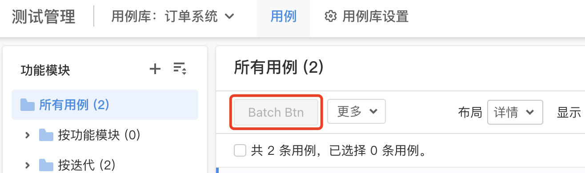

# 模块插槽

除全局插槽与应用插槽外的所有插槽，统称模块插槽

## settings

插件设置模块，用于承载插件自身的设置项

## 登录

### ones:login

登录页模块，用于替换系统登录页

### ones:login:connect

系统登录页的第三方登录模块，用于新增系统登录页的第三方登录入口

## 工作项

### ones:issue:feed:all

「工作项 - 动态 - 全部」模块插槽，用于替换「工作项 - 动态」的「全部」模块

### ones:issue:feed:comment

「工作项 - 动态 - 评论」模块插槽，用于替换「工作项 - 动态」的「评论」模块

### ones:issue:feed:file

「工作项 - 动态 - 文件」模块插槽，用于替换「工作项 - 动态」的「文件」模块

### ones:issue:feed:relate

「工作项 - 动态 - 关联」模块插槽，用于替换「工作项 - 动态」的「关联」模块

### ones:issue:feed:changelog

「工作项 - 动态 - 变更记录」模块插槽，用于替换「工作项 - 动态」的「变更记录」模块

## 我的工作台

### ones:workspace:new

「我的工作台」模块插槽，用于在「我的工作台」应用顶栏新增模块页面

### ones:workspace:index

「我的工作台 - 概览」模块，用于替换「我的工作台」应用的「概览」模块

### ones:workspace:dashboard

「我的工作台 - 仪表盘」模块，用于替换「我的工作台」应用的「仪表盘」模块

### ones:workspace:dashboard:header:action:new

「我的工作台 - 仪表盘」组件的顶部操作模块，用于在「我的工作台 - 仪表盘」组件的顶部操作区域左侧追加新内容

- 可访问的上下文数据：

  - [useDashboardInfo](../packages/store.mdx#useDashboardInfo)

### ones:workspace:filter

「我的工作台 - 筛选器」模块，用于替换「我的工作台」应用的「筛选器」模块

### ones:workspace:filter:header:action:new

「我的工作台 - 筛选器」组件的顶部操作模块，用于在「我的工作台 - 筛选器」组件的「视图管理」左侧追加新内容

- 可访问的上下文数据：

  - [useFilterInfo](../packages/store.mdx#useFilterInfo)

### ones:workspace:manhour

「我的工作台 - 工时」模块，用于替换「我的工作台」应用的「工时」模块

## 项目管理

### ones:project:new

「项目管理」模块插槽，用于在「项目管理」应用顶栏新增模块页面

- 可访问的上下文数据：

  - [useProjectInfo](../packages/store.mdx#useProjectInfo)

### ones:project:index

「项目管理」首页模块，用于替换「项目管理」应用的首页模块

- 可访问的上下文数据：

  - [useProjectInfo](../packages/store.mdx#useProjectInfo)

### ones:project:component:overview

「项目管理 - 项目概览」组件模块，用于替换「项目管理 - 项目概览」组件

- 可访问的上下文数据：

  - [useProjectInfo](../packages/store.mdx#useProjectInfo)

### ones:project:component:overview:header:action:new

「项目管理 - 项目概览」组件的顶部操作模块，用于在「项目管理 - 项目概览」组件的顶部操作区域左侧追加新内容

- 可访问的上下文数据：

  - [useProjectInfo](../packages/store.mdx#useProjectInfo)

### ones:project:component:report

「项目管理 - 报表」组件模块，用于替换「项目管理 - 报表」组件

- 可访问的上下文数据：

  - [useProjectInfo](../packages/store.mdx#useProjectInfo)

### ones:project:component:member

「项目管理 - 成员」组件模块，用于替换「项目管理 - 成员」组件

- 可访问的上下文数据：

  - [useProjectInfo](../packages/store.mdx#useProjectInfo)

### ones:project:component:member:action:new

「项目管理 - 成员」组件顶部操作模块，用于在「项目管理 - 成员」组件的顶部操作区域左侧追加新内容

- 可访问的上下文数据：

  - [useProjectInfo](../packages/store.mdx#useProjectInfo)
  - [useProjectRoleInfo](../packages/store.mdx#useProjectRoleInfo)

### ones:project:component:todo

「项目管理 - 待办事项」组件模块，用于替换「项目管理 - 待办事项」组件

- 可访问的上下文数据：

  - [useProjectInfo](../packages/store.mdx#useProjectInfo)

### ones:project:component:sprint

「项目管理 - 迭代」组件模块，用于替换「项目管理 - 迭代」组件

- 可访问的上下文数据：

  - [useProjectInfo](../packages/store.mdx#useProjectInfo)

### ones:project:component:sprintPlan

「项目管理 - 迭代计划」组件模块，用于替换「项目管理 - 迭代计划」组件

- 可访问的上下文数据：

  - [useProjectInfo](../packages/store.mdx#useProjectInfo)

### ones:project:component:publish

「项目管理 - 发布」组件模块，用于替换「项目管理 - 发布」组件

- 可访问的上下文数据：

  - [useProjectInfo](../packages/store.mdx#useProjectInfo)

### ones:project:component:desk

「项目管理 - 工单」组件模块，用于替换「项目管理 - 工单」组件

- 可访问的上下文数据：

  - [useProjectInfo](../packages/store.mdx#useProjectInfo)

### ones:project:component:deliverable

「项目管理 - 交付物」组件模块，用于替换「项目管理 - 交付物」组件

- 可访问的上下文数据：

  - [useProjectInfo](../packages/store.mdx#useProjectInfo)

### ones:project:component:milestone

「项目管理 - 里程碑」组件模块，用于替换「项目管理 - 里程碑」组件

- 可访问的上下文数据：

  - [useProjectInfo](../packages/store.mdx#useProjectInfo)

### ones:project:component:pipeline

「项目管理 - 流水线」组件模块，用于替换「项目管理 - 流水线」组件

- 可访问的上下文数据：

  - [useProjectInfo](../packages/store.mdx#useProjectInfo)

### ones:project:component:bug

「项目管理 - 缺陷」组件模块，用于替换「项目管理 - 缺陷」组件

- 可访问的上下文数据：

  - [useProjectInfo](../packages/store.mdx#useProjectInfo)

### ones:project:component:task

「项目管理 - 任务」组件模块，用于替换「项目管理 - 任务」组件

- 可访问的上下文数据：

  - [useProjectInfo](../packages/store.mdx#useProjectInfo)

### ones:project:component:filter

「项目管理 - 筛选器」组件模块，用于替换「项目管理 - 筛选器」组件

- 可访问的上下文数据：

  - [useProjectInfo](../packages/store.mdx#useProjectInfo)

### ones:project:component:gantt

「项目管理 - 时间视图」组件模块，用于替换「项目管理 - 时间视图」组件

- 可访问的上下文数据：

  - [useProjectInfo](../packages/store.mdx#useProjectInfo)

### ones:project:component:doc

「项目管理 - 文档」组件模块，用于替换「项目管理 - 文档」组件

- 可访问的上下文数据：

  - [useProjectInfo](../packages/store.mdx#useProjectInfo)

### ones:project:component:file

「项目管理 - 文件」组件模块，用于替换「项目管理 - 文件」组件

- 可访问的上下文数据：

  - [useProjectInfo](../packages/store.mdx#useProjectInfo)

### ones:project:component:plan

「项目管理 - 项目计划」组件模块，用于替换「项目管理 - 项目计划」组件

- 可访问的上下文数据：

  - [useProjectInfo](../packages/store.mdx#useProjectInfo)

### ones:project:component:demand

「项目管理 - 需求」组件模块，用于替换「项目管理 - 需求」组件

- 可访问的上下文数据：

  - [useProjectInfo](../packages/store.mdx#useProjectInfo)

### ones:project:component:story

「项目管理 - 用户故事」组件模块，用于替换「项目管理 - 用户故事」组件

- 可访问的上下文数据：

  - [useProjectInfo](../packages/store.mdx#useProjectInfo)

### ones:project:component:execute

「项目管理 - 执行」组件模块，用于替换「项目管理 - 执行」组件

- 可访问的上下文数据：

  - [useProjectInfo](../packages/store.mdx#useProjectInfo)

### ones:project:settings:new

「项目管理 - 项目设置」设置模块插槽，用于在「项目管理 - 项目设置」新增设置页面

- 可访问的上下文数据：

  - [useProjectInfo](../packages/store.mdx#useProjectInfo)

### ones:project:settings:component

「项目管理 - 项目设置 - 项目组件」设置模块，用于替换「项目管理 - 项目设置 - 项目组件」设置页

- 可访问的上下文数据：

  - [useProjectInfo](../packages/store.mdx#useProjectInfo)

### ones:project:settings:issueType

「项目管理 - 项目设置 - 工作项类型」设置模块，用于替换「项目管理 - 项目设置 - 工作项类型」设置页

- 可访问的上下文数据：

  - [useProjectInfo](../packages/store.mdx#useProjectInfo)

### ones:project:settings:permission

「项目管理 - 项目设置 - 权限配置」设置模块，用于替换「项目管理 - 项目设置 - 权限配置」设置页

- 可访问的上下文数据：

  - [useProjectInfo](../packages/store.mdx#useProjectInfo)

### ones:project:settings:sprint

「项目管理 - 项目设置 - 迭代配置」设置模块，用于替换「项目管理 - 项目设置 - 迭代配置」设置页

- 可访问的上下文数据：

  - [useProjectInfo](../packages/store.mdx#useProjectInfo)

### ones:project:settings:config

「项目管理 - 项目设置 - 项目配置」设置模块，用于替换「项目管理 - 项目设置 - 项目配置」设置页

- 可访问的上下文数据：

  - [useProjectInfo](../packages/store.mdx#useProjectInfo)

### ones:project:settings:operation

「项目管理 - 项目设置 - 项目操作」设置模块，用于替换「项目管理 - 项目设置 - 项目操作」设置页

- 可访问的上下文数据：

  - [useProjectInfo](../packages/store.mdx#useProjectInfo)

## 知识库管理

### ones:wiki:new

「知识库管理」模块插槽，用于在「知识库管理」应用顶栏新增模块页面

### ones:wiki:index

「知识库管理」首页模块，用于替换「知识库管理」应用的首页模块

### ones:wiki:share

「知识库管理 - 与我共享」模块，用于替换「知识库管理」应用的「与我共享」模块

## 测试管理

### ones:testcase:new

「测试管理」模块插槽，用于在「测试管理」应用顶栏新增模块页面

### ones:testcase:index

「测试管理」首页模块，用于替换「测试管理」应用的首页模块

### ones:testcase:library

「测试管理 - 用例库」模块，用于替换「测试管理」应用的「用例库」模块

### ones:testcase:library:component:case

「测试管理 - 用例库 - 用例」组件模块，用于替换「测试管理 - 用例库 - 用例」组件

- 可访问的上下文数据：

  - [useTestCaseLibraryInfo](../packages/store.mdx#useTestCaseLibraryInfo)

### ones:testcase:library:component:case:caseList:action:new

「测试管理 - 用例库 - 用例」组件的所有用例顶部操作模块，用于在「测试管理 - 用例库 - 用例」组件的所有用例顶部操作区域左侧追加新内容

- 可访问的上下文数据：

  - [useTeseCaseLibraryInfo](../packages/store.mdx#useTestCaseLibraryInfo)
  - [useTestCaseListInfo](../packages/store.mdx#useTestCaseListInfo)

### ones:testcase:library:settings:new

「测试管理 - 用例库 - 用例库设置」设置模块插槽，用于在「测试管理 - 用例库 - 用例库设置」新增设置页面

- 可访问的上下文数据：

  - [useTestCaseLibraryInfo](../packages/store.mdx#useTestCaseLibraryInfo)

### ones:testcase:library:settings:info

「测试管理 - 用例库 - 用例库设置 - 用例库信息」设置模块，用于替换「测试管理 - 用例库 - 用例库设置 - 用例库信息」设置页

- 可访问的上下文数据：

  - [useTestCaseLibraryInfo](../packages/store.mdx#useTestCaseLibraryInfo)

### ones:testcase:library:settings:permission

「测试管理 - 用例库 - 用例库设置 - 权限配置」设置模块，用于替换「测试管理 - 用例库 - 用例库设置 - 权限配置」设置页

- 可访问的上下文数据：

  - [useTestCaseLibraryInfo](../packages/store.mdx#useTestCaseLibraryInfo)

### ones:testcase:library:settings:recycle

「测试管理 - 用例库 - 用例库设置 - 回收站」设置模块，用于替换「测试管理 - 用例库 - 用例库设置 - 回收站」设置页

- 可访问的上下文数据：

  - [useTestCaseLibraryInfo](../packages/store.mdx#useTestCaseLibraryInfo)

### ones:testcase:library:settings:more

「测试管理 - 用例库 - 用例库设置 - 删除用例库」设置模块，用于替换「测试管理 - 用例库 - 用例库设置 - 删除用例库」设置页

- 可访问的上下文数据：

  - [useTestCaseLibraryInfo](../packages/store.mdx#useTestCaseLibraryInfo)

### ones:testcase:plan

「测试管理 - 测试计划」模块，用于替换「测试管理」应用的「测试计划」模块

### ones:testcase:plan:component:case

「测试管理 - 测试计划 - 用例」组件模块，用于替换「测试管理 - 测试计划 - 用例」组件

- 可访问的上下文数据：

  - [useTestPlanInfo](../packages/store.mdx#useTestPlanInfo)

### ones:testcase:plan:component:demand

「测试管理 - 测试计划 - 需求跟踪」组件模块，用于替换「测试管理 - 测试计划 - 需求跟踪」组件

- 可访问的上下文数据：

  - [useTestPlanInfo](../packages/store.mdx#useTestPlanInfo)

### ones:testcase:plan:component:demand:header:action:new

「测试管理 - 测试计划 - 需求跟踪」组件的顶部操作模块，用于在「测试管理 - 测试计划 - 需求跟踪」组件的顶部操作区域左侧追加新内容

- 可访问的上下文数据：

  - [useTestPlanInfo](../packages/store.mdx#useTestPlanInfo)

### ones:testcase:plan:settings:new

「测试管理 - 用例库 - 测试计划设置」设置模块插槽，用于在「测试管理 - 用例库 - 测试计划设置」新增设置页面

- 可访问的上下文数据：

  - [useTestPlanInfo](../packages/store.mdx#useTestPlanInfo)

### ones:testcase:plan:settings:info

「测试管理 - 测试计划 - 测试计划设置 - 测试计划信息」设置模块，用于替换「测试管理 - 测试计划- 测试计划设置 - 测试计划信息」设置页

- 可访问的上下文数据：

  - [useTestPlanInfo](../packages/store.mdx#useTestPlanInfo)

### ones:testcase:plan:settings:perform

「测试管理 - 测试计划 - 测试计划设置 - 执行配置」设置模块，用于替换「测试管理 - 测试计划- 测试计划设置 - 执行配置」设置页

- 可访问的上下文数据：

  - [useTestPlanInfo](../packages/store.mdx#useTestPlanInfo)

### ones:testcase:plan:settings:permission

「测试管理 - 测试计划 - 测试计划设置 - 权限配置」设置模块，用于替换「测试管理 - 测试计划- 测试计划设置 - 权限配置」设置页

- 可访问的上下文数据：

  - [useTestPlanInfo](../packages/store.mdx#useTestPlanInfo)

### ones:testcase:plan:settings:more

「测试管理 - 测试计划 - 测试计划设置 - 更多」设置模块，用于替换「测试管理 - 测试计划- 测试计划设置 - 更多」设置页

- 可访问的上下文数据：

  - [useTestPlanInfo](../packages/store.mdx#useTestPlanInfo)

### ones:testcase:report

「测试管理 - 测试报告」模块，用于替换「测试管理」应用的「测试报告」模块

## 产品管理

### ones:product:new

「产品管理」模块插槽，用于在「产品管理」应用顶栏新增模块页面

- 可访问的上下文数据：

  - [useProductInfo](../packages/store.mdx#useProductInfo)

### ones:product:index

「产品管理」首页模块，用于替换「产品管理」应用的首页模块

- 可访问的上下文数据：

  - [useProductInfo](../packages/store.mdx#useProductInfo)

### ones:product:component:version

「产品管理 - 版本」组件模块，用于替换「产品管理 - 版本」组件

- 可访问的上下文数据：

  - [useProductInfo](../packages/store.mdx#useProductInfo)

### ones:product:component:desk

「产品管理 - 工单」组件模块，用于替换「产品管理 - 工单」组件

- 可访问的上下文数据：

  - [useProductInfo](../packages/store.mdx#useProductInfo)

### ones:product:component:module

「产品管理 - 模块」组件模块，用于替换「产品管理 - 模块」组件

- 可访问的上下文数据：

  - [useProductInfo](../packages/store.mdx#useProductInfo)

### ones:product:component:bug

「产品管理 - 缺陷」组件模块，用于替换「产品管理 - 缺陷」组件

- 可访问的上下文数据：

  - [useProductInfo](../packages/store.mdx#useProductInfo)

### ones:product:component:task

「产品管理 - 任务」组件模块，用于替换「产品管理 - 任务」组件

- 可访问的上下文数据：

  - [useProductInfo](../packages/store.mdx#useProductInfo)

### ones:product:component:demand

「产品管理 - 需求」组件模块，用于替换「产品管理 - 需求」组件

- 可访问的上下文数据：

  - [useProductInfo](../packages/store.mdx#useProductInfo)

### ones:product:component:story

「产品管理 - 用户故事」组件模块，用于替换「产品管理 - 用户故事」组件

- 可访问的上下文数据：

  - [useProductInfo](../packages/store.mdx#useProductInfo)

### ones:product:settings:new

「产品管理 - 产品设置」设置模块插槽，用于在「产品管理 - 产品设置」新增设置页面

- 可访问的上下文数据：

  - [useProductInfo](../packages/store.mdx#useProductInfo)

### ones:product:settings:config

「产品管理 - 产品设置 - 产品配置」设置模块，用于替换「产品管理 - 产品设置 - 产品配置」设置页

- 可访问的上下文数据：

  - [useProductInfo](../packages/store.mdx#useProductInfo)

### ones:product:settings:info

「产品管理 - 产品设置 - 基础信息」设置模块，用于替换「产品管理 - 产品设置 - 基础信息」设置页

- 可访问的上下文数据：

  - [useProductInfo](../packages/store.mdx#useProductInfo)

### ones:product:settings:component

「产品管理 - 产品设置 - 组件设置」设置模块，用于替换「产品管理 - 产品设置 - 组件设置」设置页

- 可访问的上下文数据：

  - [useProductInfo](../packages/store.mdx#useProductInfo)

### ones:product:settings:more

「产品管理 - 产品设置 - 更多」设置模块，用于替换「产品管理 - 产品设置 - 更多」设置页

- 可访问的上下文数据：

  - [useProductInfo](../packages/store.mdx#useProductInfo)

## 工单管理

### ones:desk:new

「工单管理」模块插槽，用于在「工单管理」应用顶栏新增模块页面

### ones:desk:index

「工单管理」首页模块，用于替换「工单管理」应用的首页模块

## 工单门户

### ones:deskhome:index

「工单门户」首页模块，用于替换「工单门户」应用的首页模块

## 工时管理

### ones:manhour:new

「工时管理」新增模块，用于在「工时管理」应用顶栏新增模块页面

### ones:manhour:index

「工时管理 - 工时日历」模块，用于替换「工时管理」应用的「工时日历」模块

### ones:manhour:report

「工时管理 - 工时报表」模块，用于替换「工时管理」应用的「工时报表」模块

### ones:manhour:log

「工时管理 - 工时日志」模块，用于替换「工时管理」应用的「工时日志」模块

## 效能管理

### ones:performance:new

「效能管理」模块插槽，用于在「效能管理」应用顶栏新增模块页面

### ones:performance:index

「效能管理 - 仪表盘」模块，用于替换「效能管理」应用的「仪表盘」模块

### ones:performance:component:dashboard:header:action:new

「效能管理 - 仪表盘」组件的顶部操作模块，用于在「效能管理 - 仪表盘」组件的顶部操作区域左侧追加新内容

## 项目集管理

### ones:plan:new

「项目集管理」模块插槽，用于在「项目集管理」应用顶栏新增模块页面

- 可访问的上下文数据：

  - [useProgramInfo](../packages/store.mdx#useProgramInfo)

### ones:plan:index

「项目集管理」首页模块，用于替换「项目集管理」应用的首页模块

- 可访问的上下文数据：

  - [useProgramInfo](../packages/store.mdx#useProgramInfo)

### ones:plan:gantt

「项目集管理 - 甘特图」模块，用于替换「项目集管理」应用的「甘特图」模块

- 可访问的上下文数据：

  - [useProgramInfo](../packages/store.mdx#useProgramInfo)

### ones:plan:component:project

「项目集管理 - 项目集 - 项目」组件模块，用于替换「项目集管理 - 项目集 - 项目」组件

- 可访问的上下文数据：

  - [useProgramInfo](../packages/store.mdx#useProgramInfo)

### ones:plan:component:member

「项目集管理 - 项目集 - 成员」组件模块，用于替换「项目集管理 - 项目集 - 成员」组件

- 可访问的上下文数据：

  - [useProgramInfo](../packages/store.mdx#useProgramInfo)

## 流水线管理

### ones:pipeline:new

「流水线管理」模块插槽，用于在「流水线管理」应用顶栏新增模块页面

- 可访问的上下文数据：

  - [usePipelineInfo](../packages/store.mdx#usePipelineInfo)

### ones:pipeline:index

「流水线管理」首页模块，用于替换「流水线管理」应用的首页模块

- 可访问的上下文数据：

  - [usePipelineInfo](../packages/store.mdx#usePipelineInfo)

### ones:pipeline:component:history

「流水线管理 - 流水线 - 历史」组件模块，用于替换「流水线管理 - 流水线 - 历史」组件

- 可访问的上下文数据：

  - [usePipelineInfo](../packages/store.mdx#usePipelineInfo)

## 版本管理

### ones:version:new

「版本管理」模块插槽，用于在「版本管理」应用顶栏新增模块页面

### ones:version:index

「版本管理」首页模块，用于替换「版本管理」应用的首页模块

## 配置中心

### ones:settings:new

「配置中心」设置模块插槽，用于在「配置中心」新增设置模块

### ones:settings:team

「配置中心 - 团队配置」设置模块，用于替换「配置中心 - 团队配置」设置模块

### ones:settings:team:new

「配置中心 - 团队配置」设置模块插槽，用于在「配置中心 - 团队配置」新增设置模块

### ones:settings:account

「配置中心 - 账号与成员」设置模块，用于替换「配置中心 - 账号与成员」设置模块

### ones:settings:account:new

「配置中心 - 账号与成员」设置模块插槽，用于在「配置中心 - 账号与成员」新增设置模块

### ones:settings:account:default

「配置中心 - 账号与成员」设置模块，用于替换「配置中心 - 账号与成员」设置模块默认分组

### ones:settings:account:default:new

「配置中心 - 账号与成员」设置模块插槽，用于在「配置中心 - 账号与成员」默认分组新增设置模块

### ones:settings:account:default:member

「配置中心 - 账号与成员 - 成员管理」设置模块，用于替换「配置中心 - 账号与成员 - 成员管理」设置页

### ones:settings:account:default:group

「配置中心 - 账号与成员 - 用户组」设置模块，用于替换「配置中心 - 账号与成员 - 用户组」设置页

### ones:settings:account:default:login

「配置中心 - 账号与成员 - 登录登出设置」设置模块，用于替换「配置中心 - 账号与成员 - 登录登出设置」设置页

### ones:settings:account:default:connect

「配置中心 - 账号与成员 - 第三方集成」设置模块，用于替换「配置中心 - 账号与成员 - 第三方集成」设置页

### ones:settings:account:default:safe

「配置中心 - 账号与成员 - 信息安全设置」设置模块，用于替换「配置中心 - 账号与成员 - 信息安全设置」设置页

### ones:settings:import

「配置中心 - 导入数据」设置模块，用于替换「配置中心 - 导入数据」设置模块

### ones:settings:import:new

「配置中心 - 导入数据」设置模块插槽，用于在「配置中心 - 导入数据」新增设置模块

### ones:settings:appearance

「配置中心 - 系统偏好设置」设置模块，用于替换「配置中心 - 系统偏好设置」设置模块

### ones:settings:appearance:new

「配置中心 - 系统偏好设置」设置模块插槽，用于在「配置中心 - 系统偏好设置」新增设置模块

### ones:settings:manhour

「配置中心 - 工时设置」设置模块，用于替换「配置中心 - 工时设置」设置模块

### ones:settings:manhour:new

「配置中心 - 工时设置」设置模块插槽，用于在「配置中心 - 工时设置」新增设置模块

### ones:settings:safe

「配置中心 - 系统安全」设置模块，用于替换「配置中心 - 系统安全」设置模块

### ones:settings:safe:new

「配置中心 - 系统安全」设置模块插槽，用于在「配置中心 - 系统安全」新增设置模块

### ones:settings:project

「配置中心 - 项目管理配置」设置模块，用于替换「配置中心 - 项目管理配置」设置模块

### ones:settings:project:new

「配置中心 - 项目管理配置」设置模块插槽，用于在「配置中心 - 项目管理配置」新增设置模块

### ones:settings:project:self

「配置中心 - 项目管理配置 - 项目」设置模块，用于替换「配置中心 - 项目管理配置 - 项目」设置模块

### ones:settings:project:self:manage

「配置中心 - 项目管理配置 - 项目 - 项目管理」设置模块，用于替换「配置中心 - 项目管理配置 - 项目 - 项目管理」设置页

### ones:settings:project:self:field

「配置中心 - 项目管理配置 - 项目 - 项目属性」设置模块，用于替换「配置中心 - 项目管理配置 - 项目 - 项目属性」设置页

### ones:settings:project:self:status

「配置中心 - 项目管理配置 - 项目 - 项目状态」设置模块，用于替换「配置中心 - 项目管理配置 - 项目 - 项目状态」设置页

### ones:settings:project:self:role

「配置中心 - 项目管理配置 - 项目 - 项目角色」设置模块，用于替换「配置中心 - 项目管理配置 - 项目 - 项目角色」设置页

### ones:settings:project:issue

「配置中心 - 项目管理配置 - 工作项」设置模块，用于替换「配置中心 - 项目管理配置 - 工作项」设置模块

### ones:settings:project:issue:type

「配置中心 - 项目管理配置 - 工作项 - 工作项类型」设置模块，用于替换「配置中心 - 项目管理配置 - 工作项 - 工作项类型」设置页

### ones:settings:project:issue:field

「配置中心 - 项目管理配置 - 工作项 - 工作项属性」设置模块，用于替换「配置中心 - 项目管理配置 - 工作项 - 工作项属性」设置页

### ones:settings:project:issue:status

「配置中心 - 项目管理配置 - 工作项 - 工作项状态」设置模块，用于替换「配置中心 - 项目管理配置 - 工作项 - 工作项状态」设置页

### ones:settings:project:issue:priority

「配置中心 - 项目管理配置 - 工作项 - 优先级」设置模块，用于替换「配置中心 - 项目管理配置 - 工作项 - 优先级」设置页

### ones:settings:project:issue:relate

「配置中心 - 项目管理配置 - 工作项 - 关联关系类型」设置模块，用于替换「配置中心 - 项目管理配置 - 工作项 - 关联关系类型」设置页

### ones:settings:project:product

「配置中心 - 项目管理配置 - 产品」设置模块，用于替换「配置中心 - 项目管理配置 - 产品」设置模块

### ones:settings:project:product:field

「配置中心 - 项目管理配置 - 产品 - 产品属性」设置模块，用于替换「配置中心 - 项目管理配置 - 产品 - 产品属性」设置页

### ones:settings:project:config

「配置中心 - 项目管理配置 - 全局配置方案」设置模块，用于替换「配置中心 - 项目管理配置 - 全局配置方案」设置模块

### ones:settings:project:config:view

「配置中心 - 项目管理配置 - 全局配置方案 - 视图配置」设置模块，用于替换「配置中心 - 项目管理配置 - 全局配置方案 - 视图配置」设置页

### ones:settings:project:permission

「配置中心 - 项目管理配置 - 权限」设置模块，用于替换「配置中心 - 项目管理配置 - 权限」设置模块

### ones:settings:project:permission:config

「配置中心 - 项目管理配置 - 权限 - 权限配置」设置模块，用于替换「配置中心 - 项目管理配置 - 权限 - 权限配置」设置模块

### ones:settings:wiki

「配置中心 - 知识库管理配置」设置模块，用于替换「配置中心 - 知识库管理配置」设置模块

### ones:settings:wiki:new

「配置中心 - 知识库管理配置」设置模块插槽，用于在「配置中心 - 知识库管理配置」新增设置模块

### ones:settings:testcase

「配置中心 - 测试管理配置」设置模块，用于替换「配置中心 - 测试管理配置」设置模块

### ones:settings:testcase:new

「配置中心 - 测试管理配置」设置模块插槽，用于在「配置中心 - 测试管理配置」新增设置模块

### ones:settings:testcase:base

「配置中心 - 测试管理配置 - 基础配置」设置模块，用于替换「配置中心 - 测试管理配置 - 基础配置」设置模块

### ones:settings:testcase:base:project

「配置中心 - 测试管理配置 - 基础配置 - 关联项目配置」设置模块，用于替换「配置中心 - 测试管理配置 - 基础配置 - 关联项目配置」设置页

### ones:settings:testcase:base:permission

「配置中心 - 测试管理配置 - 基础配置 - 权限配置」设置模块，用于替换「配置中心 - 测试管理配置 - 基础配置 - 权限配置」设置页

### ones:settings:testcase:case

「配置中心 - 测试管理配置 - 测试用例」设置模块，用于替换「配置中心 - 测试管理配置 - 测试用例」设置模块

### ones:settings:testcase:case:field

「配置中心 - 测试管理配置 - 测试用例 - 用例属性」设置模块，用于替换「配置中心 - 测试管理配置 - 测试用例 - 用例属性」设置页

### ones:settings:testcase:case:config

「配置中心 - 测试管理配置 - 测试用例 - 用例属性配置」设置模块，用于替换「配置中心 - 测试管理配置 - 测试用例 - 用例属性配置」设置页

### ones:settings:testcase:plan

「配置中心 - 测试管理配置 - 测试计划」设置模块，用于替换「配置中心 - 测试管理配置 - 测试计划」设置模块

### ones:settings:testcase:plan:field

「配置中心 - 测试管理配置 - 测试计划 - 测试计划属性」设置模块，用于替换「配置中心 - 测试管理配置 - 测试计划 - 测试计划属性」设置页

### ones:settings:testcase:report

「配置中心 - 测试管理配置 - 测试报告」设置模块，用于替换「配置中心 - 测试管理配置 - 测试报告」设置模块

### ones:settings:testcase:report:template

「配置中心 - 测试管理配置 - 测试报告 - 管理报告模板」设置模块，用于替换「配置中心 - 测试管理配置 - 测试报告 - 管理报告模板」设置页

### ones:settings:pipeline

「配置中心 - 流水线管理配置」设置模块，用于替换「配置中心 - 流水线管理配置」设置模块

### ones:settings:pipeline:new

「配置中心 - 流水线管理配置」设置模块插槽，用于在「配置中心 - 流水线管理配置」新增设置模块

### ones:settings:plan

「配置中心 - 项目集管理配置」设置模块，用于替换「配置中心 - 项目集管理配置」设置模块

### ones:settings:plan:new

「配置中心 - 项目集管理配置」设置模块插槽，用于在「配置中心 - 项目集管理配置」新增设置模块

### ones:settings:performance

「配置中心 - 效能管理配置」设置模块，用于替换「配置中心 - 效能管理配置」设置模块

### ones:settings:performance:new

「配置中心 - 效能管理配置」设置模块插槽，用于在「配置中心 - 效能管理配置」新增设置模块

### ones:settings:automation

「配置中心 - 流程自动化」设置模块，用于替换「配置中心 - 流程自动化」设置模块

### ones:settings:automation:new

「配置中心 - 流程自动化」设置模块插槽，用于在「配置中心 - 流程自动化」新增设置模块

## 组织管理

### ones:settings:organization:new

「组织管理」设置模块插槽，用于在「组织管理」追加设置模块

### ones:settings:organization:manage

「组织管理 - 组织管理」设置模块，用于替换「组织管理 - 组织管理」设置模块

### ones:settings:organization:manage:new

「组织管理 - 组织管理」设置模块插槽，用于在「组织管理 - 组织管理」追加设置页

### ones:settings:organization:manage:info

「组织管理 - 组织管理 - 组织信息」设置模块，用于替换「组织管理 - 组织管理 - 组织信息」设置页

### ones:settings:organization:manage:permission

「组织管理 - 组织管理 - 组织权限」设置模块，用于替换「组织管理 - 组织管理 - 组织权限」设置页

### ones:settings:organization:manage:team

「组织管理 - 组织管理 - 团队管理」设置模块，用于替换「组织管理 - 组织管理 - 团队管理」设置页

### ones:settings:organization:manage:payment

「组织管理 - 组织管理 - 产品授权管理」设置模块，用于替换「组织管理 - 组织管理 - 产品授权管理」设置页

### ones:settings:organization:account

「组织管理 - 账号和成员」设置模块，用于替换「组织管理 - 账号和成员」设置模块

### ones:settings:organization:account:new

「组织管理 - 账号和成员」设置模块插槽，用于在「组织管理 - 账号和成员」追加设置页

### ones:settings:organization:account:connect

「组织管理 - 账号和成员 - 第三方账号」设置模块，用于替换「组织管理 - 账号和成员 - 第三方账号」设置页

### ones:settings:organization:account:manage

「组织管理 - 账号和成员 - 组织成员管理」设置模块，用于替换「组织管理 - 账号和成员 - 组织成员管理」设置页

### ones:settings:organization:appearance

「组织管理 - 系统偏好设置」设置模块，用于替换「组织管理 - 系统偏好设置」设置模块

### ones:settings:organization:appearance:new

「组织管理 - 系统偏好设置」设置模块插槽，用于在「组织管理 - 系统偏好设置」追加设置页

### ones:settings:organization:appearance:sidebar

「组织管理 - 系统偏好设置 - 侧边栏颜色」设置模块，用于替换「组织管理 - 系统偏好设置 - 侧边栏颜色」设置页

### ones:settings:organization:appearance:favicon

「组织管理 - 系统偏好设置 - 浏览器 Favicon」设置模块，用于替换「组织管理 - 系统偏好设置 - 浏览器 Favicon」设置页

### ones:settings:organization:appearance:email

「组织管理 - 系统偏好设置 - 邮件设置」设置模块，用于替换「组织管理 - 系统偏好设置 - 邮件设置」设置页

### ones:settings:organization:appearance:message

「组织管理 - 系统偏好设置 - 短信服务设置」设置模块，用于替换「组织管理 - 系统偏好设置 - 短信服务设置」设置页

### ones:settings:organization:safe

「组织管理 - 系统安全」设置模块，用于替换「组织管理 - 系统安全」设置模块

### ones:settings:organization:safe:new

「组织管理 - 系统安全」设置模块插槽，用于在「组织管理 - 系统安全」追加设置页

### ones:settings:organization:safe:log

「组织管理 - 系统安全 - 操作日志」设置模块，用于替换「组织管理 - 系统安全 - 操作日志」设置页

### ones:settings:organization:safe:policy

「组织管理 - 系统安全 - 网络访问安全策略」设置模块，用于替换「组织管理 - 系统安全 - 网络访问安全策略」设置页

### ones:settings:organization:safe:watermark

「组织管理 - 系统安全 - 移动端水印」设置模块，用于替换「组织管理 - 系统安全 - 移动端水印」设置页

## 个人中心

### ones:account:new

「个人中心」设置模块插槽，用于在「个人中心」新增设置模块

### ones:account:personal

「个人中心 - 个人信息」设置模块，用于替换「个人中心 - 个人信息」设置模块

### ones:account:personal:new

「个人中心 - 个人信息」设置模块插槽，用于在「个人中心 - 个人信息」新增设置页面

### ones:account:personal:profile

「个人中心 - 个人信息 - 账户信息」设置模块，用于替换「个人中心 - 个人信息 - 账户信息」设置页

### ones:account:personal:connect

「个人中心 - 个人信息 - 绑定第三方账号」设置模块，用于替换「个人中心 - 个人信息 - 绑定第三方账号」设置页

### ones:account:dashboard

「个人中心 - 仪表盘」设置模块，用于替换「个人中心 - 仪表盘」设置模块

### ones:account:dashboard:new

「个人中心 - 仪表盘」设置模块插槽，用于在「个人中心 - 仪表盘」新增设置页面

### ones:account:dashboard:common

「个人中心 - 仪表盘 - 常用仪表盘」设置模块，用于替换「个人中心 - 仪表盘 - 常用仪表盘」设置页

### ones:account:dashboard:create

「个人中心 - 仪表盘 - 我创建的」设置模块，用于替换「个人中心 - 仪表盘 - 我创建的」设置页

### ones:account:dashboard:share

「个人中心 - 仪表盘 - 共享给我的」设置模块，用于替换「个人中心 - 仪表盘 - 共享给我的」设置页
