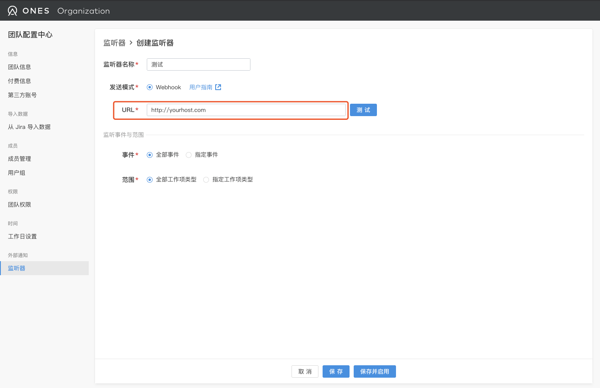

# webhook 用户指南

- [概述](#概述)
- [使用 webhook](#使用-webhook)
  - [前提条件](#前提条件)
  - <a href="#mymy">如何在 ONES 中启用 webhook</a>
  - <a href="#3">配置 webhook</a>
  - [场景示例](#场景示例)
- [消息重传机制](#消息重传机制)
- [消息类型](#消息类型)
- [消息体格式](#消息体格式)
- [消息示例](#消息示例)
  - [事件通知消息](#事件通知消息)
  - [心跳消息](#心跳消息)
  - [应答消息](#应答消息)

## 概述

webhook 是 ONES 系统的外部事件通知机制的实现。用户提供 webhook 钩子的地址，并且实现简单的消息应答，就可以使用 webhook 来获取系统中发生的事件的通知。

## 使用 webhook

### 前提条件

要使用我们的 webhook 通知，需要提供一个 http 服务并实现一个 post 接口。此接口需要在收到消息后返回一个确认消息。若收不到返回的确认消息，我们的 webhook 将尝试进行重发。在一定时间内若收不到任何确认，
则不再发送通知消息，并将自己的状态设置为未启用。此时，需要在配置页面手动重新启用后，webhook 才能正常工作。

关于消息格式与确认消息的格式，请参考[消息体格式](#消息体格式)。

关于消息重传与停止/重新发送的技术细节，请参考[消息重传机制](#消息重传机制)。

### 如何在 ONES 中启用 webhook

<div id="mymy">请联系我们的服务人员，我们会对您的部署实例进行升级、配置。</div>

### 配置 webhook

<div id="3"> webhook 的配置非常简单，用户只需要在配置页面中新建 webhook 钩子，并指定自己实现的web接口地址就可以了。</div>



我们也提供通知的过滤。用户可以在配置页面根据实际情况选择只接受满足哪些条件的通知消息。


配置的过程中，可以对接收端进行测试。

配置完成后，可以点击“保存并启用”来启动 webhook 通知。

### 场景示例

打通项目管理平台 ONES 与内部通讯平台
您的公司使用一个统一的通讯平台，希望能够在平台上接入我们的通知消息。当 ONES 系统中发生您觉得需要通知给干系人的事件以后，将事件通知到有关的人员。

这种情况下，您可以实现一个简单的 web 接口并在 ONES 中配置 webhook。当收到我们的通知消息后，将消息进行处理后对接到您的通知平台上。

## 消息重传机制

用户需要在其钩子 api 上实现简单的消息应答协议。用户的 webhook 钩子收到消息后，需要将消息中的 ID 返回，这是为了让我们的消息尽可能送达。通过获取送达的消息的 ID，我们可以实现在网络环境不佳导致消息未送达时的消息重发。

目前我们的重试策略是：5 秒内未收到应答即重发，每个消息最大重发数量是 3 次。

若 webhook 在一定的时间（30 分钟）内，未能收到任意一笔消息的应答（系统没有产生通知时，我们会每 5 分钟发送一次心跳消息），我们认为对端的 web 服务已经失效，将停止发送通知。一旦发生这种情况，
则需要用户手动的在配置页面重新启用此 webhook。

## 消息类型

我们将发送两种消息:

&emsp;&emsp;系统产生的通知；

&emsp;&emsp;用于定时检测接口有效性的心跳消息；

用户无论是收到的系统通知，还是心跳消息，都需要返回其 ID。如果未收到返回消息，则判定当前消息发送失败。

接收通知消息的服务可以按照需要继续处理，心跳消息可以直接应答后抛弃。通知消息和心跳消息都是 json 标准的字符串。

我们在消息中提供了部分描述信息，以便于用户的使用。根据这些描述信息，用户可以直接得到一个可读性高的消息（与我们在微信或者 ONES 网页右上角收到的通知一样），而不需要根据某些 ID 去查询其对应的值。

## 消息体格式

| 字段名   | 类型      | 说明                                       |
| :------- | :-------- | :----------------------------------------- |
| id       | string    | 消息体唯一标识 16 位                       |
| messages | []message | 消息体数组(目前消息推送只支持推送单条消息) |

`message`

| 字段名          | 类型   | 说明                                |
| :-------------- | :----- | :---------------------------------- |
| from_user       | user   | 消息来源                            |
| to_users        | []user | ONES 系统内的配置的消息通知列表     |
| title           | string | 消息标题：格式 [团队名称]工作项名称 |
| desc            | string | 消息描述 格式：`who [do_what]`      |
| url             | string | 工作项 url 地址                     |
| task_uuid       | string | 工作项 UUID                         |
| issue_type_uuid | string | 工作项类型 UUID                     |
| issue_type_name | string | 作项类型名称                        |
| event_type      | string | 事件类型                            |
| event_name      | string | 事件名称                            |
| raw_message     | raw    | ONES 系统中消息体                   |

`user`

| 字段名 | 类型   | 说明      |
| :----- | :----- | :-------- |
| uuid   | string | 用户 UUID |
| name   | string | 用户名称  |

`raw`

| 字段名                    | 类型   | 说明                                                                                                                                                   |
| :------------------------ | :----- | :----------------------------------------------------------------------------------------------------------------------------------------------------- |
| uuid                      | string | message uuid                                                                                                                                           |
| team_uuid                 | string | 团队 uuid                                                                                                                                              |
| ref_type                  | string | 消息引用类型：<br/>task：工作项<br/>project：项目                                                                                                      |
| ref_id                    | string | 消息引用类型的 uuid：<br/>如果"ref_type"是"task"的话，那么"ref_id"的值就是工作项 uuid<br/>如果"ref_type"是"project"的话，那么"ref_id"的值就是项目 uuid |
| type                      | string | 消息类型：<br/>discussion：评论类型动态<br/>system：系统类型动态                                                                                       |
| from                      | string | 谁发送的消息：<br/>BOT：代表系统                                                                                                                       |
| to                        | string | 操作的实体：某个工作项或者某个项目                                                                                                                     |
| send_time                 | int64  | 发送时间 ，单位微秒                                                                                                                                    |
| text                      | string | 当"type"为"discussion"才有，评论的内容                                                                                                                 |
| is_can_show_richtext_diff | bool   | 是否能查看工作项描述的 diff                                                                                                                            |
| subject_type              | string | 一般值为"user"                                                                                                                                         |
| subject_id                | string | 操作人 uuid                                                                                                                                            |
| action                    | string | 操作类型：<br/>add：新增<br/>update：更新<br/>delete:删除<br/>move:移动<br/>copy:复制                                                                  |
| object_type               | string | 消息实体 uuid                                                                                                                                          |
| object_name               | string | 消息实体名称                                                                                                                                           |
| object_attr               | string | 消息实体属性                                                                                                                                           |
| new_value                 | string | 更新后的值                                                                                                                                             |
| ext                       | ext    | 修改数据说明                                                                                                                                           |

`ext`

| 字段名              | 类型   | 说明                    |
| :------------------ | :----- | :---------------------- |
| field_uuid          | string | 属性 UUID               |
| field_name          | string | 属性名称，omitempty     |
| field_type          | int    | 属性类型                |
| old_value           | string | 属性旧值                |
| new_value           | string | 属性新值                |
| old_option          | desc   | 旧属性项，omitempty     |
| new_option          | desc   | 新属性项，omitempty     |
| new_multi_option    | []desc | 旧属性项列表，omitempty |
| old_multi_option    | []desc | 新属性项列表，omitempty |
| batch_action        | string | 批处理动作              |
| parent_message_uuid | string | 主消息 UUID             |
| trigger_task_uuid   | string | 触发工作项 UUID         |
| trigger_task_title  | string | 触发工作项标题          |

`desc`

| 字段名 | 类型   | 说明 |
| :----- | :----- | :--- |
| uuid   | string | UUID |
| name   | string | 名称 |

## 消息示例

### 事件通知消息

```json
{
  "id": "SWzhDqzxDDzgsJPB",
  "messages": [
    {
      "from_user": {
        "uuid": "6ZpgEzkk",
        "name": "Lyon"
      },
      "to_users": [],
      "title": "[onePiece]title a",
      "desc": "Lyon modify attribute from status to planned",
      "url": "https://xxxxxxx/#/team/BDfDqJU7/project/6ZpgEzkkmkvOVIU6/issue_type/GwNxpqQh/task/6ZpgEzkkUmmWMLeg",
      "task_uuid": "6ZpgEzkkUmmWMLeg",
      "issue_type_uuid": "GwNxpqQh",
      "issue_type_name": "Requirement",
      "event_type": "update_task_status",
      "event_name": "update task status",
      "raw_message": {
        "uuid": "P6KGV72t",
        "team_uuid": "BDfDqJU7",
        "ref_type": "project",
        "ref_id": "6ZpgEzkkmkvOVIU6",
        "type": "system",
        "from": "BOT",
        "to": "6ZpgEzkkmkvOVIU6",
        "send_time": 1583152234311552,
        "subject_type": "user",
        "subject_id": "6ZpgEzkk",
        "action": "update",
        "object_type": "task",
        "object_id": "6ZpgEzkkUmmWMLeg",
        "object_name": "title a",
        "object_attr": "field",
        "old_value": "SriNNDVw",
        "new_value": "FXapje9B",
        "ext": {
          "field_name": "status",
          "field_type": 12,
          "field_uuid": "field005",
          "new_option": {
            "name": "planned",
            "uuid": "FXapje9B"
          },
          "new_value": "",
          "old_option": {
            "name": "in progress",
            "uuid": "SriNNDVw"
          },
          "old_value": "",
          "parent_message_uuid": "FBRsgsj3"
        },
        "is_can_show_richtext_diff": false
      }
    }
  ]
}
```

### 心跳消息

```json
{
  "id": "hhqS4Wa3UQYJeHZv"
}
```

### 应答消息

直接以字符串写入应答的消息体

```text
hhqS4Wa3UQYJeHZv
```

在使用时应尽量关注心跳答复，如遇到 webhook 没有发送消息时，可以先查看心跳是否正常。
