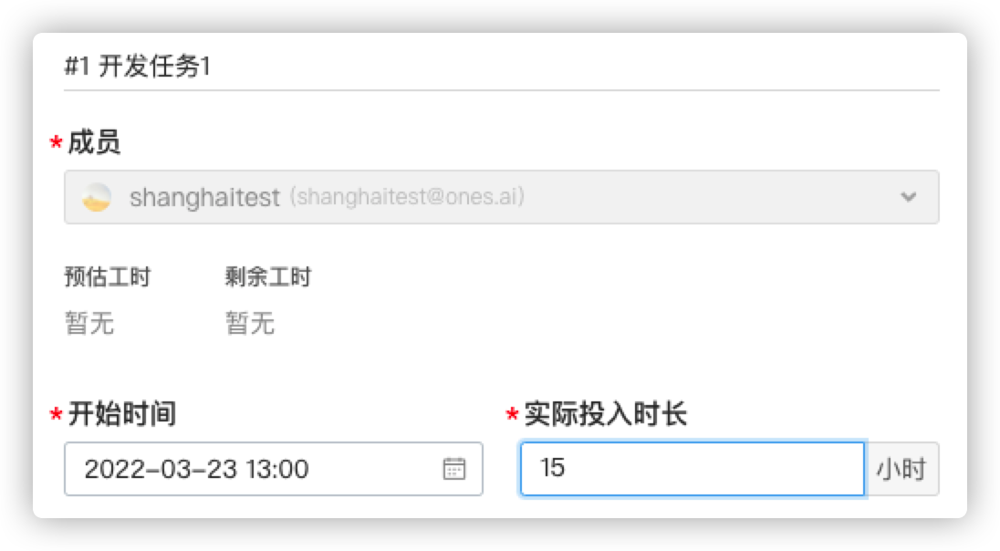

# 3. 分部门统计工时

> 插件示例地址：[分部门统计工时](https://gitlab.partner.ones.ai/example/manhourstatistics)

## 目标

通过一个业务实现较为复杂的插件实现，演示如何使用“脚本属性-数字”来满足标准系统的定制需求；

在此过程中，我们将会：

- 了解如何使用业务开放能力；
- 在插件代码中，调用标准系统的接口，获取标准系统数据（工时数据、人员数据）等；
- 了解如何初始化插件的数据表，并进行读写操作；

## 需求

背景说明：

- 某公司有两个分公司协同工作，他们都使用 ONES 登记工时；
- 两地的人员常常会基于同一个任务单进行开发工作，并登记自己的工时；

需求描述：

- 作为项目管理员，我希望能够在每个工作项中，看到分属不同大部门（上海、深圳团队）的同事分别登记的工时的总数；

## 产品设计方案


## 技术实现方案

1、插件启用时候创建脚本属性"深圳工时"、"上海工时"，脚本属性类型为 1009（浮点型）

2、使用业务开放能力”插件承载脚本属性 - 数字“

3、在对应的文件编写脚本属性的业务逻辑

## 实现过程

### 插件实例

https://gitlab.partner.ones.ai/example/manhourstatistics

1、在 plugin.yaml 中声明使用该能力

```yaml
abilities:
  - id: qRUFfcomn
    name: 上海工时浮点型脚本属性
    version: 1.0.0
    abilityType: ScriptFieldFloat
    function:
      calcFieldValue: calcShangHai
    config:
      - key: FieldName
        value: 上海工时
        fieldType: Input
        show: false
  - id: qRUFWEsa
    name: 深圳工时浮点型脚本属性
    version: 1.0.0
    abilityType: ScriptFieldFloat
    function:
      calcFieldValue: calcShenZhen
    config:
      - key: FieldName
        value: 深圳工时
        fieldType: Input
        show: false
```

每个 calcFieldValue 对应的方法请求格式和返回格式如下，

```javascript
// 示例方法 脚本浮点型的计算方法
// 一次计算多个task的field_uuid
// 请求的格式：
    {
         fieldUUID: "xxx",
         taskUUIDs: ["taskuuid1", "taskuuid2"]
    }

// 返回的格式：
 {
    values: [
        {
             taskUUID: "taskuuid1",
             value: 1.2
         },
         {
             taskUUID: "taskuuid2",
             value: 2.3
         },
     ]
 }
```

## 代码

在`scriptfieldnumber.ts`中编写如下代码

```javascript
import {PluginRequest, PluginResponse} from "@ones-op/node-types";
import {fetchONES} from "@ones-op/node-fetch";


//上海工时统计
export const calcShangHai = async (request: PluginRequest): Promise<PluginResponse> => {
    const body = request?.body as any
    // 工作项uuid 列表
    let taskUUIDs = body.taskUUIDs
    //工时字段
    let fieldUUID = body.fieldUUID

    //统计公司在上海的员工 工作项工时
    let returnValue = await calcManHours(taskUUIDs, fieldUUID, "上海") as any
    return {
        body: {
            code: 200,
            body: {
                values: returnValue
            }
        }
    }
}

//深圳工时统计
export const calcShenZhen = async (request: PluginRequest): Promise<PluginResponse> => {
    const body = request?.body as any
    // 工作项uuid 列表
    let taskUUIDs = body.taskUUIDs
    //工时字段
    let fieldUUID = body.fieldUUID

    //统计公司在深圳的员工 工作项工时
    let returnValue = await calcManHours(taskUUIDs, fieldUUID, "深圳") as any
    return {
        body: {
            code: 200,
            body: {
                values: returnValue
            }
        }
    }
}

//统计工时方法
async function calcManHours(taskUUIDs: any [], fieldUUID: string,departmentName: string) {

    // 返回统计工时结果
    let returnValue: any[] = []
    //graphql语句拼接
    let queryContent = `{
            tasks(filter: {uuid_in:$taskUUIDS})
            {
                uuid
                manhours{
                hours
                owner {
                    company
                }
            }
            }
        }`
    let variables = { taskUUIDS:taskUUIDs }
    //获取工作项具体工时信息
    const response = await fetchONES(
        {
            path: `/team/${globalThis.onesEnv.teamUUID}/items/graphql`,
            method: 'POST',
            body: {
                query: queryContent,
                variables: variables,
            },
            root: true,
        }
    )

    if (response != null) {
        let manhours = 0
        let res = JSON.parse(JSON.stringify(response));
        let tasks = res.body.data.tasks
        let tasksLength = tasks.length
        if(fieldUUID && tasksLength > 0){
            // console.log("查询到的工作项数目：", tasksLength)
            for (let i = 0; i < tasksLength; i++) {
                manhours = 0
                let manhoursLength = tasks[i].manhours.length //任务项下登记工时数量
                console.log("任务项" + (i + 1) + "下登记工时数量：", manhoursLength)
                for (let j = 0; j < manhoursLength; j++) {
                    //如果查询到的公司名称跟数据库保持的一致，就往对应地区增加工时
                    if (tasks[i].manhours[j].owner.company.includes(departmentName)) {
                        manhours += tasks[i].manhours[j].hours
                    }
                }
                //该能力需要返回的是一个数组对象，每个对象中的属性分别是任务的uuid，还有被统计到的值
                let task = {
                    taskUUID: tasks[i].uuid,
                    value: manhours
                }
                //往数组中添加已经计算好的工作项工时
                returnValue.push(task)
            }
        }
    }
    //如果没有查询到工作项工时，就返回空数组
    if (returnValue == [] || returnValue == null) {
        for (let taskUUID of taskUUIDs) {
            returnValue.push({
                taskUUID: taskUUID,
                manHours: 0
            })
        }
    }
    return returnValue
}

```

### 操作步骤

插件安装并且启用后会在工作项属性中显示“上海工时”和“深圳工时”两个脚本属性，


添加登记人公司信息为：”深圳公司”和“上海公司”


在某个项目下的项目的项目配置中选择工作项类型，点击”任务”工作项的“属性与视图”选项，进到如下图页面，点击”添加工作项属性”按钮，


将两个脚本属性添加到该工作项下，


新建一个新的任务时候我们就可以发现，新的脚本属性已经显示到该工作项下了


点击登记工时，这里一共登记了 22 个小时，


脚本属性自动为该任务统计深圳员工的在该工作项的工时统计信息，并显示出来。


登记上海工时只需要用该部门的员工在该工作项下进行工时登记或修改即可，




