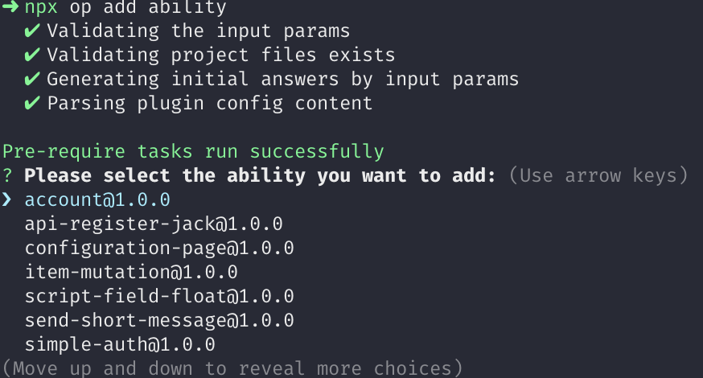

# 添加开放能力

> 插件开发视频教程: [插件开发入门](../examples/videos/start.mdx)

在插件工程根目录执行 `op` 的 `add ability` 指令，可以向插件新增开放能力：

```
npx op add ability
```



在列表中可以通过选择方向键选择接口相关能力或业务开放能力

## 开放能力列表

- [接口相关能力列表](../../abilities/api/index.md)
- [业务开放能力列表](../../abilities/bussiness/index.md)

## 开放能力添加示例

这里我们以 [简单登录校验](../../abilities/bussiness/simple-auth.md) 能力为例，当选择添加该能力后，可以看到在 `/config/plugin.yaml` 文件的 `abilities` 字段中新增了一项内容：

```yaml title="/config/plugin.yaml"
- id: Simple-login
  name: Simple-login
  version: 1.0.0
  abilityType: SimpleAuth
  function:
    validateFunc: SimpleAuthValidate
```

同时，在 `/backend/src` 目录下中，会为当前能力生成以下内容：

```ts title="/backend/src/index.ts"
// Append to the file
export * from './simple-auth'
```

```ts title="/backend/src/simple-auth.ts"
// Create a new file
import type { PluginRequest, PluginResponse } from '@ones-op/node-types'

// 示例方法 SimpleAuth 简单登录能力使用
export async function SimpleAuthValidate(request: PluginRequest): Promise<PluginResponse> {
  const { user_uuid } = request?.body as any
  if (!user_uuid) {
    return {
      body: {
        code: 400,
        reason: '缺少参数 user_uuid',
      },
    }
  }
  return {
    body: {
      code: 200,
      data: {
        uuid: user_uuid,
      },
    },
  }
}
```

可以看到，该方法固定返回一个用户 id，表示在每次方法调用时都会将该用户进行登录

当你在生产环境中使用这段代码时，将此用户 `id` 修改为真实存在的用户 `id` 即可

## 注意事项

在添加开放能力时会基于能力类型:

- 创建开放能力文件模板 (如添加 `simple-auth@1.0.0` 时创建 `/backend/src/simple-auth.ts`)
- 向 `/backend/src/index.ts` 添加对开放能力文件模板的引用
- 向 `workspace/plugin.sql` 添加对应的 `sql` 模板内容 (如添加 `system-db@1.0.0` 能力时)

需要注意的是，相同的开放能力可以多次或重复添加在插件工程中添加，在开放能力被重复添加时：

- 不会向插件工程中重复添加文件模板与 `sql` 模板内容
- 会添加开放能力的相关配置内容至 `config/plugin.yaml` 中
