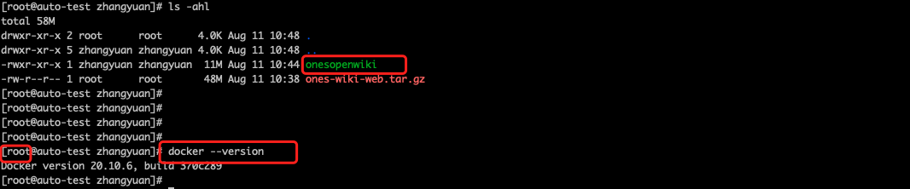
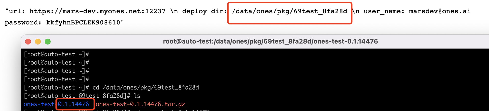
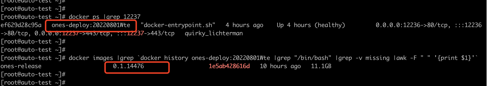
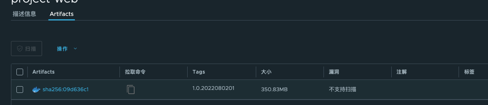

# 部署 开源 ONES

前文可知，我们 ONES 将 Project 和 Wiki 两部分都进行了开源。您可以根据您的需求对单一工程进行开发，也可以同时开发两个工程。并且，您能够进行本地构建，生成 tar 包。

本文介绍，如何使用运维工具，将 tar 包在您的生产(测试)环境中进行部署。考虑到，ONES 的客户环境包含：私有部署环境，高可用环境。下面，我们分别从这两种环境，详细介绍如何使用运维工具来部署 wiki-web（ones-project-web 同理）。

## 部署 wiki-web

### 私有部署环境

#### 前置条件

在开始之前，请进行以下准备工作：

- 私有部署环境设备：您已经拥有私有部署实例，后续相关操作都是在该实例设备上面进行，如 192.168.100.10。
- 前端定制 tar 包：本地构建所生成 tar 包，如 ones-wiki-web.tar.gz。
- 运维工具：该工具将 tar 包集成到私有部署环境，如 onesopenwiki。

前端定制 tar 包和运维工具，需上传到私有部署环境设备。有很多方式可以实现，常用的如 scp，xftp。如：

```bash
scp ones-wiki-web.tar.gz user_name@192.168.100.10:/home/user_name
scp onesopenwiki user_name@192.168.100.10:/home/user_name
```

确认权限。onesopenwiki 工具要有可执行权限。执行的用户（如下图 root），要有 docker 命令等权限。


#### 部署步骤

##### 执行 onesopenwiki 工具，生成 ones-release 新镜像

```bash
./onesopenwiki rebuild --wiki_web_tar=ones-wiki-web.x.x.x.tar.gz --ones_release_tag=xxx --ones_release_out_tag=xxx
```

• 您可以通过执行命令 ./onesopenwiki rebuild --help 获取帮助信息。

```bash
[root@auto-test zhangyuan]# ./onesopenwiki rebuild --help
Rebuild the new ones-release image based on the customer Wiki Web tar package

Usage:
  onesopenwiki rebuild [flags]

Flags:
      --ones_release_out_tag string   [option]Tag of output ones-release image, format：1.0.yyyymmddxx
      --ones_release_tag string       [require]Tag of input ones-release image
      --wiki_web_tar string           [require]Tar package of ONES.AI Wiki Web，suffix:.tar.gz
```

• wiki_web_tar，必填项，后缀格式要求：.tar.gz。该参数指定前端定制 tar 包。

• ones_release_tag 参数，必填项。私有部署环境所使用镜像 ones-release 的 tag。

通过 deploy dir 查看 ones-release 的 tag。

通过 docker 命令查看

• ones_release_out_tag 参数，非必填项。集成前端 tar 包后的 ones-release 新镜像的 tag。

用户可以自定义，格式要求：1.0.yyyymmddxx，均为数字，并且不能和现有的 ones-release 镜像 tag 重名。

执行日志如下：

```bash
#示例
[root@auto-test zhangyuan]# ./onesopenwiki rebuild --wiki_web_tar=ones-wiki-web.tar.gz  --ones_release_tag=0.1.14597
===================================================================================================================
2022-09-11 10:44:47
log: /tmp/ones_open_wiki.log
cmd.checkRedeploy:100 enter
input params:{OnesReleaseTag:0.1.14597 WikiWebTar:ones-wiki-web.tar.gz OnesReleaseOutTag: backReleaseOutTag:}
Auto generate params...
generate params:{OnesReleaseTag:0.1.14597 WikiWebTar:ones-wiki-web.tar.gz OnesReleaseOutTag:1.0.2022081100 backReleaseOutTag:1.0.2022081101}
cmd.checkRedeploy:152 success
workdir:/tmp/ones3003415399
cmd.renderBackDockerfile:155 enter
cmd.renderBackDockerfile:164 success
cmd.buildBackImage:185 enter
Backup image ones-release:0.1.14597 to ones-release:1.0.2022081101
cmd.buildBackImage:197 success
cmd.renderRedeployDockerfile:168 enter
cmd.renderRedeployDockerfile:181 success
cmd.buildRedeployImage:201 enter
Building image ones-release:1.0.2022081100
Building image will take several minutes,Please wait a moment...
cmd.buildRedeployImage:213 success
Please continue to execute the following command to deploy the new image:
	docker images | grep 1.0.2022081100
	enter deployment path(cd /data/ones/...)
	touch 1.0.2022081100.tar && sh upgrade.sh && rm -rf 1.0.2022081100.tar
To rollback the deployment image, execute the following command:
	docker images | grep 1.0.2022081101
	enter deployment path(cd /data/ones/...)
	touch 1.0.2022081101.tar && sh upgrade.sh && rm -rf 1.0.2022081101.tar
===================================================================================================================
```

##### 部署新镜像

分为两类：测试环境部署，生产环境部署。二者，流程是一样的，仅仅是对 tag 号的有不同的要求。

根据步骤 2 的提示，进行新镜像部署。首先 cd 进入部署路径，然后使用 upgrade.sh 进行新镜像部署。

示例执行如下：

```bash
#示例
[root@auto-test ~]# docker images | grep 1.0.2022080102
ones-release                     1.0.2022080102              269507c43b62   5 minutes ago   11.6GB
[root@auto-test ~]# cd /data/ones/pkg/69test_8fa28d
[root@auto-test 69test_8fa28d]# ls
ones-test-0.1.14476  ones-test-0.1.14476.tar.gz
[root@auto-test 69test_8fa28d]# cd ones-test-0.1.14476
[root@auto-test ones-test-0.1.14476]# ls *.sh
env.sh  ones-deploy.sh  private_check.sh  upgrade.sh
[root@auto-test ones-test-0.1.14476]# touch 1.0.2022080102.tar && sh upgrade.sh && rm -rf 1.0.2022080102.tar
Check version
 Umask is 0022, is ok
Disk space is ok
Local version: 1.0.2022080101  online version: 1.0.2022080102
New version found, confirm upgrade: Y/N
y
Start upgrade...
```

##### 验证效果

• 前端效果验证。验证客户的定制改动效果。
• docker 命令查看。

```bash
docker ps |grep 443
```

##### 回退

如果需要回退到之前的环境，那么根据步骤 2 的提示或者查看/tmp/ones_open.log 日志内容，执行相关命令来实现。

```bash
docker images | grep 1.0.2022081101
enter deployment path(cd /data/ones/...)
touch 1.0.2022081101.tar && sh upgrade.sh && rm -rf 1.0.2022081101.tar
```

## 高可用环境

### 前置条件

在开始之前，请进行以下准备工作：

- 高可用环境设备：k8s 操作机器，实现高可用的更新部署（如 192.168.100.10）。
- 前端定制 tar 包：本地构建&生成客户定制的 tar 包，如 ones-wiki-web.tar.gz。
- 运维工具：[docker](https://www.docker.com/products/docker-desktop/) 、onesopenwiki。

本地安装并配置好 dokcer 环境。google 搜索 docker，官网下载，进行安装。


确认权限。onesopenwiki 工具要有可执行权限。

### 部署步骤

#### 执行 onesopenproject 工具，生成本地镜像文件

```bash
./onesopenwiki webimage --wiki_web_out_tag=xxx --project_web_tar=ones-wiki-web.tar.gz
```

• 您可以通过执行命令 ./onesopenwiki webimage --help 获取帮助信息。

```bash
[root@auto-test zhangyuan]# ./onesopenwiki webimage --help
Build wiki_web image based on the customer Wiki Web tar package

Usage:
  onesopenwiki webimage [flags]

Flags:
      --wiki_web_out_tag string   [option]Tag of output wiki_web image, format：1.0.yyyymmddxx
      --wiki_web_tar string       [require]Tar package of ONES.AI Wiki Web，suffix:.tar.gz
```

• project_web_tar 参数，必填项，后缀格式要求：.tar.gz。该参数指定前端定制 tar 包。

该参数的获取，参考私有部署，

• wiki_web_out_tag 参数，非必填项。根据前端 tar 包，生成镜像 wiki-web 的 tag。

用户可以自定义，格式要求：1.0.yyyymmddxx，均为数字，并且不能和现有的 wiki-web 镜像 tag 重名。

• 执行该命令会生成生成本地镜像文件，可通过 docker images |grep xxx 查看

示例日志如下：

```bash
[root@auto-test zhangyuan]# ./onesopenwiki webimage --wiki_web_tar=ones-wiki-web.tar.gz
===================================================================================================================
2022-09-11 11:11:22
log: /tmp/ones_open_wiki.log
cmd.checkWebImage:51 enter
input params:{WikiWebTar:ones-wiki-web.tar.gz WikiWebOutTag:}
Auto generate params...
generate params:{WikiWebTar:ones-wiki-web.tar.gz WikiWebOutTag:1.0.2022081100}
cmd.checkWebImage:91  success
workdir:/tmp/ones685568270
cmd.renderWebImageDockerfile:126 enter
cmd.renderWebImageDockerfile:138 success
cmd.buildWebImageImage:142 enter
Building image wiki-web:1.0.2022081100
Building image will take several minutes,Please wait a moment...
cmd.buildWebImageImage:154 success
Show the generated image:
	docker images | grep 1.0.2022081100
===================================================================================================================

```

#### 将镜像推送到公共|私有仓库

如果镜像托管到公共仓库 Dockerhub，那么参考方式 a 推送到公共仓库；如果是客户私有仓库，参考方式 b 推送到私有仓库。

• 推送到公共仓库

```bash
docker tag wiki-web:1.0.2022080201 onestest/wiki-web:v1.0.0
docker push onestest/wiki-web:v1.0.0
```


• 推送到私有仓库

以私有仓库 192.168.1.100 为例

• 配置信任私有仓(可选)

```bash
#注意如果您的私有仓库带受信任https证书，则不需要修改 /etc/docker/daemon.json
vim /etc/docker/daemon.json
{
    "insecure-registers":[
        "192.168.1.100"
    ]
}

systemctl restart docker
```

• 登录私有仓库

```bash
#u 为登录的用户账号;p 为该用户密码。要求登录的账号具有镜像推送的权限。
docker login 192.168.1.100 -u xxx -p xxx
```

• 推送到私有仓库

```bash
docker tag wiki-web:1.0.2022080201  192.168.1.100/项目/wiki-web:v1.0.2
docker push 192.168.1.100/项目/wiki-web:v1.0.2
```

登录 [项目的仓库](https://192.168.1.100/) ，查看刚才上传的镜像文件


#### 高可用部署

登录到 k8s 操作机，执行以下步骤，实现滚动更新操作。

```bash
#配置文件优先级说明: config/private.yaml > config/public.yaml > default/config.yaml
#修改config/private.yaml。添加or修改 wikiWebImage
# wikiWebImage: 192.168.1.100/项目/wiki-web:v1.0.2
vi /data/ones/ones-ai-k8s/config/private.yaml
# 重新部署高可用环境
make setup-ones
```

#### 效果

• 查看 wiki-web 镜像的版本。

```bash
kubectl -n ones-namespace  get pods -o yaml |grep image |grep wiki-web
```

• 前端效果验证

#### 回退

如果需要回退此次部署，可通过滚动更新操作。

```bash
#将3改动还原回去
vi /data/ones/ones-ai-k8s/config/private.yaml
# 更新操作
make setup-ones
```

## 部署 ones-project-web

您只需将 ones-wiki-web.tar.gz 替换成 ones-ai-web.tar.gz，运维工具 从 onesopenwiki 改为 onesopenproject。

高可用环境，配置项 wikiWebImage 改为 projectWebImage。

其他流程按照上述文档操作即可。
