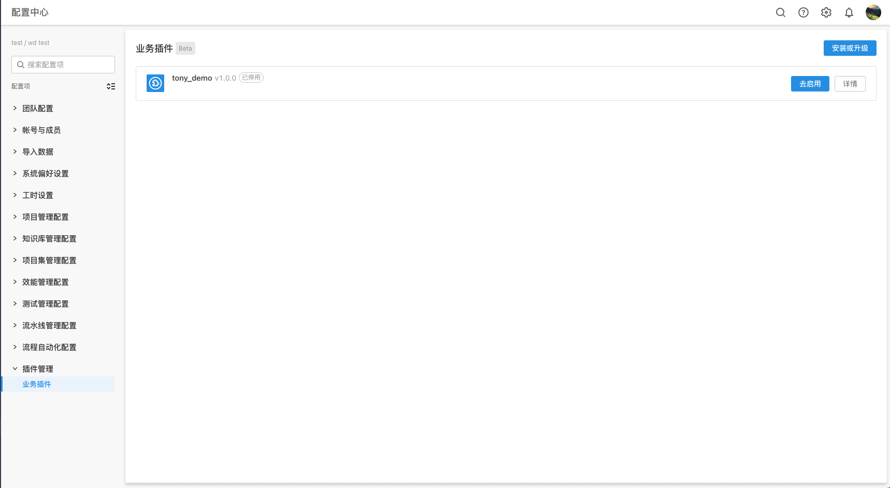

import Image from '@theme/IdealImage'

# 持续集成

## 概述

在插件工程初始化的时候，ONES CLI 预先帮你做了`git`的初始化。我们推荐你使用 GitLab 来托管你的工程代码，并且使用 GitLab CI/CD 来构建你插件工程的持续集成方案。所以接下来的文档教程都是基于`GitLab 插件持续集成方案`编写的。

## 使用

### 前置条件

- Gitlab 上已经配置了流水线项目
- 你拥有项目的维护者或所有者角色。

### 初始化

使用 ONES CLI 初始化的插件工程会生成两份与 GitLab CI/CD 相关的配置。`.gitlab-ci.yml` 和 `config/ci-deploy.yaml`。

#### .gitlab-ci.yml

插件工程内的 `.gitlab-ci.yml` 预配置内容，会去触发我们提供的流水线项目，该流水线会帮你把生成的插件包部署到对应的 ONES 实例环境上。其余的配置方式可以参考[.gitlab-ci.yml](https://docs.gitlab.cn/jh/ci/yaml/gitlab_ci_yaml.html)。

#### ci-deploy.yaml

`ci-deploy.yaml`这个文件的主要作用是**设置 GitLab 流水线运行时所需要的参数**。

### 第一步：连接 ONES

因为流水线会帮你把生成的插件包部署到对应的 ONES 环境，所以需要先连接到 ONES。在插件工程的根目录下执行以下命令：

```bash
npx op ci
```

在连接过程中会有以下交互式问答:

```bash
Branch name: master
? Please enter the environment base URL: https://ones.cn
? Username: test@ones.cn
? Password: [hidden]
  ✔ Converting CI deployment params
  ✔ Validating CI deployment params
  ✔ Updating configuration into config/ci-deploy.yaml
✔ Successfully updated CI deployment configuration
Now you can commit your changes to the remote repository and deploy your project
? Do you want to execute 'npx op pickteam' for update team information into config file? (Y/n)
```

**输入参数释义：**

- **branch name (master):** 选择的分支名称，选择默认的 master 即可
- **base URL:** ONES 地址
- **username:** ONES 账号
- **password:** ONES 密码

参数输入完成并校验成功之后，会继续询问你是否需要执行`pickteam`指令进行团队选择操作，当然你也可以在后面手动执行`npx op pickteam ci` 来选择团队。

:::caution 提示
执行`npx op pickteam ci`后会需要你输入一个 branchName，这时你选择`default`就行。
:::

上述操作完成之后，op 工具会回写一些配置到工程下的`config/ci-deploy.yaml` 文件，**切勿手动修改该配置**。配置如下所示:

```yaml title="ci-deploy.yaml"
default:
  host: https://ones.cn
  username: test@ones.cn
  password: test1234
  ones-check-id: 6vjJcr4L
  ones-check-point: team
  ones-plugin-id: JefbDHq5
  team_uuid: 6vjJcr4L
```

至此连接 ONES 完成

### 第二步：凭证信息脱敏

`/config/ci-deploy.yaml` 文件中会明文存储用户凭证。当你不想明文存储凭证时，你可以将用户凭证添加到[CI/CD variable](https://gitlab.plugins.myones.net/help/ci/variables/index.md#add-a-cicd-variable-to-a-project)。

进入 GitLab 的 【Settings】选择 【CI/CD】然后在页面上找到【Variables】对凭证信息进行配置

<Image img={require('./variable.png')} />

:::caution 注意
Gitlab CI/CD Variable 配置的 Key 必须与配置文件中保持一致
:::

随后将插件工程中`config/ci-deploy.yaml` 中对应字段进行替换，如 username 和 password 字段

```yaml title="ci-deploy.yaml"
default:
  host: https://ones.cn
  username: ${username}
  password: ${password}
  ones-check-id: 6vjJcr4L
  ones-check-point: team
  ones-plugin-id: JefbDHq5
  team_uuid: 6vjJcr4L
```

### 第三步：推送代码，触发流水线

你每次将代码推送到远端仓库，都会触发 GitLab 的流水线任务

进入 GitLab 的 【CI/CD】选择 [Pipelines] 则可以看到刚刚推送触发的流水线任务。如下图:

<Image img={require('./pipeline.png')} />

### 第四步：使用插件

当所有流水线任务成功之后，你可以到对应的 ONES 环境中找到你的插件愉快的使用它了。

