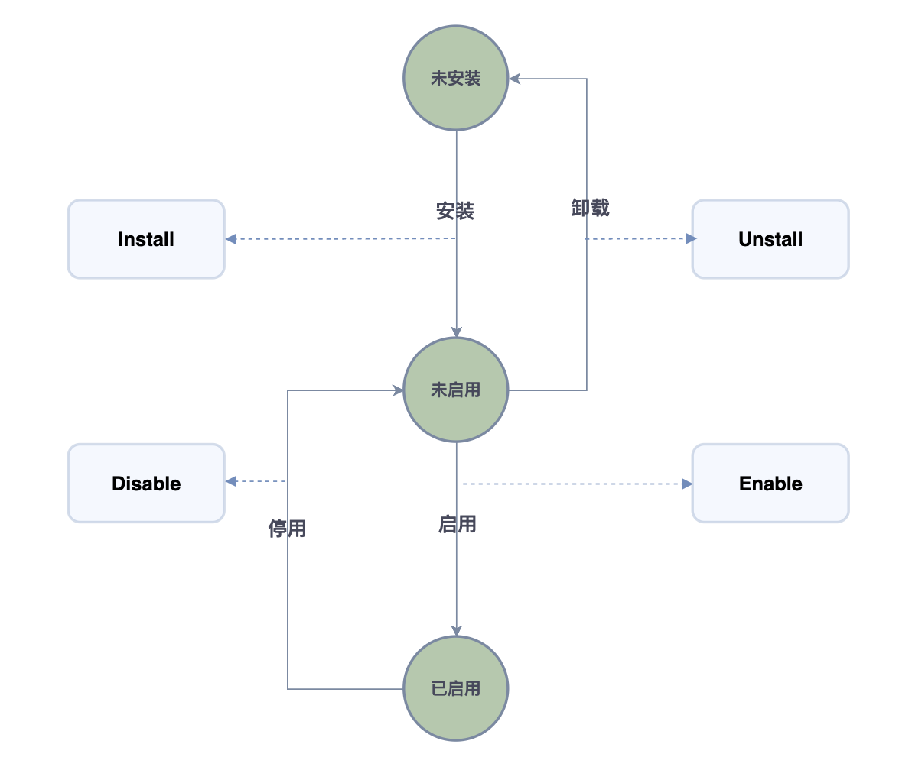

# 插件生命周期

## 概述

插件的生命周期是指插件在 ONES 中上传到卸载整个阶段的完整过程。从插件上传至 ONES 实例开始，插件的状态流转如下图所示。插件的状态会在用户进行安装、启用等操作时发生改变。而在插件状态改变时会运行生命周期函数，开发者可以在生命周期函数添加自己的代码来实现业务逻辑。



## 生命周期方法

插件的生命周期方法分为组织级别和团队级别两种，根据插件的类型在生命周期中调用对应的方法，其中团队级别的生命周期方法是：`Install`, `Enable`, `Disable`, `UnInstall`, `Upgrade`, `Start`, `Stop`。而组织级别的生命周期方法是：`OrgInstall`, `OrgEnable`,`OrgDisable`, `OrgUnInstall`, `OrgUpgrade`, `Start`, `Stop`。其中 `Start` 和 `Stop` 方法在两种级别的插件中是相同的。

### 使用生命周期方法

生命周期方法声明在插件工程的`/backend/src/index.ts`文件中，每个插件工程在初始化时，会预先生成生命周期函数的模版。

**方法模版：**

```typescript
// Method called when the team level plugin is being installed.
export async function Install() {
  Logger.info('[Plugin] Install')
}

// Method called when the team level plugin is being launched.
export async function Enable() {
  Logger.info('[Plugin] Enable')
}

// Method called when the team level plugin is being suspended.
export function Disable() {
  Logger.info('[Plugin] Disable')
}

// Method called when the team level plugin is being uninstalled.
export function UnInstall() {
  Logger.info('[Plugin] UnInstall')
}

// Method called when the team level plugin is being upgraded.
export function Upgrade(oldPluginInfo) {
  const oldVersion = oldPluginInfo.version
  Logger.info('[Plugin] Upgrade', 'old version:', oldVersion)
}

// Method called when the organization level plugin is being installed.
export async function OrgInstall(
  request: PluginRequest,
  teamUUIDList: string[],
  firstInstall: boolean
) {
  Logger.info('[Plugin] OrgInstall')
}

// Method called when the organization level plugin is being launched.
export function OrgEnable(
  request: PluginRequest,
  teamUUIDList: string[]
): void | string[] | Promise<string[]> {
  Logger.info('[Plugin] OrgEnable')
  return []
}

// Method called when the organization level plugin is being suspended.
export function OrgDisable(
  request: PluginRequest,
  teamUUIDList: string[]
): void | string[] | Promise<string[]> {
  Logger.info('[Plugin] OrgDisable')
  return []
}

// Method called when the organization level plugin is being uninstalled.
export function OrgUnInstall(request: PluginRequest, teamUUIDList: string[]) {
  Logger.info('[Plugin] OrgUnInstall')
}
s

// Method called when the organization level plugin is being upgraded.
export function OrgUpgrade(request: PluginRequest, teamUUIDList: string[]) {
  Logger.info('[Plugin] OrgUpgrade')
}
```

**组织级别插件生命周期方法参数介绍：**

| 名称         | 类型          | 说明                                                                                                              |
| ------------ | ------------- | ----------------------------------------------------------------------------------------------------------------- |
| request      | PluginRequest | 请求发起者的相关信息和环境信息，例如触发插件事件用户的 `uuid`、`token` 和 ONES 系统当前语言（多语言相关）等信息。 |
| teamUUIDList | string[]      | 本次启用的目标团队 UUID 列表，组织级别插件在启用时，会作用到具体的团队上，该列表中存放的团队就是待生效的团队。    |

#### 注意事项

1. `Enable` 和 `Disable` 方法中的操作必须是幂等的。
2. 不应该在生命周期方法中执行耗时较久的操作。
