# Account

## 应用背景

支持第三方系统登录、同步用户信息和发送消息等；

本文示例使用钉钉作为第三方接入系统，相关资料的官方链接如下，

> https://open.dingtalk.com/document/orgapp-server/tutorial-obtaining-user-personal-information 钉钉实现登录第三方网站
>
> https://open.dingtalk.com/document/orgapp-server/scan-qr-code-to-log-on-to-third-party-websites 扫码登录第三方网站
>
> https://open.dingtalk.com/document/orgapp-server/obtain-orgapp-token 获取企业内部应用的 access_token
>
> https://open.dingtalk.com/document/orgapp-server/obtain-the-user-information-based-on-the-sns-temporary-authorization 根据 sns 临时授权码获取用户信息

## 功能相关

涉及到的业务开放能力：Account

## 示例地址

[Account-SSO](https://gitlab.partner.ones.ai/example/account-sso)

## 适用版本

ONES 3.6.0+

## 操作步骤与代码设计

### 能力声明

在 plugin.yaml 插件配置文件中添加如下代码，

```yaml
apis:
  - function: DoExchangeUser
    methods:
      - POST
    type: addition
    url: /DoExchangeUser
abilities:
  - id: LKJHgdfsx
    name: account
    abilityType: account
    version: 1.0.0
    function:
      createLoginUrl: CreateLoginUrl # 创建重定向登录URL
      doExchangeUser: DoExchangeUser # 确认登录用户信息
      doPullData: DoPullData # 同步第三方系统用户数据
      sendMessage: SendMessage # 发送消息
    config:
      # 是否实现了登录功能
      - key: canLogin
        show: false
        value: true
      # 是否实现了同步功能
      - key: canSync
        show: false
        value: true
      # 是否实现了发送消息的功能
      - key: canMessage
        show: false
        value: true
      # 第三方登录的logo地址，写的是文件名，要求该文件放在前端资源根目录下，web/dist/
      - key: logo
        show: false
        value: logo.svg
      # 第三方登录名称文案
      - key: title
        show: false
        value: Account-SSO
      # 第三方描述文案
      - key: desc
        show: false
        value: Account-SSO
      # 第三方详情提醒文案
      - key: detailTip
        show: false
        value: Account-SSO
      # 第三方配置提醒文案
      - key: configTip
        show: false
        value: Account-SSO
```

### 第三方系统接入

#### **前提条件**

1. 注册钉钉

   ​ 登录企业钉钉（此步骤不提供详细操作）

2. 创建 H5 微应用

   ​ 钉钉 OAuth2.0 授权登录让钉钉用户使用钉钉身份安全登录 ONES，在钉钉用户授权登录已接入钉钉 OAuth2.0 后，插件可以获取到用户的接口调用凭证 sns_token，通过 sns_token 可以进行钉钉开放平台授权关系接口调用，从而实现获取钉钉用户基本开放信息和帮助用户实现基础开放功能等。

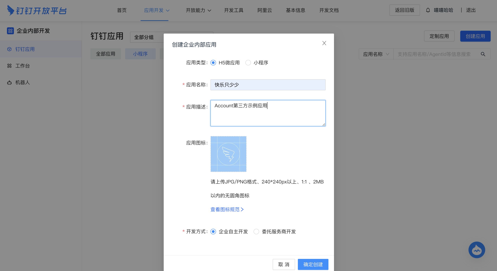

创建成功后，在应用界面下方找到应用信息，并记录钉钉企业内部应用的 AgentId、AppKey、AppSecret。

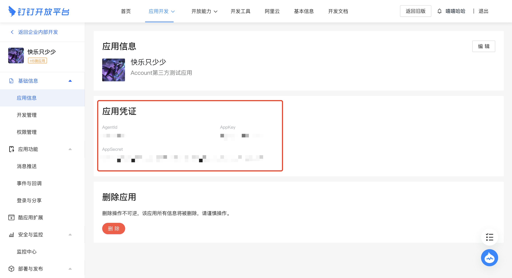

在应用界面下方找到 `应用功能 -> 登录与分享 -> 接入登录`，在输入框中填写的域名就是钉钉扫码登录后回调的**ONES 实例域名**。

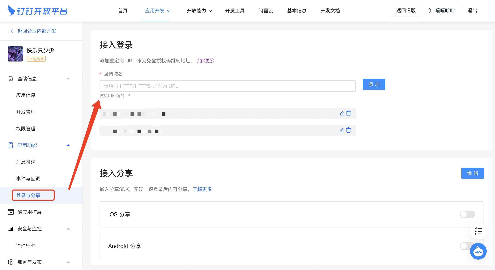

插件安装后，在组织管理-第三方集成中点击"添加第三方集成"，并且把用户目录同步、登录验证和消息通知打开，

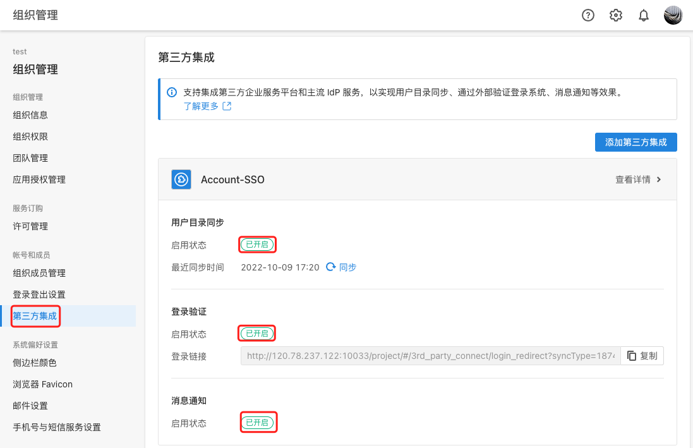

#### 用户登录

第三方用户登录时序图如下，

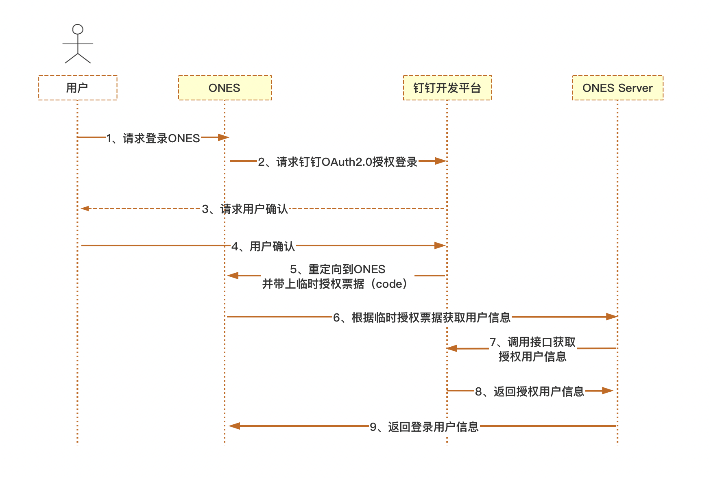

进入 ONES 的登录界面后，点击插件提供的钉钉扫码登录入口，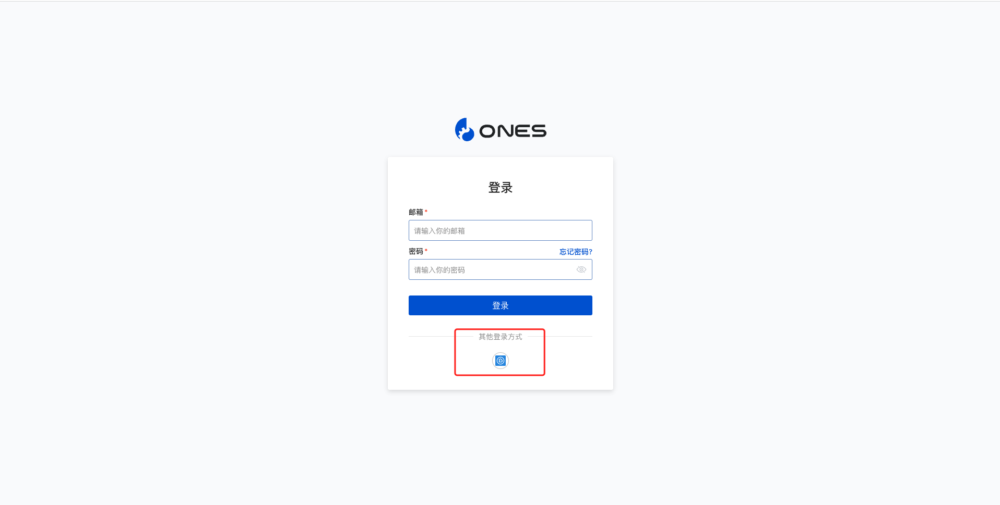

使用钉钉扫码登录，


在手机上确认授权登录，

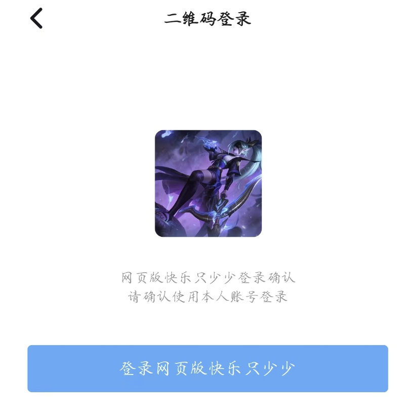

通过前面的操作步骤，开发者已经完成了时序图中第一步到第四步的操作步骤，而这些的操作步骤的具体实现是在插件代码中的`CreateLoginUrl()`方法内，

:::caution 注意

- 每次点击插件提供的钉钉扫码登录入口，都会先进入到`CreateLoginUrl()`方法内部，该方法的主要作用是创建第三方登录的 URL，URL 的构建格式可以参考[钉钉扫码登录](https://open.dingtalk.com/document/orgapp-server/scan-qr-code-to-log-on-to-third-party-websites)。
- `CreateLoginUrl()`方法中的请求头 Request 已经包含重定向 ONES 的 URL，使用以下代码可以对重定向 URL 进行 urlencode 编码。

:::

```tsx
type CreateLoginUrlResponse = {
  url: string
}

// Login
export async function CreateLoginUrl(request: PluginRequest): Promise<PluginResponse> {
  Logger.info('Welcome to Login')
  let respUrl: string = ''
  let response: CreateLoginUrlResponse = {
    url: '',
  }
  if (typeof request?.body == 'object' && !Array.isArray(request?.body)) {
    // 重定向url
    let redirectUrl: string = request?.body.redirect_url
    Logger.info('redirectUrl:', redirectUrl)
    // 登录url
    let loginUrl = new URL(DindDing_LoginURL)
    loginUrl.searchParams.append('response_type', 'code')
    loginUrl.searchParams.append('scope', 'snsapi_login')
    loginUrl.searchParams.append('state', 'STATE')
    loginUrl.searchParams.append('appid', AppKey) // AppKey
    loginUrl.searchParams.append('redirect_uri', redirectUrl) // 请求头传进来的，重定向URL
    // 返回的url
    respUrl = loginUrl.toString()
    Logger.info('respUrl: ', respUrl)
    response.url = respUrl
    return CreateLoginUrlRespData(200, '200', '', '', '', response)
  }
  return CreateLoginUrlRespData(500, '', '', '', '', response)
}
```

:::caution 注意

- 经过扫码获得临时授权后，页面会回调到 ONES 的登录界面，接下来需要开发者在`DoExchangeUser()`方法中实现根据临时授权票据获取用户信息、调用接口获取授权用户信息和返回登录用户信息等操作步骤，调用的相关接口信息可以参考——[根据 sns 临时授权码获取用户信息](https://open.dingtalk.com/document/orgapp-server/obtain-the-user-information-based-on-the-sns-temporary-authorization)。
- 在钉钉回调到 ONES 登录界面后时，临时授权 code 可以在`DoExchangeUser()`方法的请求头 Request 里得到，当用户信息按照代码中的`DoExchangeUserResponse`的格式返回后，第三方系统用户即可成功登录 ONES。

:::

```tsx
// 确认登录用户
export async function DoExchangeUser(request: PluginRequest): Promise<PluginResponse> {
  Logger.info('DoExchangeUser Come in')
  let resp: DoExchangeUserResponse = {
    third_party_id: '',
    name: '',
    title: '',
    avatar: '',
    email: '',
    phone: '',
  }
  Logger.info('Request:', request?.body)

  // 解析请求体，解析出code
  let code: string = getCode(request)
  Logger.info('Request Code:', code)

  // 获取应用token
  let token = await getToken()
  if (token == '') {
    return DoExchangeUserRespData(500, '', '', 'token missing', 'plugin', resp)
  }
  Logger.info('Token:', token)

  // 通过临时授权码获得用户UnionID
  let uniod = (await getUserInfoByCode(code)) as any
  if (uniod == '' || uniod == undefined) {
    return DoExchangeUserRespData(500, '', '', 'uniod missing', 'plugin', resp)
  }
  Logger.info('Uniod:', uniod)

  // 通过用户UnionID得到用户UUID
  let userID = (await getUserIDByUnionID(uniod, token)) as any
  if (userID == '' || userID == undefined) {
    return DoExchangeUserRespData(500, '', '', 'userID missing', 'plugin', resp)
  }
  Logger.info('UserID:', userID)

  // 通过用户UUID得到用户信息
  let userInfo = (await getUser(userID, token)) as any
  Logger.info('UserInfo:', userInfo)
  ;(resp.third_party_id = userInfo?.userid),
    (resp.name = userInfo?.name),
    (resp.title = userInfo?.position),
    (resp.avatar = userInfo?.avatar),
    (resp.email = userInfo?.email),
    (resp.phone = userInfo?.mobile)
  Logger.info('Login User:', resp)

  // 返回登录用户信息
  return DoExchangeUserRespData(200, '', '', '', '', resp)
}
```

#### 部门同步

部门用户同步目录的前提是**需要第三方系统的用户已经在 ONES 系统成功激活过**。

在`DoPullData()`方法中需要实现**对第三方系统的部门和用户信息查询**，返回内容按照代码注释结构即可。
:::caution 注意

- 根部门的 ID 必须是 "-1"；
- 部门信息并不能全部同步，目前仅支持同步**根部门下**的所有用户信息；
- 开发者可以在同步代码中调用创建部门接口、添加用户到部门接口去分配同步的用户到的某个部门；
- 开发者或团队管理者手动管理同步过来的用户到不同部门。

:::

```tsx
// 同步信息
// departments: [  //返回一个部门列表,必须有一个部门id为-1的部门，该部门为根部门
//      {
//           third_party_id: "-1",  // 部门唯一id
//           name: agent?.name,     // 部门名称
//           parent_id: "",         // 父部门id
//           next_id: ""            // 在同级部门中，下一个部门的id
//      }
//     ...
// ]
// users: [
//   		{
//           third_party_id: userid,       // 用户id
//           name: userInfo?.name,         // 用户名称
//           email: userInfo?.email,       // 用户email
//           title: userInfo?.position,    // 职位
//           department_ids: ["-1"]        // 所属部门id
//   		}
//   ...
// ]
export async function DoPullData(request: PluginRequest): Promise<PluginResponse> {
  const body = request.body || {}
  Logger.info('[Plugin] hello ======= 请求成功')
  let resp: DoPullDataResponse = {
    departments: [],
    users: [],
  }

  // 获取企业应用token
  let token = await getToken()
  if (token == '') {
    Logger.info('获取token失败')
    return DoPullDataRespData(500, '', '', '', '', resp)
  }

  // 获取根部门详情
  let agent = await getRootDepartmentInfo(token)
  if (agent == '') {
    return DoPullDataRespData(500, '', '', '', '', resp)
  }
  Logger.info('agent:', agent?.name)

  // 假设只有一个根部门，部门信息必须有一个根部门，根部门id为 "-1"
  let rootDepartment = {
    third_party_id: '-1',
    name: agent?.name,
    parent_id: '',
    next_id: '',
  }

  let departments: DepartmentInfo[] = []
  // 增加根部门ID
  departments[0] = rootDepartment

  // 所有用户
  let userInfos: UserInfo[] = []

  // 获取部门相关的用户信息（根据实际业务需要提供用户信息）
  let departUserInfos = await listDepartmentUsers('1', token)

  for (let i = 0; i < departUserInfos.length; i++) {
    //根据用户ID查询所在的部门列表
    let userInfo = (await getUser(departUserInfos[i]?.userid, token)) as any
    userInfos.push({
      third_party_id: userInfo?.userid,
      name: userInfo?.name,
      email: userInfo?.email,
      title: userInfo?.title,
      department_ids: ['-1'], //设置为根部门
      company: 'ONES',
      id_number: userInfo?.job_number,
    })
  }

  Logger.info('departments:', departments)
  Logger.info('userInfos:', userInfos)
  resp.departments = departments
  resp.users = userInfos
  return DoPullDataRespData(200, '', '', '', '', resp)
}
```

在成员管理界面中，手动添加同步好的用户到指定部门，

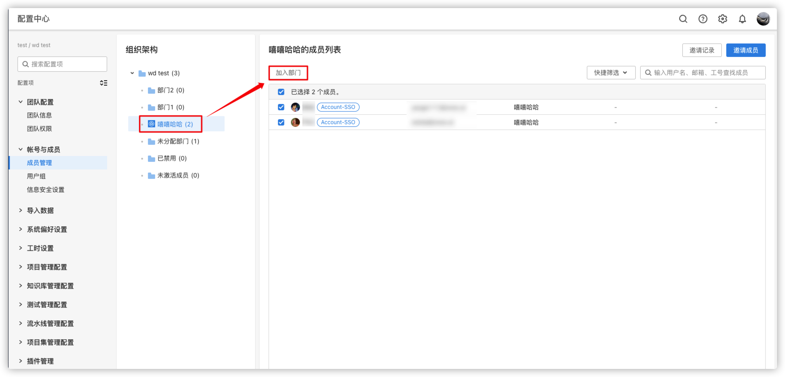

#### 消息推送

在项目管理设置-工作项类型-工作项通知中配置，

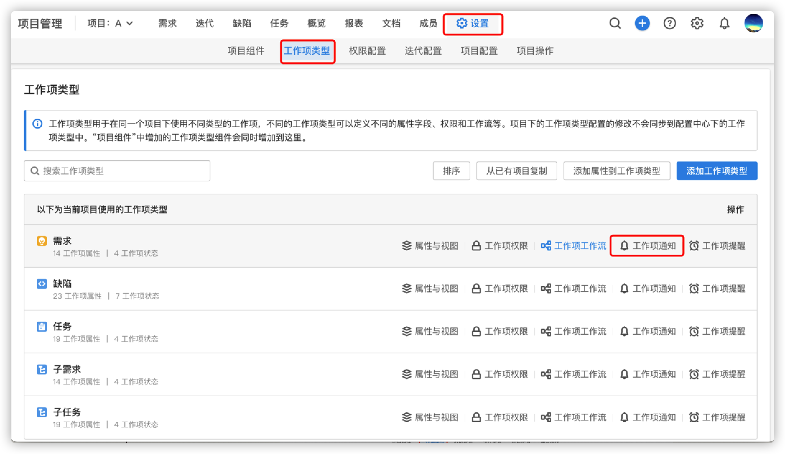

再结合需求场景配置发送通知的方式，

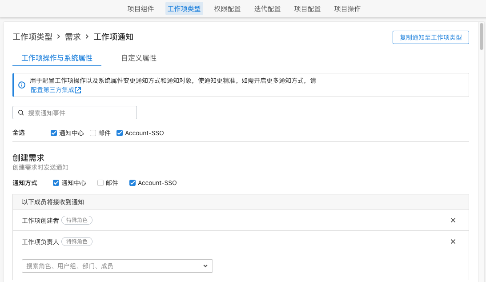

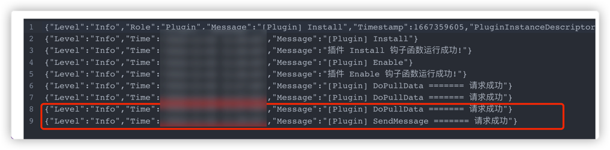

当消息通知成功时，可以在插件日志页面查看到`SendMessage()`方法内部输出的信息。当然，开发者也可以在该方法内实现具体的业务逻辑。

```tsx
// 发送消息
export async function SendMessage(request: PluginRequest): Promise<PluginResponse> {
  Logger.info('[Plugin] SendMessage ======= 请求成功')
  return sendMessageRespData(200, '', '', '', '')
}
```
