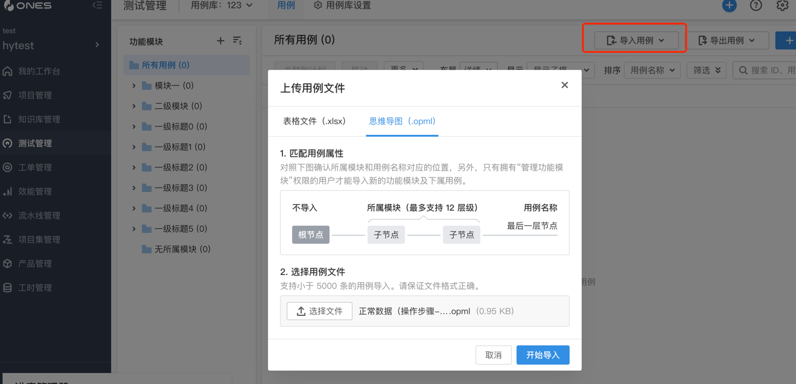
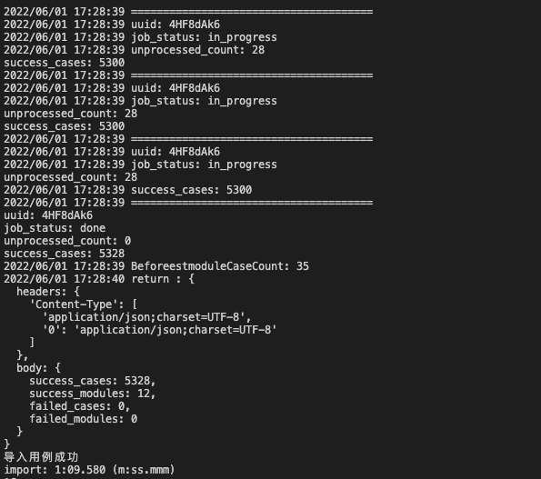

# 文件操作解析

## 能力描述

对文件进行导入、解析、修改、上传、下载一系列相关操作解析

## 插件示例 demo

[文件操作示例](https://gitlab.partner.ones.ai/example/fileopeation)

### 使用

文件导入拦截动作
在 plugin.yaml 文件中添加导入接口替换配置

```yaml
apis:
- type: replace
methods:
    - POST
url: /team/:teamUUID/testcase/library/:libraryUUID/import_with_opml
function: ImportOpml
}
```

拦截导入接口以后对文件进行解析并转换格式,将 opml 文件转换为 xlsx 文件



```javascript
{
const body = request.body
const url = request.url
let urlArr = []
if (url) {
    urlArr = url.toString().split("/")
    if (urlArr.length > 5) {
        teamUUID = globalThis.onesEnv.teamUUID
        libraryUUID = urlArr[5]  //libraryUUID
        //用例库的用例配置的UUID
        const testcaseOptionUUID = await getTestcaseOptionUUID(globalThis.onesEnv.teamUUID, libraryUUID)
        if (testcaseOptionUUID != null) {
            if (testcaseOptionUUID) {
                Optionuuid = testcaseOptionUUID?.data?.testcaseLibraries[0]?.testcaseFieldConfig?.uuid;
                AftertestcaseCaseCount = testcaseOptionUUID?.data?.testcaseLibraries[0]?.testcaseCaseCount;
            }
        }
        //用例库的用例配置
        const testcaceOption = await getTestcaseOption(teamUUID, libraryUUID, Optionuuid)
        if (testcaceOption != null) {
            //优先级类型
            const priority = testcaceOption?.data?.fields.find((n) => n.name == '优先级');
            for (let i = 0; i < priority.options.length; i++) {
                priorityArr.push(priority.options[i].value)
            }
            //设置用例库导入前的数量信息
            AftertestmoduleCaseCount = await getModules()
        }
        //解析opml数据
        if (body) {
            const obj = await opmlToJSON(body)
            opmljson = JSON.parse(JSON.stringify(obj))
        }
        getName(opmljson.children[0].children, Node)
        if (countSuccess < 1) {
            return faildBody
        }
        xlsx = json2xls(jsonObject);
}
```

将转换格式的文件存储到插件目录 workspace 下

```javascript
xlsx = json2xls(jsonObject)
await fs.writeFileSync(__dirname + '/workspace/data.xlsx', xlsx, 'binary')
```

将 workspace 下的文件通过上传文件的能力上传到项目工作项下

```javascript
const file = await PluginFile.uploadFile('data.xlsx', 'task_uuid', 'desc')
```

将 workspace 下的文件上传到测试管理下的用例库中进行导入用例

```javascript
const response = await fetchONES({
  path: `/team/${teamUUID}/testcase/library/${libraryUUID}/upload`,
  headers: {
    'Replace': 'replace',
    'Ones-User-Id': [userUUID],
    'Ones-Auth-Token': [userToken],
    ...data.getHeaders(),
  },
  method: 'POST',
  body: new Uint8Array(data.getBuffer()),
  // root: true,
})
if (response != null) {
  const res = JSON.parse(JSON.stringify(response.body))
  return res.file_hash
}
return response
```

将上传的转换完格式的用例导入用例库

```javascript
const response = await fetchONES({
  path: `/team/${teamUUID}/testcase/library/${libraryUUID}/import`,
  method: 'POST',
  headers: {
    'Replace': ['replace'],
    'Ones-User-Id': [userUUID],
    'Ones-Auth-Token': [userToken],
  },
  body: {
    mapping: {
      module_name_1: '一级模块',
      module_name_2: '二级模块',
      module_name_3: '三级模块',
      module_name_4: '四级模块',
      module_name_5: '五级模块',
      module_name_6: '六级模块',
      module_name_7: '七级模块',
      module_name_8: '八级模块',
      module_name_9: '九级模块',
      module_name_10: '十级模块',
      module_name_11: '十一级模块',
      module_name_12: '十二级模块',
      name: '用例名称',
      priority: '优先级',
      type: '用例类型',
      condition: '前置条件',
      step_desc: '步骤描述',
      step_result: '预期结果',
      desc: '备注',
      assign: '维护人',
      fields: fileds,
    },
    file_hash: filehash,
  },
  root: true,
})
if (response != null) {
  return response
}
```

### 效果展示


