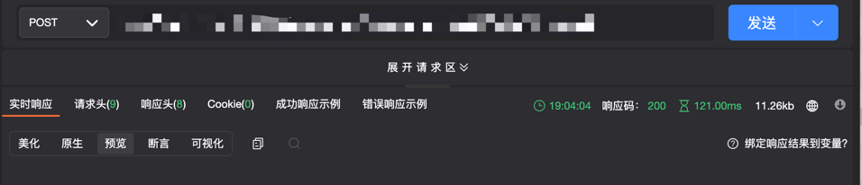

# 接口注册

## 能力描述

插件可以注册新的接口，支持新的插件专用的内部接口或外部接口；这些接口能够像正常的标准系统接口一样被调用，如果路由以/team/:teamUUID 开头，当插件在某个团队安装时，可通过请求 **"/team/:teamUUID(团队的 uuid）/URL"** 访问路由绑定的插件函数。

## 能力使用

#### addition （插件自身实现的接口）


### **external** （team 级别的新增接口）

external 的新增接口必须以 /team/:teamUUID 开头，当插件在某个团队按照时，可通过请求/team/:teamUUID/xxx 访问路由绑定的插件函数。

### 能力声明

**接口注册**，**addition**和**external**都可以新增接口，其中 addition 是插件级别的接口，而 external 是团队级别的接口，external 类型的接口注册后，对其注册的接口发起请求的时候，需要在 url 前拼接**/team/:teamUUID/\*\***，\*\*可以通过参考下述内容进行了解，

在 plugin.yaml 中声明新注册的接口，

```yaml
apis:
  - type: addition         //接口类型：addition:新增
  methods:                 //接口请求方式
    - POST
  url: /hello              //自定义url
  function: hello          //名称与代码里的函数名保持一致

    - type: external       //external新增（团队级别的接口）
  methods:
    - POST
  url: /team/:teamUUID/hello1
  function: hello1
```

:::caution 注意

如果修改了插件配置文件（`config/plugin.yaml`），需要运行 `npx op invoke clear` 并重新运行 `npx op invoke run` 指令才能使配置生效。
:::

### 调用方法

在 `backend/src/index.ts`文件下编写与 apis 配置的函数方法体，

```javascript
import { Logger } from '@ones-op/node-logger' //需要导入的依赖依赖包
import { fetchHttp, fetchONES } from '@ones-op/node-fetch'

//addition 注册的接口对应方法
export async function hello(request: PluginRequest): Promise<PluginResponse> {
  const body = request.body || {}
  Logger.info('[Plugin] hello ======= 请求成功')
  return {
    body: {
      res: 'hello world',
      requestBody: body,
    },
  }
}

// external 注册的接口对应方法
export async function hello1(request: PluginRequest): Promise<PluginResponse> {
  const body = request.body || {}
  Logger.info('[Plugin] hello1 ======= 请求成功')
  return {
    body: {
      res: 'hello world1',
      requestBody: body,
    },
  }
}
```

### 实现过程

#### 请求插件注册的接口

**`addition`** 接口在 postman 等调试工具中填写参数如下，

```javascript
url：https://yourhost/hello
headers: Ones-Check-Point:team; Ones-Plugin-Id:{插件实例ID}
method: POST

```

或在终端、命令行内容输入以下内容，

```javascript
curl --location --request POST 'https://yourhost/hello' \
--header 'Content-Type: application/json;charset=utf-8' \
--header 'Ones-Check-Point: team' \
--header 'Ones-Plugin-Id: {插件实例ID}' \
--data ''
```

返回结果如下：


**`external`** 接口在 postman 等调试工具中填写参数如下，
addition 和 external 接口的区别就是 url 多了 team/teamUUID，但是 external 接口请求头可以不用带上 Ones-Check-Point 和 Ones-Plugin-Id

```javascript
url：https://yourhost/team/{teamUUID}/hello1
method: POST
```

或在终端、命令行内容输入以下内容，

```javascript
curl --location --request POST 'https://yourhost/team/{teamUUID}/hello1' \
--header 'Content-Type: application/json;charset=utf-8' \
--data ''
```

返回结果如下：



### 请求头说明

| 参数名           | 参数位置     | 值类型 | 描述                                     |
| ---------------- | ------------ | ------ | ---------------------------------------- |
| Ones-User-Id     | HTTP Headers | string | 用户 uuid                                |
| Ones-Auth-Token  | HTTP Headers | string | 登录成功的 token                         |
| Ones-Plugin-Id   | HTTP Headers | string | 对应后端插件的实例 ID                    |
| Ones-Check-Point | HTTP Headers | string | 对应权限检查点 team/organization         |
| Ones-Check-Id    | HTTP Headers | string | 对应权限检查点 teamUUID/organizationUUID |

Ones-Plugin-Id 说明：对于前端来说插件类型分为四种

- addition 类型即新增接口，Ones-Plugin-Id 需要传入对应的插件实例的 UUID。
- 插件平台固有接口，Ones-Plugin-Id 传入固定值：`built_in_apis`。

### 接口劫持示例插件

https://gitlab.partner.ones.ai/example/api-register-jack

### FAQ

> ### 使用 addition:新增类型问题描述
>
> 插件 addtion 路由, GET 请求传参数会导致接口无法拿到返回值

> ### 出现原因
>
> 标准系统使用的 fasthttp 包不支持 get 请求传 body。 该问题已经被包修复， 是我们使用的包版本太久

> 处理方式：使用 post 请求。
