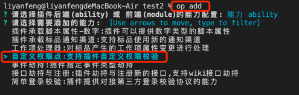

# 插件自定义权限点(新)

### 新特性

- 支持插件实现自定义权限校验方法

### 声明方式

1. 使用 op 工具添加能力

   

- 包含以下文件变更：
  - 文件修改：config/plugin.yaml 上新增了能力配置
  - 文件新增：backend/src/custompermission.ts

2. 配置 config/plugin.yaml

```yaml
abilities:
  - id: 98b399b0-IqCW
    name: 自定义权限点
    abilityType: CustomPermission
    version: 1.0.0
    function:
      customPermissionCheckFunc: customPermissionCheck
    config:
      - key: name
        label: 权限点名称
        show: false
        value: 工作项编辑权限
      - key: field
        label: 权限点字段
        show: false
        value: task_edit_permission
      - key: desc
        label: 权限点描述
        show: false
        value: 工作项编辑权限描述
      - key: is_plugin_custom_check
        label: 插件自定义权限校验
        show: false
        value: true
```

- 如果 is_plugin_custom_check == true 时
  - 接口：/team/:team_uuid/plugin/permissionrule/check 调用的是插件的自定义校验方法(customPermissionCheckFunc)
  - 开发者可以在 customPermissionCheckFunc 中 实现校验逻辑

```ts
export async function customPermissionCheck(request: PluginRequest): Promise<PluginResponse> {
  Logger.info('[Plugin] customPermissionCheck ======= 请求成功')
  var body = request?.body as any
  var userUUID = body.user_uuid
  var field = body.permission_field
  var context = body.context
  Logger.info('userID:', userUUID)
  Logger.info('permission_field', field)
  Logger.info('context', context)
  //  permission check logic
  return {
    statusCode: 200,
    body: {
      code: 200,
      body: {
        is_permission: true,
      },
    },
  }
}
```
