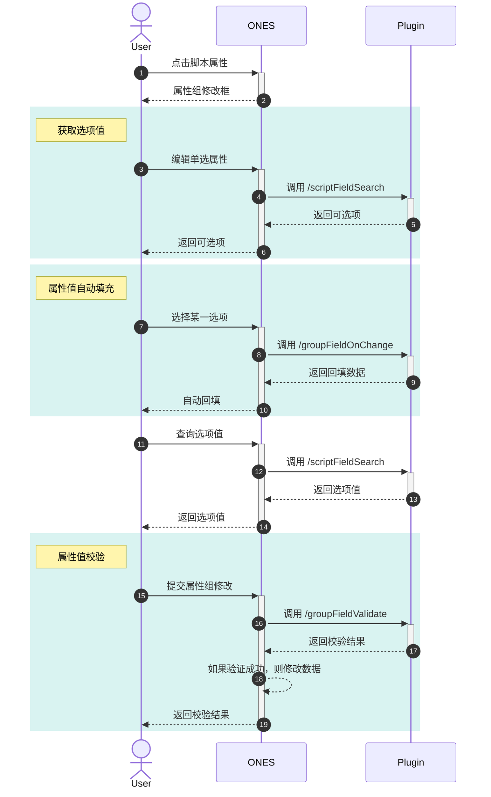

import Image from '@theme/IdealImage'

# 属性组

## 要求

| **ONES** |
| :------- |
| v3.6.0+  |

## 概述

属性组由一组具有相互联系的属性组合而成。属性组能力能够在 ONES 中创建属性组，还能实现属性之间的联动。目前仅支持使用脚本属性创建属性组，支持添加属性组的实体有项目和工作项。

该能力一般可用在以下场景：

1. 属性之间关系密切，需要建立关联关系。
2. 某个属性的值会影响其他属性的可选值。（例如：添加了国家、城市、乡镇等地域信息，选择了不同的国家，会导致可选的城市变化）
3. 属性组中属性能够设置的值有限制，在提交修改的时候需要校验合法性。

:::caution 注意
添加到 ONES 的属性组无法进行删除和编辑
:::

### 能力表现

在使用该能力添加脚本属性和属性组之后，可在添加工作项属性时看到属性组的选项，如下图所示

<Image img={require('./images/fieldgroup0.png')} />

在将属性组添加至工作项之后，在工作项的详情页可编辑脚本属性

<Image img={require('./images/fieldgroup1.png')} />

## 使用

### 添加脚本属性

属性组只能添加**单选/多选**类型的脚本属性

#### 第一步：添加脚本属性至实体

通过调用 SDK 中提供的方法向实体中添加脚本属性，添加成功后会返回属性的`fieldUUID`。后续其他属性组的其他操作需要使用到这些`fieldUUID`，建议在添加时持久化保存。

- **工作项**

  在代码中调用 [Field.FieldsAdd](../../../../reference/packages/node-ability/node-ability.md#FieldsAdd) 添加脚本属性。详情可参考文档： [插件承载脚本属性 - 单选/多选](../script-field-selection/script-field-selection.mdx)

  示例：在插件生命周期`Install()`方法中向工作项添加单选脚本属性

  ```typescript title="backend/src/index.ts"
  import { Field } from '@ones-op/node-ability'

  export async function Install() {
    const FieldsAddRes = await Field.FieldsAdd({
      Name: 'task_field',
      Type: 1001, //表示添加单选类型脚本属性
    })
    if (FieldsAddRes.Error) {
      throw new Error('Failed to create field')
    }
    const { UUID: fieldUUID } = FieldsAddRes //获取属性uuid
    Logger.info('[Plugin] Install')
  }
  ```

  **参数介绍**

  | 参数 | 类型   | 说明                                            |
  | :--- | :----- | :---------------------------------------------- |
  | Name | string | 属性名称                                        |
  | Type | int    | 脚本属性类型<br />- 1001：单选<br/>- 1002：多选 |

- **项目**

  在代码中调用 [Field.ItemsAdd](../../../../reference/packages/node-ability/node-ability.md#ItemsAdd) 添加脚本属性

  示例：在插件生命周期`Install()`方法中向项目添加单选脚本属性

  ```typescript title="backend/src/index.ts"
  import { Field, FieldTypeEnum, PoolEnum } from '@ones-op/node-ability'
  //向项目添加单选类型的脚本属性
  export async function Install() {
    const ItemsAddProjectRes = await Field.ItemsAdd({
      FieldType: FieldTypeEnum.SingleLabel, //表示添加单选类型脚本属性
      Name: 'project_field',
      ItemType: 'field',
      Pool: PoolEnum.Project, //实体类型为项目
      ContextType: 'team',
      required: false,
    })
    if (ItemsAddProjectRes.Error) {
      throw new Error('Failed to create field')
    }
    const { UUID: fieldUUID } = ItemsAddProjectRes //获取属性`uuid`
    Logger.info('[Plugin] Install')
  }
  ```

  **参数介绍**

  | 参数        | 类型   | 说明                                                                                            |
  | :---------- | :----- | :---------------------------------------------------------------------------------------------- |
  | FieldType   | string | 脚本属性类型：<br />- `FieldTypeEnum.SingleLabel`: 单选<br />- `FieldTypeEnum.MultiLabel`: 多选 |
  | Name        | string | 属性名称                                                                                        |
  | ItemType    | string | 固定值：`field`                                                                                 |
  | Pool        | string | 固定值: `PoolEnum.Project`                                                                      |
  | ContextType | string | 上下文类型                                                                                      |
  | required    | bool   | 是否必填                                                                                        |

#### 第二步：数据源

脚本属性的数据需要由插件提供，

在 `plugin.yaml` 中添加 `/scriptFieldSearch` 接口, 即使添加多个**单选/多选**类型的脚本属性也只需要配置一次。

```yaml title="config/plugin.yaml"
apis:
  - type: addition
    methods:
      - POST
    url: /scriptFieldSearch
    function: GetOptions
```

编写 `GetOptions` 处理函数，如果同时有多个**单选/多选**类型的脚本属性，可根据添加脚本属性时返回的`fieldUUID`进行逻辑划分。

```typescript
interface OptionType {
  uuid: string //属性值`UUID`
  value: string //属性值
}
export async function GetOptions(request: PluginRequest): Promise<PluginResponse> {
  const body = request?.body as any
  const options: OptionType[] = [] //返回的选项数据
  for (let i = 0; i < 3; i++) {
    options.push({
      uuid: 'fieldValueUUID-' + i.toString(), //选项值的`uuid`
      value: 'fieldValue-' + i.toString(), //选项值
    })
  }

  return {
    statusCode: 200,
    body: {
      code: 200,
      body: {
        options: options,
      },
    },
  }
}
```

以下是获取脚本属性的选项值时请求体中的内容示例。其中`relations`字段包含属性组中所有属性的`fieldUUID`和当前的属性值。`field_uuid`字段为触发此次请求的脚本属性的`fieldUUID`。当使用`uuids`进行查询时 其它查询上下文均会失效，只采用 kv 映射查询。

```json
"body": {
  "relations": [
    {
      "field_uuid": "3LhidrCX",
      "field_value": null
    },
    {
      "field_uuid": "WGmNxtyW",
      "field_value": null
    },
  ],
  "field_uuid": "3LhidrCX",
  "uuids":[],
  "UserUUID": "SFBs7BHh"
}
```

### 建立属性组

为多个属性建立关联关系形成属性组，并将属性组添加到实体中。属性和属性组的业务对象类型必须一致，否则会导致添加失败。

- **建立属性组**

  ```typescript
  const relateionsTask: any[] = []
  // `fieldUUIDs` 数组为添加的脚本属性的`uuid`数组
  fieldUUIDs.forEach((fieldUUID, index) => {
    const relation = {
      FieldUUID: fieldUUID,
      FieldParentUUID: '',
      Position: index,
    }
    relateionsTask.push(relation)
  })
  const AddGroupFieldRes = await Field.AddGroupField({
    ObjectType: PoolEnum.Task,
    Name: 'issueFieldGroup',
    Relations: relateionsTask,
  })
  ```

- **参数介绍**

  [Field.AddGroupField](../../../../reference/packages/node-ability/node-ability.md#AddGroupField) 方法的参数如下所示：

  | 参数       | 类型                                    | 说明                                                                                      |
  | :--------- | :-------------------------------------- | :---------------------------------------------------------------------------------------- |
  | ObjectType | string                                  | 属性组的实体类型，可选值：<br />- `PoolEnum.Project`: 项目<br />- `PoolEnum.Task`: 工作项 |
  | Name       | string                                  | 属性组名称                                                                                |
  | Relations  | [IRelationMessage](#IRelationMessage)[] | 关系信息数组                                                                              |

  #### IRelationMessage {#IRelationMessage}

  | 参数            | 类型   | 说明                                   |
  | :-------------- | :----- | :------------------------------------- |
  | FieldUUID       | string | 属性的`fieldUUID`                      |
  | FieldParentUUID | string | 父属性`UUID`，表示和该属性形成层级关系 |
  | Position        | string | `Position`:在属性组中的位置            |

### 属性值自动填充

当在编辑属性组中某个属性的值时，会向插件发送一个请求，并携带当前属性组中所有属性的值。开发者可通过响应该请求的方式，将属性值回填到编辑页面中。

- **添加配置**

  ```yaml title="config/plugin.yaml"
  apis:
    - type: addition
      methods:
        - POST
      url: /groupFieldOnChange
      function: GroupFieldOnChange
  ```

- **编写处理函数**

  `field_values`为需要回填的数据

  ```typescript
  interface FieldValueType {
    field_uuid: string //属性的`UUID`
    option_uuids: string[] //属性值的`UUID`数组
  }
  export async function GroupFieldOnChange(request: PluginRequest): Promise<PluginResponse> {
    const body = request?.body as any
    const field_values: FieldValueType[] = []

    return {
      statusCode: 200,
      body: {
        code: 200,
        body: {
          field_values: field_values,
        },
      },
    }
  }
  ```

- **请求体内容**

  其中`group_uuid`字段是属性组的`UUID`,`change_field_uuid`字段是属性的`fieldUUID`，`field_values`包含当前属性组的编辑面板中所有属性的情况。

  ```json
  "body": {
    "group_uuid": "4cE7QxNW",
    "change_field_uuid": "3LhidrCX",
    "field_values": [
      {
        "field_uuid": "3LhidrCX",
        "option_uuids": [
          "China"
        ]
      },
      {
        "field_uuid": "WGmNxtyW",
        "option_uuids": null
      }
    ],
    "UserUUID": "SFBs7BHh"
  }
  ```

### 属性值校验

在提交属性组中属性的值的修改时，会请求 `/groupFieldValidate` 接口，并携带当前属性组中所有属性的值。开发者可以对此次修改的数据，进行合法性校验。校验成功与否取决于状态码是否为 `200`，检验失败则修改无效。当校验成功时，还能完成一次属性值更新。

- **添加配置**

  ```yaml title="config/plugin.yaml"
  apis:
    - type: addition
      methods:
        - POST
      url: /groupFieldValidate
      function: GroupFieldValidate
  ```

- **编写处理函数**

  `option`中的数据是需要更新的属性值

  ```typescript
  interface UpdateType {
    field_uuid: string //属性的`UUID`
    option_uuid: string //属性值的`UUID`
    option_value: string //属性值
  }
  export async function GroupFieldValidate(request: PluginRequest): Promise<PluginResponse> {
    const body = request?.body as any
    const options: updateType[] = []

    return {
      statusCode: 200,
      body: {
        code: 200,
        body: {
          options: options,
        },
      },
    }
  }
  ```

- **请求体内容**

  `field_groups`字段中包含属性组`UUID`以及属性组中所有属性的数据，可根据这些数据进行校验

  ```json
  "body": {
    "UserUUID": "SFBs7BHh",
    "field_groups": [
      {
        "group_uuid": "4cE7QxNW",
        "field_values": [
          {
            "field_uuid": "3LhidrCX",
            "option_uuids": [
              "China"
            ]
          },
          {
            "field_uuid": "WGmNxtyW",
            "option_uuids": [
              "Guangdong"
            ]
          }
        ]
      }
    ]
  }
  ```

### 属性值更新

单选/多选 类型的脚本属性的每个选项值都有一个 `uuid`，某个属性的值保存的是选项值的 `uuid`。可以通过修改该 `uuid` 对应的选项值，从而修改界面显示。

- **调用函数更新选项值**

  ```typescript
  const UpdateFieldOptionRes = await Field.UpdateFieldOption([
    {
      TeamUUID: globalThis.onesEnv.teamUUID,
      FieldUUID: fieldUUID,
      UUID: 'valueUUID',
      Value: 'value',
      ObjectType: 3,
    },
  ])
  ```

- **参数介绍**

  | 参数       | 类型   | 说明                                                   |
  | :--------- | :----- | :----------------------------------------------------- |
  | TeamUUID   | string | 团队`uuid`                                             |
  | FieldUUID  | string | 脚本属性`fieldUUID`                                    |
  | UUID       | string | 选项值的`UUID`                                         |
  | Value      | string | 选项值                                                 |
  | ObjectType | int    | 实体类型，可选值如下：<br />- 1: 项目<br />- 2: 工作项 |

### 时序图

在完成脚本属性以及属性组的添加之后，完整的属性修改流程如下所示：



## 示例

[位置信息属性组](./location-fieldgroup.md)
