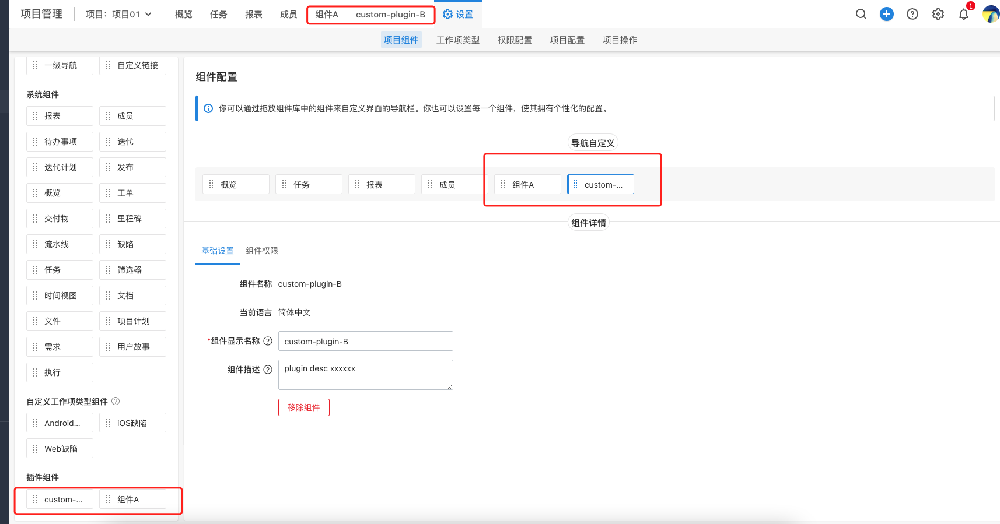
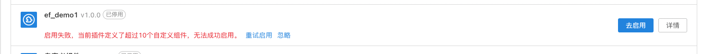

# 插件承载 project 自定义组件

## 能力描述

- 标品已有的组件无法满足的功能场景。
- 用户自定义更加多元的项目配置需求场景。

针对上述场景，插件使用该能力可以向标品的项目添加自定义组件。然后，我们可以按照标品的统一标准来使用——自定义组件在导航栏的顺序以及基础配置。



该能力的功能：

- 自定义组件，支持用户自定义配置组件名称、组件描述配置信息；

- 当承载有该能力的插件启用后，能力所定义的自定义组件会出现在项目组件库，用户可以按照标品的统一标准来使用这些组件；

- 当承载有该能力的插件停用/卸载后，能力所定义的自定义组件以及用户使用这些组件创建的对象都会从项目删除；

## 能力使用

### 能力声明

在 plugin.yaml 中声明该能力

```yaml
service:
  app_id: Wr1aVwZS
  ...
modules:
  - entry: modules/ones-login-ptLT/index.html
    id: ones-login-ptLT
    moduleType: ones:project:component:new
    title: front-end slot
abilities:
  - id: tRUFWEsd
    name: custom component plugin
    abilityType: ProjectCustomComponent
    function:
      copyPluginData: copyTest
    version: 1.0.0
    relateModule:
      componentModuleEnter: 'ones-login-ptLT'
    config:
      - key: component_name
        label: 自定义组件名称
        value: 自定义组件
        fieldType: Input
        show: true
      - key: component_desc
        label: 自定义组件描述
        value: ''
        fieldType: TextArea
        show: true
        props:
          placeholder: 自定义组件描述，允许为空
      - key: is_support_copy
        label: 是否支持插件数据复制
        value: true
        show: false
```

:::caution 注意

关于参数 componentModuleEnter，必须是[ones:project:component:new 类型插槽](../../api/slot/module.md)的 modules.id。

如果参数 is_support_copy 为 true，还需要在"backend/src/plugin_copy.ts"的 "copyTest()" 函数中实现插件复制逻辑。

:::

如果用户需要配置组件名称、组件描述配置信息，需要将 component_name,component_desc 的 show 设置为 true。

一般情况，还需要考虑到[多语言](../base/i18n/index.md)的场景，此时我们可以使用 label 字段来实现多语言展示。

```yaml
service:
  app_id: Wr1aVwZS
  ...
modules:
  - entry: modules/ones-login-ptLT/index.html
    id: ones-login-ptLT
    moduleType: ones:project:component:new
    title: front-end slot
abilities:
  - id: tRUFWEsd
    name: custom component plugin
    abilityType: ProjectCustomComponent
    function:
      copyPluginData: copyTest
    version: 1.0.0
    relateModule:
      componentModuleEnter: 'ones-login-ptLT'
    config:
      - key: component_name
        label: '{{.ComponentName}}'
        value: 自定义组件
        fieldType: Input
        show: true
      - key: component_desc
        label: '{{.ComponentDesc}}'
        value: ''
        fieldType: TextArea
        show: true
        props:
          placeholder: 自定义组件描述，允许为空
      - key: is_support_copy
        label: 是否支持插件数据复制
        value: true
        show: false
```

### 能力使用范围

Project 项目管理

- 项目设置，可添加插件组件
- 项目设置，可拖拽插件组件产生对象
- 项目设置，可修改插件对象信息，可移动插件对象位置

## FAQ

### 自定义组件能力与插槽如何绑定？

yaml 文件有一个配置参数 componentModuleEnter，用于绑定自定义组件能力与前端插槽关联关系。

### 如果我要创建多个自定义能力怎么办？

plugin.yaml 中的 abilities 是一个数组，可以将自定义组件类型（ProjectCustomComponent）能力定义多次，从而实现创建多个自定义组件的能力。其中，每个能力的 id 应该不一样。

:::caution 注意

一个插件最多支持 10 个自定义组件类型（ProjectCustomComponent）能力。如果定义超过这个限制，插件启用时候失败并给予错误提示。



:::
