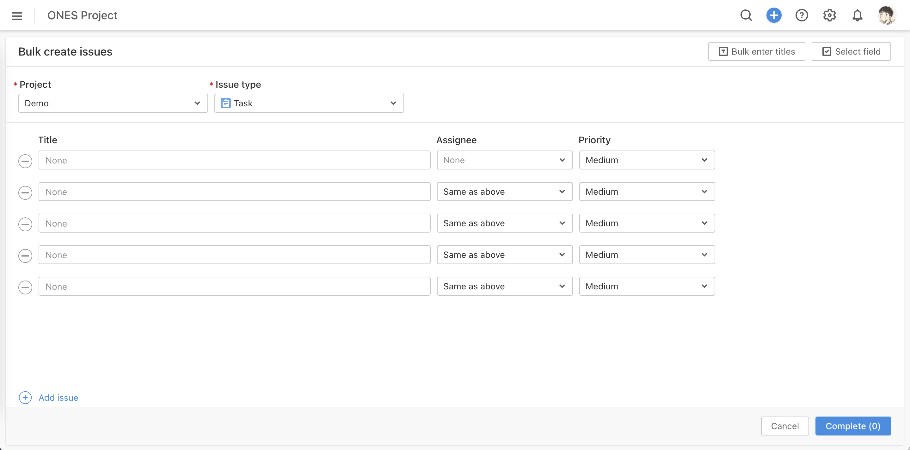
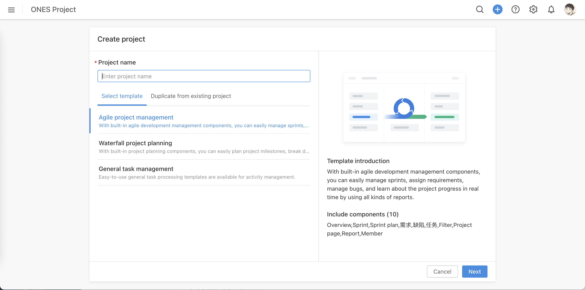
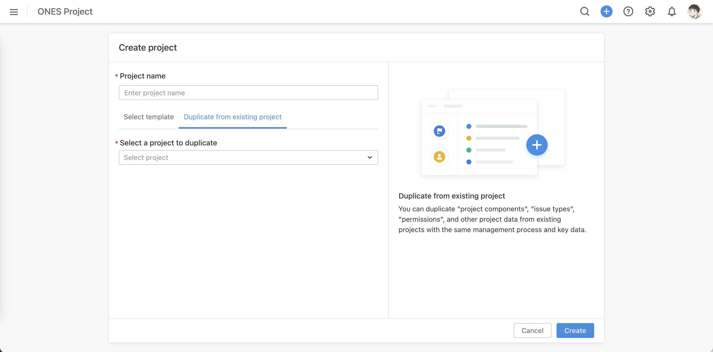
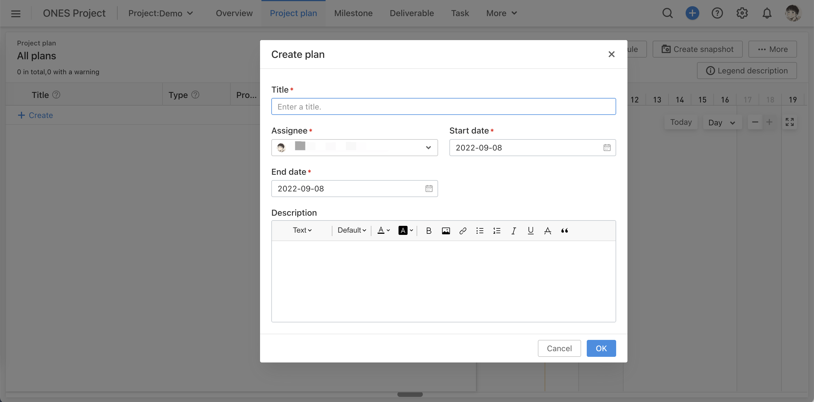

# 触发列表

### action:pre:ones:task:fields:update

工作项普通属性更新前置操作

### action:post:ones:task:fields:update

工作项普通属性更新后置操作

### action:pre:ones:task:field:status:update

工作项状态更新前置操作

:::caution 注意

「发布」工作项类型，状态转为「已发布」时，数据格式与普通状态变更存在不同

:::

### action:post:ones:task:field:status:update

工作项状态更新后置操作

### action:pre:ones:task:action:stdToStdIssueType

工作项「变更工作项类型」前置操作

### action:post:ones:task:action:stdToStdIssueType

工作项「变更工作项类型」后置操作

### action:pre:ones:task:action:stdToSubIssueType

工作项「转为子工作项」前置操作

### action:post:ones:task:action:stdToSubIssueType

工作项「转为子工作项」后置操作

### action:pre:ones:task:action:subToSubIssueType

子工作项「变更子工作项类型」前置操作

### action:post:ones:task:action:subToSubIssueType

子工作项「变更子工作项类型」后置操作

### action:pre:ones:task:action:subToStdIssueType

子工作项「转为工作项」前置操作

### action:post:ones:task:action:subToStdIssueType

子工作项「转为工作项」后置操作

### action:pre:ones:task:add `v3.11.25+`

「新建工作项」「新建子工作项」「批量新建子工作项目」前置操作

### action:post:ones:task:add `v3.11.25+`

「新建工作项」「新建子工作项」「批量新建子工作项目」后置操作

### action:pre:ones:taskList:action:modifyIssueType

工作项列表「批量变更工作项类型」前置操作

### action:post:ones:taskList:action:modifyIssueType

工作项列表「批量变更工作项类型」后置操作

### action:pre:ones:taskList:action:stdToSubIssueType

工作项列表「批量转为子工作项」前置操作

### action:post:ones:taskList:action:stdToSubIssueType

工作项列表「批量转为子工作项」后置操作

### action:pre:ones:taskList:action:subToStdIssueType

工作项列表「批量转为工作项」前置操作

### action:post:ones:taskList:action:subToStdIssueType

工作项列表「批量转为工作项」后置操作

### action:pre:ones:taskList:action:modifyFieldValues

工作项列表「批量修改工作项属性」前置操作

### action:post:ones:taskList:action:modifyFieldValues

工作项列表「批量修改工作项属性」后置操作

### action:pre:ones:taskList:batchAdd `v3.11.25+`

「批量新建工作项」前置操作

### action:pre:ones:taskList:batchAdd `v3.11.25+`

「批量新建工作项」后置操作

### action:pre:ones:project:add `v3.11.25+`

「新建项目」前置操作

### action:post:ones:project:add `v3.11.25+`

「新建项目」后置操作

### action:pre:ones:project:copy `v3.11.25+`

「复制项目」前置操作

### action:post:ones:project:copy `v3.11.25+`

「复制项目」后置操作

### action:pre:ones:project:update `v3.11.25+`

「更新项目相关信息」前置操作，如：项目名称、项目信息、项目状态、项目属性等

### action:post:ones:project:update `v3.11.25+`

「更新项目相关信息」后置操作，如：项目名称、项目信息、项目状态、项目属性等

### action:pre:ones:manhour:estimated:update `v3.11.25+`

工时简单模式，工时信息「修改预估工时」前置操作

### action:post:ones:manhour:estimated:update `v3.11.25+`

工时简单模式，工时信息「修改预估工时」后置操作

### action:pre:ones:manhour:remaining:update `v3.11.25+`

工时信息「修改剩余工时」前置操作

:::caution 注意

工时模式切换简单模式与汇总模式，数据格式存在不同

:::

### action:post:ones:manhour:remaining:update `v3.11.25+`

工时信息「修改剩余工时」后置操作

:::caution 注意

工时模式切换简单模式与汇总模式，数据格式存在不同

:::

### action:pre:ones:manhour:add `v3.11.25+`

「添加成员登记工时」「添加成员预估工时」前置操作

### action:post:ones:manhour:add `v3.11.25+`

「添加成员登记工时」「添加成员预估工时」后置操作

### action:pre:ones:manhour:update `v3.11.25+`

「修改成员登记工时」「修改成员预估工时」前置操作

### action:post:ones:manhour:update `v3.11.25+`

「修改成员登记工时」「修改成员预估工时」后置操作

### action:pre:ones:manhour:delete `v3.11.25+`

「删除成员登记工时」「删除成员预估工时」前置操作

### action:post:ones:manhour:delete `v3.11.25+`

「删除成员登记工时」「删除成员预估工时」后置操作

### action:pre:ones:activity:add `v3.11.25+`

「新建项目计划」「新建里程碑」前置操作

### action:post:ones:activity:add `v3.11.25+`

「新建项目计划」「新建里程碑」后置操作

### action:pre:ones:activity:update `v3.11.25+`

「更新项目计划」「更新里程碑」前置操作

### action:post:ones:activity:update `v3.11.25+`

「更新项目计划」「更新里程碑」后置操作

### action:pre:ones:activity:delete `v3.11.25+`

「删除项目计划」「删除里程碑」前置操作

### action:post:ones:activity:delete `v3.11.25+`

「删除项目计划」「删除里程碑」后置操作

### action:pre:activityRelationLink:add `v3.11.25+`

项目计划「添加工作项前、后置依赖」前置操作

### action:post:activityRelationLink:add `v3.11.25+`

项目计划「添加工作项前、后置依赖」后置操作

### action:pre:activityRelationLink:delete `v3.11.25+`

项目计划「删除工作项前、后置依赖」前置操作

### action:post:activityRelationLink:delete `v3.11.25+`

项目计划「删除工作项前、后置依赖」后置操作

### action:pre:ones:activityRelease:add `v3.11.25+`

「创建快照」前置操作

### action:post:ones:activityRelease:add `v3.11.25+`

「创建快照」后置操作

### action:pre:ones:activityRelease:update `v3.11.25+`

「更新快照」前置操作

### action:post:ones:activityRelease:update `v3.11.25+`

「更新快照」后置操作

### action:pre:ones:deliverable:add `v3.11.25+`

「新建交付物」前置操作

### action:post:ones:deliverable:add `v3.11.25+`

「新建交付物」后置操作

### action:pre:ones:deliverable:update `v3.11.25+`

「更新交付物」前置操作

### action:post:ones:deliverable:update `v3.11.25+`

「更新交付物」后置操作

### action:pre:ones:deliverable:delete `v3.11.25+`

「删除交付物」前置操作

### action:post:ones:deliverable:delete `v3.11.25+`

「删除交付物」后置操作

