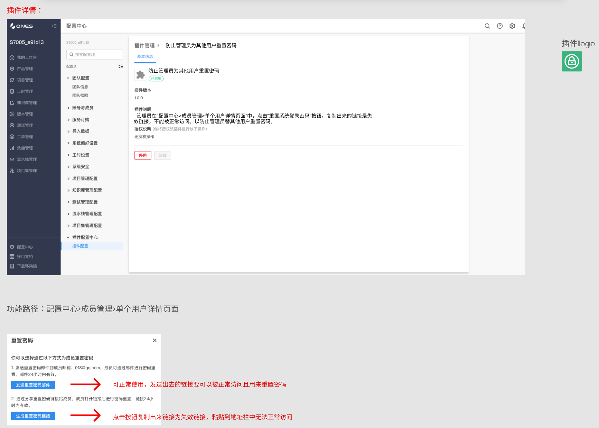
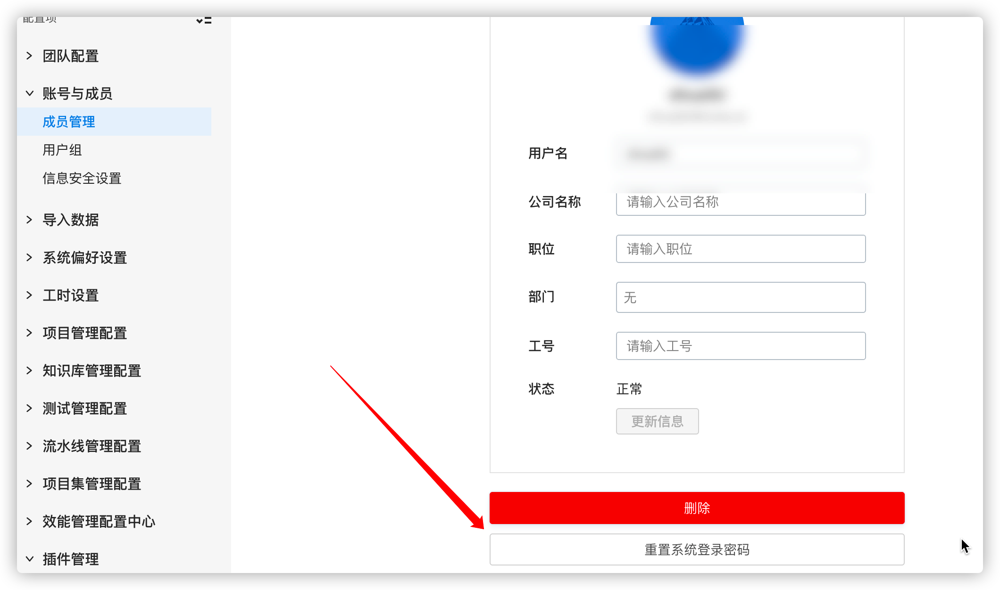
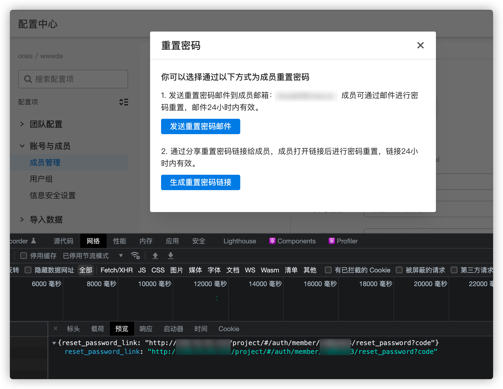

# 通过替换接口，替换重置密码链接

> 插件示例链接：[重置用户密码链接](https://gitlab.partner.ones.ai/example/restpassword)

## 目标

这是一个纯前端实现的插件。

通过这个插件，我们可以了解：

- 如何使用接口的基础能力（拦截现有系统接口），修改标准系统的功能；

## 需求

作为系统配置人员，希望管理员不能通过链接重置其它用户的密码；

## 产品设计方案



## 技术实现方案

- 1、劫持 **"project/api/project/team/:teamuuid/user/:useruuid/reset_password_link"**接口，该接口的作用是用来生成用户重置密码链接，本次插件劫持该接口的类型为"**replace** 替换"
- 2、插件业务逻辑代再次请求"**project/api/project/team/:teamuuid/user/:useruuid/reset_password_link**"接口，得到返回内容
- 3、处理业务逻辑获得的返回内容，并将返回的内容中包含重置链接的内容给去掉，返回给标品。

## 实现过程

#### 使用接口劫持能力

1. 在 plugin.yaml 中声明本次劫持的接口，接口的类型、标品 Url 等

```yaml
apis:
  - type: replace  //劫持接口类型
    methods:
      - GET
    url: /team/:teamUUID/user/:userUUID/reset_password_link  //标品url
    function: GetResetPasswordLink                           //接口劫持的处理函数
```

2. 在插件代码中增加 GetResetPasswordLink 方法，按照标准系统的 reset_password_link 的 api 返回一个无效的 url

## 代码

```javascript
export async function getResetPasswordLink(request: PluginRequest): Promise<PluginResponse> {
  const path = request.url || '' //获得需要重置的用户链接
  let restLink = ''
  //再次发起重置用户链接请求
  const Link = await fetchONES({
    headers: {
      'Content-Type': ['application/json'],
    },
    path: path,
    method: 'GET',
    root: true,
  })
  // Link返回内容如下：
  /*
     body: {
         reset_password_link: 'http://120.xx.xx.xxx/project/#/auth/member/xxxxxxxx/reset_password?code=z0XsIWftH57eaLCX5Kn2GePbR9Lamp6v'
        },
    * */
  if (Link) {
    var parseLink = JSON.parse(JSON.stringify(Link))
    //截取"="号前面的内容，后面=号提供的重置链接将不返回
    restLink = parseLink.body.reset_password_link.split('=')[0] || ''
    console.log('reset_password_link:', restLink)
  }
  return {
    body: {
      reset_password_link: restLink,
    },
  }
}
```

1、在成员页面点击重置密码按钮



2、此时该接口返回内容的链接已经被替换成无效链接 code 后面的参数被插件过滤掉了，管理员将不能通过链接重置其它用户的密码；


