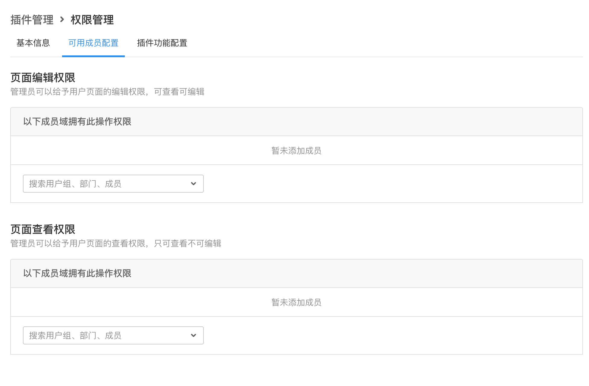
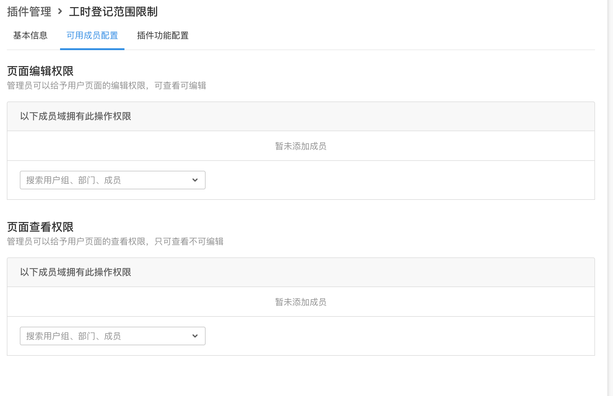

# 插件自定义权限点

## 能力描述

插件可以自定义权限点。注意，这个权限点仅在插件内生效。

开发者也可以自行实现其插件内部的权限逻辑，使用这个能力，可以大大降低定义、使用权限的复杂度。

例如，当插件的前端需要实现分“级别”的页面，并且需要使用权限来判断不同的用户(群组)及其访问范围时，可以使用这个开放能力。



需要注意的是，这里的自定义权限点，与标准系统中的权限点并没有直接关系。

这个能力的主要目标是，为插件开发者提供简单可用的、与标准系统类似的权限描述方式。

也就是说：

1. 这些权限点对标准系统是不可见的；
2. 这些权限点不支持有较多上下文场景的用户域；
3. 这些权限点的声明与其显示效果是一体的；

### 能力声明

在 plugin.yaml 中使用

```Plain Text
  permission:
    -
      name: "页面编辑权限"
      field: "table_edit_permission"
      desc : "管理员可以给予用户页面的编辑权限，可查看可编辑"
    -
      name: "页面查看权限"
      field: "table_view_permission"
      desc : "管理员可以给予用户页面的查看权限，只可查看不可编辑"
```

name：权限配置名称

field：Identification of authority. If the value is the same as the `id` or `permisson` value of the module, it controls the module permissions. In particular, as the same module can find capabilities that match the value of `permisson` and capabilities that match the value of `id`, use capabilities that match the value of `permisson` to control module permissions.

desc：权限内容描述

### 能力使用

1. 一旦能力被声明，可以在插件的配置页面找到权限点配置；
2. 插件前端可以调用对应的插件接口，来获取这些权限点的配置；与其它接口调用方法一致；

### API

#### list

url: team/:team_uuid/plugin/permissioninfo/list

入参

| 参数              | 类型   | 说明        |
| ----------------- | ------ | ----------- |
| instance_uuid     | string | 插件实例 id |
| team_uuid         | string | 所属团队 id |
| organization_uuid | string | 所属组织 id |

返回

```json
{
  "data": [
    {
      "org_uuid": "8Z6vS8FZ",
      "team_uuid": "GSwm2Lix",
      "instance_uuid": "78ed9ab1",
      "permission_name": "页面编辑权限",
      "permission_field": "table_edit_permission",
      "permission_id": 56076,
      "permission_desc": "管理员可以给予用户页面的编辑权限，可查看可编辑",
      "rule_info": [
        {
          "id": 25,
          "permission": 56076,
          "context_type": "plugin",
          "context_param_1": "78ed9ab1",
          "context_param_2": "",
          "user_domain_type": "everyone",
          "user_domain_param": "",
          "position": 0
        }
      ]
    },
    {
      "org_uuid": "8Z6vS8FZ",
      "team_uuid": "GSwm2Lix",
      "instance_uuid": "78ed9ab1",
      "permission_name": "页面查看权限",
      "permission_field": "table_view_permission",
      "permission_id": 50227,
      "permission_desc": "管理员可以给予用户页面的查看权限，只可查看不可编辑",
      "rule_info": [
        {
          "id": 26,
          "permission": 50227,
          "context_type": "plugin",
          "context_param_1": "78ed9ab1",
          "context_param_2": "",
          "user_domain_type": "everyone",
          "user_domain_param": "",
          "position": 0
        }
      ]
    }
  ]
}
```

#### check

url: team/:team_uuid/plugin/permissionrule/check

入参

| 参数              | 类型   | 说明         |
| ----------------- | ------ | ------------ |
| instance_id\*     | string | 插件实例 id  |
| team_uuid         | string | 所属团队 id  |
| organization_uuid | string | 所属组织 id  |
| permission_field  | string | 自定义权限点 |

返回

| 参数          | 类型 | 说明       |
| ------------- | ---- | ---------- |
| is_permission | bool | 是否有权限 |

### 实现

安装插件后，点击插件详情，可以在可用成员中添加成员权限。



管理员可以根据用户的权限不同，给予编辑权限或查看权限，编辑权限可以对页面进行更改，查看权限只可查看页面不能编辑。

####
