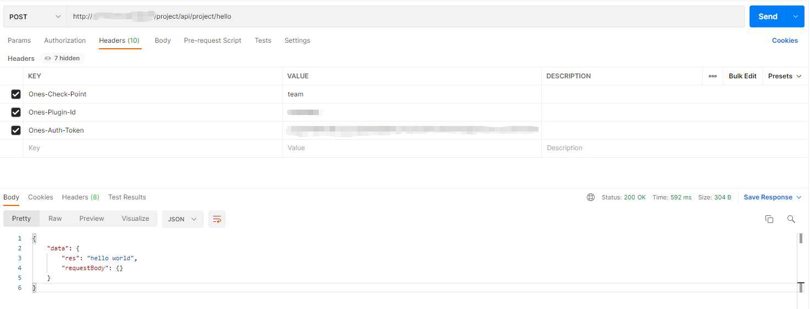

# 在本地调试插件

> 本地调试视频教程: [插件开发与调试](../sample-tutorial/videos/test.mdx)

插件开发完成后，你可以直接在本地打包，然后在插件管理中上传安装。

不过在此之前，我们建议你在本地进行插件的实时调试，这是非常方便的。

## 登录调试环境

在进行插件调试前，你需要先登录调试环境。

执行 `op login` 命令，进行登录操作：

```
op login
```

按照提示依次输入调试环境信息：

```
% op login
? 输入登录开发环境环境url: https://devapi.myones.net/project/P8022
? 输入用户邮箱: wangxueying@ones.cn
? 输入密码: **********
2022/02/23 16:22:20 登录成功!!

? 选择需要指定的team: GSwm2Lix ones
? 安装插件测试是否指向另一个环境? No
2022/02/23 16:22:31 当前已有历史登录注册用户信息..
? 是否覆盖当前登录注册用户信息: Yes
2022/02/23 16:22:33 注册用户信息成功!

2022/02/23 16:22:33 开始生成本地开发环境配置..
? 请输入平台服务ip和端口号: tcp://119.23.130.213:20001
? 输入推送代码目标分支: master
2022/02/23 16:22:52 配置ci-deploy.yaml成功!!
```

### 详细说明

插件的本地调试，首先需要脚手架工具具备远程调试环境的权限，能够获取数据、操作团队等。


如上图所示，我们的远程实时调试，实际上是在本地执行一个“远程宿主机”。

因此，`op login` 流程中填入的主要是就是两个部分的内容：

1. **开发环境 url 及登录信息：** 因为在 开发 / 调试 过程中，OP 工具需要能够获取调试环境的授权，以便在调试过程中获取团队等数据。因此建议使用此环境的登录用户使用组织管理员，以便可以在 CLI 直接创建新团队并进行调试；
2. **平台服务 ip 和端口号：** 为了能够本地调试，需要在这里填入远程调试环境的开放平台组件对外的 tcp 服务端口（需要环境配置了对外开放此端口）；

#### 关于「安装插件测试是否指向另一个环境?」

OP 工具支持 [持续集成测试](./ci-deploy.md)。开发者可以选择是否复用调试环境用于集成测试：

- 若选择是，则集成测试时，插件包将会推送到此环境；
- 若选择否，则进入持续集成测试的配置过程；

完成调试环境的登录之后，我们会在 `/config` 目录中生成 `local.yaml` 文件，内容如下：

```yaml title="/config/local.yaml"
platform:
  address: tcp://120.76.45.123:9006
local:
  id: '73412830'
  language: nodejs
  debug_mode: true
  timeout_sec: 30
  organization_uuid: 8Z6vS8FZ
  team_uuid: GSwm2Lix
  web_service_port: '3000'
  web_service_ip: '192.168.2.11'
  user_uuid: 01duxk8t
  token: INMOIa9VUhX72Ym0ZrP0eSo980iXifz8W4CSVG1T0318RFmUuS@EWGMhekzi6Mqz
  log_in_local: false
  file_in_local: false
  mysql_in_local: false
  mysql_user_name: ''
  mysql_user_password: ''
  mysql_database_name: ''
  mysql_host: ''
  mysql_port: ''
```

> 详细的字段说明，请参考 [local.yaml](../../api/config/local.md) 的配置文档。

## 启动插件

完成登录之后，执行 `op run` 命令即可启动插件：

```bash
op run
```

输出信息如下：

```bash
% op run
2022/02/25 14:30:49 > node_plugin_demo1@1.0.0 build
> cd backend && npm run build && cd ../web && npm run build
2022/02/25 14:30:49 > node-plugin-template@1.0.0 build
> rm -rf dist && set NODE_ENV=production && rollup -c rollup.config.js
2022/02/25 14:30:49
/Users/huangyao/go/src/cli-test0214/backend/src/index.ts → dist/index.js...
2022/02/25 14:30:50 created dist/index.js in 756ms
2022/02/25 14:30:50 > cli-test0214@0.0.0 build
> ones-plugin build
/opt/homebrew/bin/npm start
2022/02/25 14:30:51 ----开发环境访问路径：http://120.76.45.123
2022/02/25 14:30:52 {
  action: 'run',
  email: '',
  password: '',
  reinstall: false,
  instance_uuid: undefined,
  hostID: undefined,
  webIp: '192.168.2.11',
  webPort: '3000',
  orgUUID: '8Z6vS8FZ',
  teamUUID: 'GSwm2Lix',
  user_uuid: 'Q1duxk8t',
  token: 'lNMOIa9VUhX72Ym0ZrP0eSo98OiXifz8W4CSVG1T03i8RFmUuS0EWGMhekzi6Mqz',
  webServiceUrl: '192.168.2.11:3000'
}

> cli-test0214@0.0.0 start
> ones-plugin start

asset logo.svg 489 bytes [emitted] [from: public/logo.svg] [copied]
orphan modules 161 KiB [orphan] 22 modules
webpack 5.68.0 compiled successfully in 384 ms
<i> [webpack-dev-server] Project is running at:
<i> [webpack-dev-server] Loopback: http://localhost:3000/
<i> [webpack-dev-server] On Your Network (IPv4): http://192.168.2.11:3000/
<i> [webpack-dev-server] On Your Network (IPv6): http://[fe80::1]:3000/
<i> [webpack-dev-server] Content not from webpack is served from '/Users/huangyao/go/src/cli-test0214/web/public' directory
2022/02/25 14:30:58 本地调试返回值: {"instance_uuid":"5a21a6d7","token":"lNMOIa9VUhX72Ym0ZrP0eSo98OiXifz8W4CSVG1T03i8RFmUuS0EWGMhekzi6Mqz","user_uuid":"Q1duxk8t"}
```

:::caution 注意

如果修改了插件配置（`/config/plugin.yaml`），需要重新运行 `op run` 命令才能看到效果。例如：新增了能力，修改了配置项，声明了新权限点等

:::

## 本地调试

### 调试前端

`op run` 命令会为前端启动一个开发服务器（基于 [webpack-dev-server](https://github.com/webpack/webpack-dev-server)）并提供开箱即用的模块热重载。

### 调试后端

`op run` 命令也会为后端启动一个开发服务，第一次启动后，控制台会返回一些可供本地调试的内容：

```bash
2022/02/25 14:30:58 本地调试返回值: {"instance_uuid":"5a21a6d7","token":"lNMOIa9VUhX72Ym0ZrP0eSo98OiXifz8W4CSVG1T03i8RFmUuS0EWGMhekzi6Mqz","user_uuid":"Q1duxk8t"
```

这些信息，可以作为接口请求头的值来进行接口调试。

#### 调试接口

我们可以使用控制台返回的 `instance_uuid` 和 `token` 在 [Postman](https://www.postman.com/) 中进行接口调试：



如上图所示，我们在接口的请求头中添加了 `Ones-Check-Point` `Ones-Plugin-Id` `Ones-Plugin-Token` 三个参数：

```ts title="Header"
{
  "Ones-Check-Point": "team",
  "Ones-Plugin-Id": "5a21a6d7", // instance_uuid
  "Ones-Plugin-Token": "lNMOIa9VUhX72Ym0ZrP0eSo98OiXifz8W4CSVG1T03i8RFmUuS0EWGMhekzi6Mqz", // token
}
```

可以看到，接口调用成功后给我们返回了 "Hello world"：

```json
{
  "data": {
    "res": "Hello world",
    "requestBody": {}
  }
}
```
