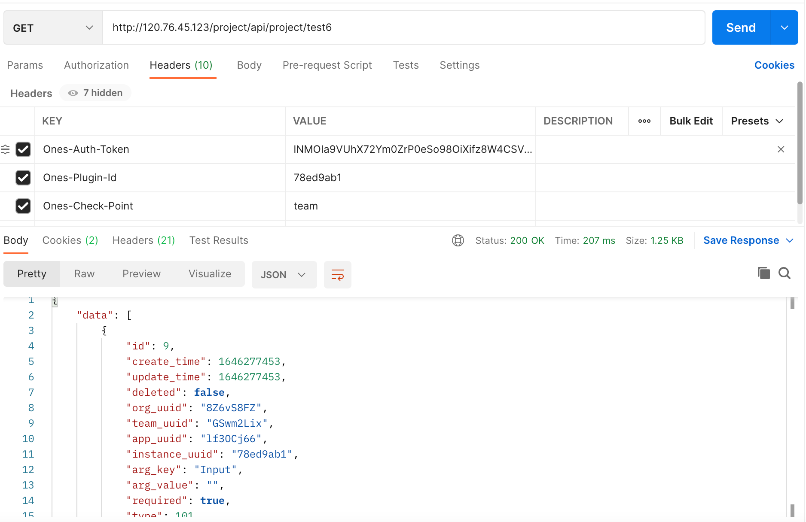

# 插件自定义配置页面 Demo 实例

### Demo 代码示例

```typescript
import { PluginConfig } from '@ones-op/node-ability'

const configs = await PluginConfig.getPluginConfig()
```

### plugin.yaml 配置

通过 service 下的 config 进行配置

```yaml
service:
  app_id: ykwHs6lm2342d23432
  name: nodejs-plugin-examples
  version: 1.0.0
  description: 描述
  mode: org
  logo: ''
  language: nodejs
  language_version: 16.13.0
  host_version: 1.0.2
  host_sub_version: 1.0.0
  min_system_version: 3.5.0
  config:
    - key: Input
      value: ''
      type: 101
      required: true
  apis:
    - type: addition
      methods:
        - GET
      url: /test6
      function: test6
```

### 功能描述

用于用户自定义界面，支持以下类型组件

```go
 'Input'  //单行输入框.   101
 'Input.TextArea' // 多行输入框 102
 'Input.Password' //密码输入框 103
 'Input.Number' // 数字输入框
 'Select'  //单选
 'Select.Multi'  //多选
 'DatePicker'  //日期选择器
 'DatePicker.Time'  //时间日期选择器
 'TimePicker'  //时间选择器
```

### 功能验证

添加完组件以后可以通过请求头中加入 AbilityName\* :ConfigList 来访问获取组件中的值


