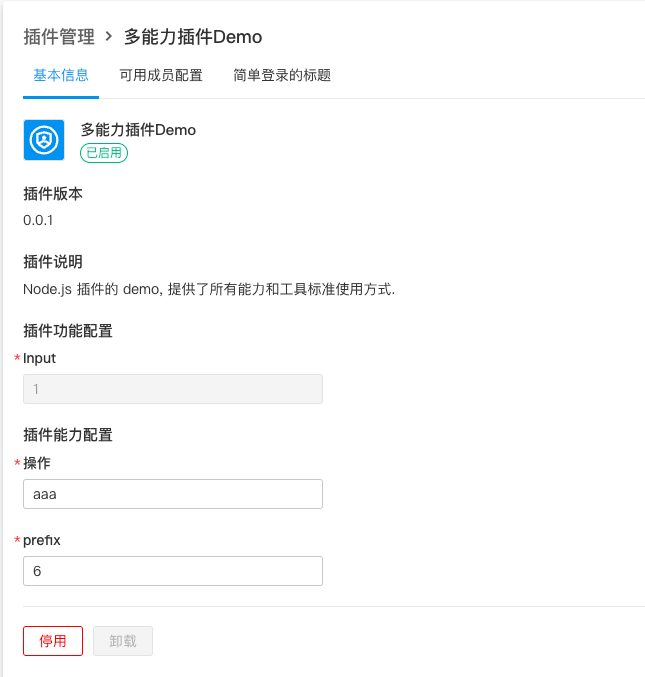
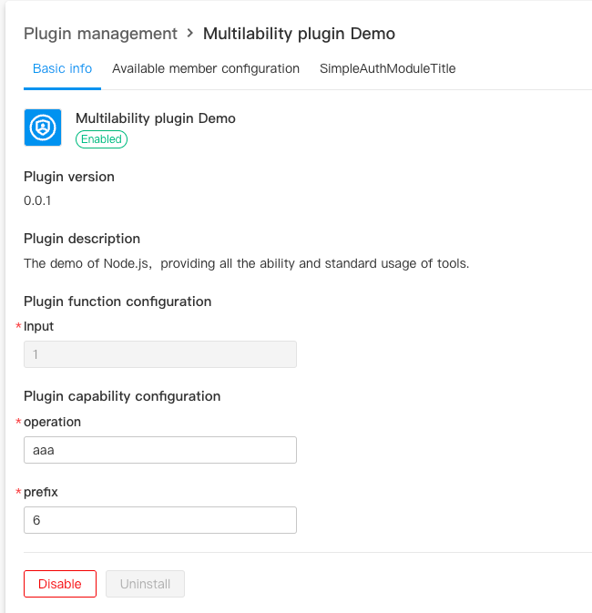

# 在插件中使用多语言

## 为什么需要使用多语言

多语言是为了 ONES 为了拓展海外业务，提供给顾客多语言的选择，帮助他们使用我们的系统。

而插件安装后，它的界面、文案等，最好能与系统的语言保持一致。所以我们建议插件在实现过程中，也使用多语言能力。

## 多语言的使用场景

当用户切换语言时，我们的系统中支持多语言的功能部分，它们的文案都会随之变化。如果希望插件的效果能够与标准系统一致，插件应该：

1. 插件自定义页面中的文案，应该跟着用户当前设置语言进行更改；
2. 插件各个提示弹窗的返回信息，应该跟着用户当前设置语言进行更改；
3. 插件管理页面中的展示信息，应该跟着用户当前设置语言进行更改；

## 如何在产品中更改多语言配置

进入 ONES 环境中进入个人中心-个人信息-语言设置中进行语言的更换


## 在插件配置中使用多语言

[插件示例 Demo](https://gitlab.partner.ones.ai/example/fileopeation/-/tree/master/)

开放平台支持使用简单的声明与配置，实现插件的配置页面中各个内容的多语言支持。

插件的多语言配置主要是 **config/plugin.yaml **和** workspce/language **下的 **zh.yaml** 和 **en.yaml **配置文件。这主要是由于当前系统主要支持中文（简体）和英文。后续我们系统会支持更多语言。

插件配置多语言支持的主要实现方式，是在配置文件中使用占位符，并在对应的语言文件中定义对应的文本。

具体来说，config/plugin.yaml 中主要是用来替换展示的插件信息用占位符来进行动态转变，例如下面展示代码中的{{.PluginName}}、{{.PluginDescription}}。

下面的示例为插件的名字和描述使用多语言:

```yaml
service:
  app_id: ykwHs6lm4
  name: '{{.PluginName}}'
  version: 0.0.1
  description: '{{.PluginDescription}}'
```

而占位符读取的就是 workspce/language 下的 zh.yaml 和 en.yaml\*\* \*\*配置文件,会根据用户切换的语言读取对应的配置信息

例如 en.ymal 是英文展示配置信息：

```yaml
PluginName: Multilability plugin Demo
PluginDescription: The demo of Node.js，providing  all the ability and standard usage of tools.
```

而对应的，zh.ymal 是中文展示配置信息：

```yaml
PluginName: 多能力插件Demo
PluginDescription: Node.js 插件的 demo, 提供了所有能力和工具标准使用方式.
```

效果展示




## 在插件代码中使用多语言

除了插件配置页面之外，插件功能实现过程中也需要支持多语言。

例如安装插件后，拦截接口返回的数据需要根据多语言，来进行返回进行前端页面展示。

首先与上文一样，我们需要在 workspce/language 下的 zh.yaml 和 en.yaml 配置文件中加入需要返回的多语言信息。

例如，en.ymal 英文展示配置信息：

```yaml
PluginError: Request error, please contact the administrator for processing
```

对应的，zh.ymal 是中文展示配置信息

```yaml
PluginError: 请求错误，请联系管理员进行处理
```

接下来，插件开发者可以在插件后端代码中，获取用户的语言信息，并进行返回数据。

```typescript
import { Language } from '@ones-op/node-ability'

// 获取用户语言
const language = await Language.getLanguage(user_uuid)

// 获取语言对应的多语言key的值
const text = await Language.getLanguageString(language, 'PluginError')

async (request: PluginRequest): Promise<PluginResponse> => {
  const { field_name, item_name } = request?.body as any
   if(!field_name || !item_name){
     return {
       body: {
         error: text
       }
     }
   }
]
```

## 在插件前端组件中使用多语言

在插件中，你可以使用 `window` 访问我们在插件执行环境注入的全局变量。

## **ones_op_locale**

当前用户的语言偏好设置。包含以下字段：

- 示例：

```typescript
const { locale } = window.__ones_op_locale__

console.log(locale) // zh-CN
```

当前语言标识，目前支持的语言标识如下：

| 语言标识 | 语言名称 |
| -------- | -------- |
| en       | 英语     |
| zh-CN    | 简体中文 |

我们可以获取当前用户的语言设置来动态改变前端展示信息，例如

```javascript
const zhHans = {
  toast: '吐司',
  modal: '对话框',
  text: '你好',
  pwdErr: '请再次输入密码！',
  userNameErr: '用户名错误!',
  ok: '确定',
  cancel: '取消'
}

const en: typeof zhHans = {
  toast: 'toast',
  modal: 'Dialog',
  text: 'hello',
  pwdErr: 'please input password again',
  userNameErr: 'usename error!',
  ok: 'ok',
  cancel: 'cancel'
}

const resourceMap: { [_: string]: typeof zhHans } = {
  'zh-CN': zhHans,
  'en': en
}

const locale = (window as any).__ones_op_locale__?.locale || 'zh-CN'

const langResource = resourceMap[locale]

```
