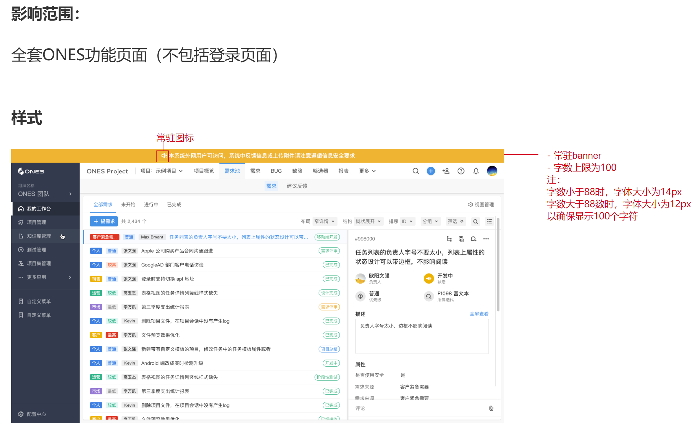
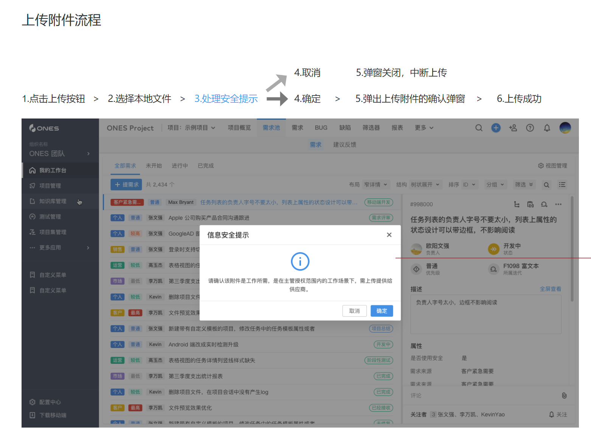
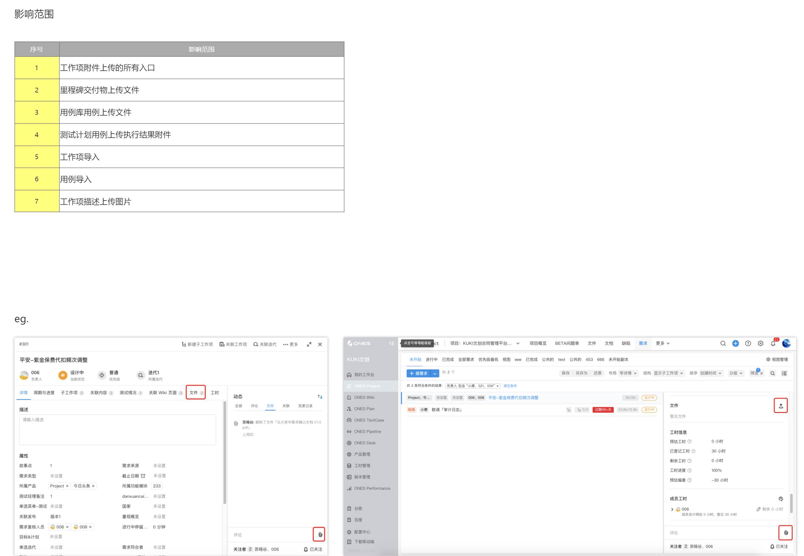
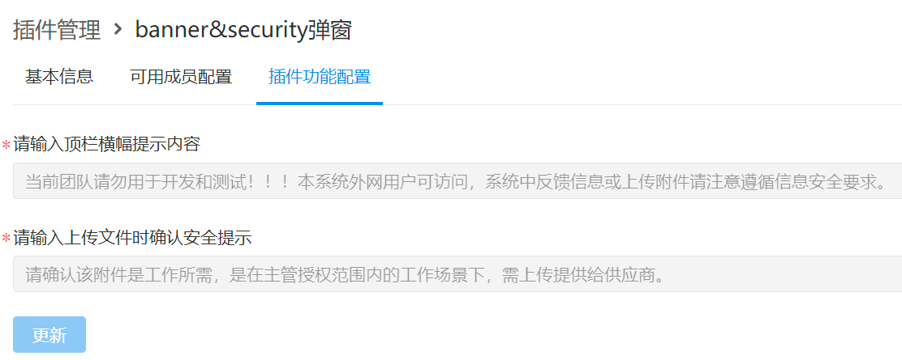

# 1. 系统 banner & security 弹窗

> 插件示例链接：[系统 banner&security 弹窗](https://gitlab.partner.ones.ai/example/banneruploadtip)

## 目标

这是一个几乎纯前端实现的插件。

通过这个插件，我们可以了解：

1. 如何使用插槽模块能力，修改现有标准系统的前端表现；
2. 插件是如何声明配置，以及插件如何使用配置；

## 需求

1. 作为审计部门，我希望公司团队在使用系统的过程中，能够有顶部条幅提示用户需要注意的安全事项；
2. 作为安全部门，我希望公司团队在使用系统的过程中，在上传文件时，弹出安全提示；

## 产品设计方案

1. 在系统所有页面的顶端增加一个条幅，并显示用户配置的内容；



2. 在上传文件时，首先弹出安全提示，提示中显示用户配置的内容；





3. 插件提供配置两个内容文本的配置页面；



## 技术实现方案

1. 使用两个前端插槽，分别插入对应的组件：
   1. 使用 ones::global::banner 插槽，展示横幅；
   2. 使用 ones::global::modal::upload 插槽，展示上传按钮的点击事件的弹窗；
2. 增加两个配置项；
   1. banner (横幅)中的提示语；
   2. tips （弹窗）中的提示语；
3. 在渲染两个插槽的内容时，获取插件中的配置项中的文本，并展示出来；

## 实现过程

- 创建插件工程代码，并初始化；
- 插件配置：
  - 使用 op 工具向代码中添加两个插槽；
  - 并向代码中添加两个配置项；
- 前端代码开发：
  - 撰写 banner 组件的代码，定义它的样式、显示效果等；
  - 撰写 modal-upload 组件的代码，定义它的样式、显示效果等；
- 在两个组件中调用方法，获取插件的配置；

## 代码

banner 前端代码

```javascript
const CRITICAL_SIZE = 88

export function BarBanner() {
  const [tips, setTips] = useState('')

  const getTips = useCallback(async function getTips() {
    try {
      const result = await getBannerTips()
      const { content = '' } = result?.data || {}
      setTips(content)
    } catch (e) {
      console.error(e)
    }
  }, [])

  useEffect(() => {
    getTips()
    addListener('update-banner-tips', getTips)
    return () => {
      removeListener('update-banner-tips', getTips)
    }
  }, [])

  const tipsSize = tips?.length > CRITICAL_SIZE ? { fontSize: '12px' } : null
  const isActive = tips?.length > 0
  return (
    <div className={`mf-bar-banner ${isActive ? 'mf-bar-banner--active' : ''}`}>
      <Notice className="mf-bar-banner__icon" />
      <span className="mf-bar-banner__content" style={tipsSize}>
        {tips}
      </span>
    </div>
  )
}
```

security 弹窗前端代码

```javascript
export function UploadConfirmDialog() {
  const [visible, setVisible] = useState(true)
  const [tips, setTips] = useState(cacheTips)

  useEffect(() => {
    const getTips = async () => {
      try {
        const result = await getUploadTips()
        console.log(result)
        const { content = DEFAULT_UPLOAD_TIPS } = result?.data || {}
        cacheTips = content
        setTips(content)
      } catch (e) {
        console.error(e)
      }
    }
    getTips()
  }, [])

  const handleOk = useCallback(() => {
    setVisible(false)

    // 等待动画执行完毕
    setTimeout(() => {
      MFGlobalDispatch('modal:ok', {
        status: 'FINISH',
      })
    }, 200)
  }, [])

  const handleCancel = useCallback(() => {
    setVisible(false)

    // 等待动画执行完毕
    setTimeout(() => {
      MFGlobalDispatch('modal:cancel', {
        status: 'CANCEL',
      })
    }, 200)
  }, [])

  return (
    <Modal
      visible={visible}
      forceRender
      title="信息安全提示"
      onOk={handleOk}
      onCancel={handleCancel}
      wrapClassName="honor-plugin-upload-confirm-dialog"
    >
      <Row gutter={[20, 10]}>
        <Col span={24} style={{ textAlign: 'center' }}>
          <InformationLarge color="#338fe5" fontSize={32} />
        </Col>
        <Col span={24} style={{ textAlign: 'center' }}>
          {tips}
        </Col>
      </Row>
    </Modal>
  )
}
```

前端获取提示信息实例代码

```javascript
const commonHeaders = window.__ONES_MF_ENV__?.request?.headers ?? {}

export function getBannerTips() {
  return fetch(`/project/api/project/getBanner`, {
    method: 'post',
    headers: commonHeaders,
  }).then((response) => {
    if (response.status !== 200) {
      throw new Error(`${response.url} fetch fail, code ${response.status}`)
    }
    return response.json()
  })
}

export function getUploadTips() {
  return fetch(`/project/api/project/getUploadTips`, {
    method: 'post',
    headers: commonHeaders,
  }).then((response) => {
    if (response.status !== 200) {
      throw new Error(`${response.url} fetch fail, code ${response.status}`)
    }
    return response.json()
  })
}
```
