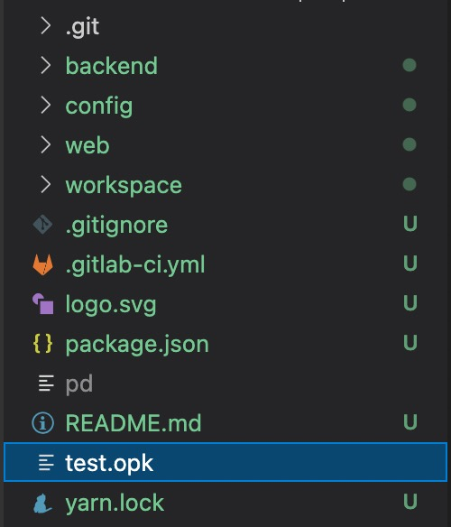

# 创建第一个插件

## 插件初始化

使用一个空文件夹作为插件目录，如 `test`

在 `test` 文件夹中打开命令行，运行以下命令来创建一个新插件：

```
op init
```

初始化过程会询问我们是否登录，我们暂时选择: No


最后会询问是否在初始化时添加能力，我们暂时选择: 退出 exit


创建好的插件目录结构如下：


## 插件打包

插件初始化完成后，你可以尝试运行以下命令来打包这个插件：

```
op package
```

完成后可以在当前目录中看到打包好的插件 opk 包，如 `test.opk`



## 插件安装

在启用了开放平台的环境中，我们可以上传并安装这个 opk 包：


现在，我们完成了第一个插件的创建与安装！
