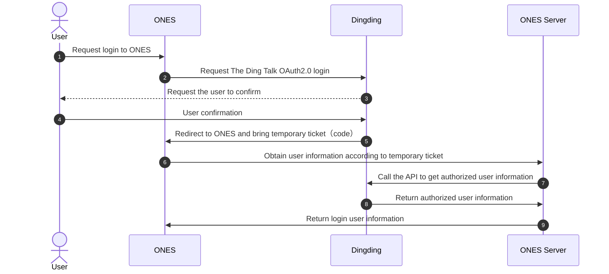

import Image from '@theme/IdealImage'
import addDepartment from './images/add-department.png'
import applicationInfo from './images/application-info.png'
import createApp from './images/create-application.png'
import nailingLoin from './images/nailing-login-sequence-diagram.png'
import ONESLoginInterface from './images/ONES-login-interface.png'
import QRCodeLogin from './images/QR-code-login.png'
import QRcode from './images/QR-code.png'
import redirectUrl from './images/redirect-url.png'
import account5 from './images/account5.png'
import account6 from './images/account6.png'

# Scene：ONES integrate with Ding Talk system

## Scene Description

Users want to synchronize the organizational structure and personnel information in the Ding Talk to the ONES, and they can directly login to the ONES by scanning the QR code.

## Solution

### ability statement

Add the following code to the plugin configuration file
`config/plugin.yaml`

```yaml title="config/plugin.yaml"
service: ...
abilities:
  - id: ...
    name: account
    abilityType: account
    version: 1.0.0
    function:
      sendMessage: SendMessage
      createLoginUrl: CreateLoginUrl # create redirect login URL
      doExchangeUser: DoExchangeUser # obtain login user information
      doPullData: DoPullData # synchronize third-party system user data
    config:
      # whether the login function is realized
      - key: canLogin
        show: false
        value: true
        # whether the synchronization function is realized
      - key: canSync
        show: false
        value: true
        # whether the function of sending messages is realized
      - key: canMessage
        show: false
        value: true
        # the logo address of the third party login, which is the name of the file, which is required to be placed in the root directory of the front-end resource, web/dist/
      - key: logo
        show: false
        value: logo.svg
        # third party login name
      - key: title
        show: false
        value: Account-SSO
        # third party description
      - key: desc
        show: false
        value: Account-SSO
        # third party description
      - key: detailTip
        show: false
        value: Account-SSO
        # third party configuration reminder
      - key: configTip
        show: false
        value: Account-SSO
```

### Third-party system access

#### prerequisite

1. Register Ding Talk account

   Log in to the Ding Talk (this step does not provide detailed operation)

2. Create H5 micro-application

   The Ding Talk OAuth2.0 authorization login allows the Ding Talk user to use the Ding Talk identity to securely log in to the ONES. After the Ding Talk user authorization login has been connected to the Ding Talk OAuth2.0, the plugin can obtain the user's interface call credential sns_token, and the sns_token can be used to call the Ding Talk open platform authorization relationship API, so as to obtain the basic open information of the Ding Talk user and help the user to achieve the basic open function.

<Image img={createApp} />

After the creation is successful, find the application information under the application page, and record the AgentId, AppKey and AppSecret of the internal application of the Ding talk enterprise.

<Image img={applicationInfo} />

Find `应用功能 -> 登录与分享 -> 接入登录` at the bottom of the application interfac.The domain name entered in the input box is the **ONES instance domain** that is called back after being logged in.

<Image img={redirectUrl} />

#### Third party login

The log-in sequence of third-party users is as follows



After entering the login page of ONES, click the Ding Talk login entry provided by the plugin.

<Image img={ONESLoginInterface} />

Log in using the Ding Talk scan QR code and confirm the authorization to log in on the mobile phone

Through the previous operation steps, the developer has completed the operation steps from step 1 to step 4 in the sequence diagram, and the specific implementation of these steps is in the `CreateLoginUrl()` method in the plugin code.

:::caution

- Every time you click on the Ding Talk scan login entry provided by the plugin, you will first enter the interior of the `CreateLoginUrl()` method. The main function of this method is to create a third-party login URL.For more information on the construction format of the URL,please refer [Ding Talk scan QR code login](https://open.dingtalk.com/document/orgapp-server/scan-qr-code-to-log-on-to-third-party-websites)。
- The request in the `CreateLoginUrl()` method already contains the URL for redirecting ONES. You can use the following code to encode the redirected URL with urlencode.

:::

```tsx
type CreateLoginUrlResponse = {
  url: string
}

// Login
export async function CreateLoginUrl(request: PluginRequest): Promise<PluginResponse> {
  Logger.info('Welcome to Login')
  let respUrl: string = ''
  let response: CreateLoginUrlResponse = {
    url: '',
  }
  if (typeof request?.body == 'object' && !Array.isArray(request?.body)) {
    let redirectUrl: string = request?.body.redirect_url
    Logger.info('redirectUrl:', redirectUrl)
    let loginUrl = new URL(DindDing_LoginURL)
    loginUrl.searchParams.append('response_type', 'code')
    loginUrl.searchParams.append('scope', 'snsapi_login')
    loginUrl.searchParams.append('state', 'STATE')
    loginUrl.searchParams.append('appid', AppKey) // AppKey
    loginUrl.searchParams.append('redirect_uri', redirectUrl)
    respUrl = loginUrl.toString()
    Logger.info('respUrl: ', respUrl)
    response.url = respUrl
    return CreateLoginUrlRespData(200, '200', '', '', '', response)
  }
  return CreateLoginUrlRespData(500, '', '', '', '', response)
}

function CreateLoginUrlRespData(
  code: number,
  errcode,
  model,
  reason,
  type: Object,
  body: CreateLoginUrlResponse
): PluginResponse {
  return {
    body: {
      code,
      errcode,
      model,
      reason,
      type,
      body,
    },
  }
}
```

:::caution

- After the temporary authorization is obtained by scanning the code, the page will be called back to the login page of ONES.Next, the developer needs to implement the steps such as obtaining user information according to temporary authorization ticket,calling API to obtain authorized user information and returning login user information in the `DoExchangeUser()` method.For more information on calling APIs,please see [obtain-the-user-information-based-on-the-sns-temporary-authorization](https://open.dingtalk.com/document/orgapp-server/obtain-the-user-information-based-on-the-sns-temporary-authorization).
- When the Ding Talk is recalled to the ONES login page, the temporary authorization code can be obtained in the request of the `DoExchangeUser()` method. When the user information is returned in the format of `DoExchangeUserResponse` in the code,the third-party system user can successfully log in to ONES.

:::

```tsx
// Get login user information
export async function DoExchangeUser(request: PluginRequest): Promise<PluginResponse> {
  Logger.info('DoExchangeUser Come in')
  let resp: DoExchangeUserResponse = {
    third_party_id: '',
    name: '',
    title: '',
    avatar: '',
    email: '',
    phone: '',
  }
  Logger.info('Request:', request?.body)

  // Parse the request body and parse the code
  let code: string = getCode(request)
  Logger.info('Request Code:', code)

  // Get Application token
  let token = await getToken()
  if (token == '') {
    return DoExchangeUserRespData(500, '', '', 'token missing', 'plugin', resp)
  }
  Logger.info('Token:', token)

  // Obtain user UnionID through temporary authorization code
  let uniod = (await getUserInfoByCode(code)) as any
  if (uniod == '' || uniod == undefined) {
    return DoExchangeUserRespData(500, '', '', 'uniod missing', 'plugin', resp)
  }
  Logger.info('Uniod:', uniod)

  // Get user UUID through user UnionID
  let userID = (await getUserIDByUnionID(uniod, token)) as any
  if (userID == '' || userID == undefined) {
    return DoExchangeUserRespData(500, '', '', 'userID missing', 'plugin', resp)
  }
  Logger.info('UserID:', userID)

  // Get user information through user UUID
  let userInfo = (await getUser(userID, token)) as any
  Logger.info('UserInfo:', userInfo)
  ;(resp.third_party_id = userInfo?.userid),
    (resp.name = userInfo?.name),
    (resp.title = userInfo?.position),
    (resp.avatar = userInfo?.avatar),
    (resp.email = userInfo?.email),
    (resp.phone = userInfo?.mobile)
  Logger.info('Login User:', resp)

  // Return login user information
  return DoExchangeUserRespData(200, '', '', '', '', resp)
}

export function getCode(request: PluginRequest) {
  // Logger.info(request)
  if (typeof request?.body == 'object' && !Array.isArray(request?.body)) {
    let authInfo = request.body.auth_info
    let obj = JSON.parse(authInfo)
    return obj.code
  }
  return ''
}

// Get the enterprise token
export async function getToken(): Promise<string> {
  Logger.info('Getting enterprise application token...')
  try {
    // url of login
    const url = 'https://oapi.dingtalk.com/gettoken' + `?appkey=${Appsecret}&appsecret=${Secret}`
    Logger.info('request =====', url)
    const response = await fetchHttp({
      url: url,
      method: 'GET',
    })
    let body = (response?.body as Record<string, any>) || ''
    const AccessToken = body?.access_token || ''
    const ExpiresIn = body?.expires_in || 0
    if (AccessToken == '') {
      Logger.info('Failed to get token::', body)
      return ''
    }
    Logger.info('token:', AccessToken)
    Logger.info('expires_in', ExpiresIn)
    Logger.info('insert_sql sql:', insert_sql)
    Logger.info('token obtained successfully')
    return AccessToken
  } catch (error) {
    Logger.info('token exception error::', error)
    return ''
  }
}

function DoExchangeUserRespData(
  code: number,
  errcode,
  model,
  reason,
  type: Object,
  body: DoExchangeUserResponse
): PluginResponse {
  return {
    body: {
      code,
      errcode,
      model,
      reason,
      type,
      body,
    },
  }
}
```

#### Departmental synchronization

The prerequisite for department users to synchronize directories is that **users who need a third-party system have been successfully activated on the ONES system**.

In the `DoPullData()` method,you need to **obtain the department and user information of the third-party system**,and the returned content can be based on the code comment structure.
:::caution

- ID of root department must be "- 1"；
- Not all department information can be synchronized. Currently, only all user information under **root department** is supported.
- Developers can call the create department API and add users to the department interface in the synchronization code to assign synchronized users to a department.
- Developers or team managers manually manage synchronized users to different departments.

:::

```tsx
// Synchronization information
// departments: [  //Returns a list of departments, which must have a department with an id of-1, which is the root department
//      {
//           third_party_id: "-1",  // The only id in the department
//           name: agent?.name,     // Department name
//           parent_id: "",         // Parent department id
//           next_id: ""            // In the same level department, the id of the next department
//      }
//     ...
// ]
// users: [
//   		{
//           third_party_id: userid,       // user id
//           name: userInfo?.name,         // user name
//           email: userInfo?.email,       // user email
//           title: userInfo?.position,    // user position
//           department_ids: ["-1"]        // department id
//   		}
//   ...
// ]
export async function DoPullData(request: PluginRequest): Promise<PluginResponse> {
  const body = request.body || {}
  let resp: DoPullDataResponse = {
    departments: [],
    users: [],
  }

  // Get enterprise application token
  let token = await getToken()
  if (token == '') {
    Logger.info('Failed to get token')
    return DoPullDataRespData(500, '', '', '', '', resp)
  }

  // Get root department details
  let agent = await getRootDepartmentInfo(token)
  if (agent == '') {
    return DoPullDataRespData(500, '', '', '', '', resp)
  }
  Logger.info('agent:', agent?.name)

  // Suppose there is only one root department, the department information must have a root department, and the root department id is "- 1"
  let rootDepartment = {
    third_party_id: '-1',
    name: agent?.name,
    parent_id: '',
    next_id: '',
  }

  let departments: DepartmentInfo[] = []
  // Append root department ID
  departments[0] = rootDepartment

  // all users
  let userInfos: UserInfo[] = []

  // Obtain user information related to the department (provide user information according to actual business needs)
  let departUserInfos = await listDepartmentUsers('1', token)

  for (let i = 0; i < departUserInfos.length; i++) {
    //Query the list of departments according to the user's ID
    let userInfo = (await getUser(departUserInfos[i]?.userid, token)) as any
    userInfos.push({
      third_party_id: userInfo?.userid,
      name: userInfo?.name,
      email: userInfo?.email,
      title: userInfo?.title,
      department_ids: ['-1'], //root department
      company: 'ONES',
      id_number: userInfo?.job_number,
    })
  }

  Logger.info('departments:', departments)
  Logger.info('userInfos:', userInfos)
  resp.departments = departments
  resp.users = userInfos
  return DoPullDataRespData(200, '', '', '', '', resp)
}

// Get the enterprise token
export async function getToken(): Promise<string> {
  Logger.info('Getting enterprise application token...')
  try {
    // url of login
    const url = 'https://oapi.dingtalk.com/gettoken' + `?appkey=${Appsecret}&appsecret=${Secret}`
    Logger.info('request =====', url)
    const response = await fetchHttp({
      url: url,
      method: 'GET',
    })
    let body = (response?.body as Record<string, any>) || ''
    const AccessToken = body?.access_token || ''
    const ExpiresIn = body?.expires_in || 0
    if (AccessToken == '') {
      Logger.info('Failed to get token::', body)
      return ''
    }
    Logger.info('token:', AccessToken)
    Logger.info('expires_in', ExpiresIn)
    Logger.info('insert_sql sql:', insert_sql)
    Logger.info('token obtained successfully')
    return AccessToken
  } catch (error) {
    Logger.info('token exception error::', error)
    return ''
  }
}

function DoPullDataRespData(
  code: number,
  errcode,
  model,
  reason,
  type: Object,
  body: DoPullDataResponse
): PluginResponse {
  return {
    body: {
      code,
      errcode,
      model,
      reason,
      type,
      body,
    },
  }
}
```

In the member management page, manually add synchronized users to the specified department, use third-party integrated synchronization users, the suffix will have the identity of the plugin.

<Image img={addDepartment} />
