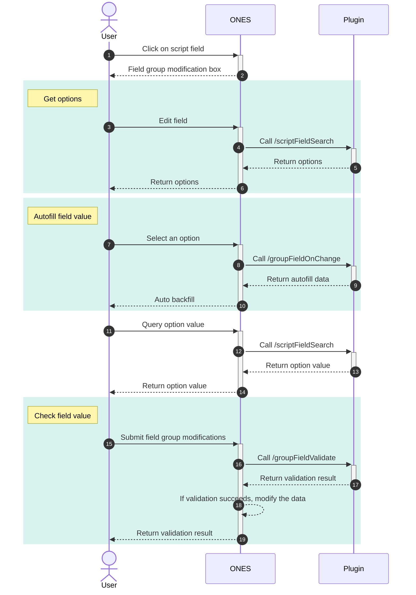

import Image from '@theme/IdealImage'

import editFieldGroup1 from './images/edit-field-group1.png'
import editFieldGroup2 from './images/edit-field-group2.png'
import editFieldGroup3 from './images/edit-field-group3.png'
import productSelecttionField from './images/product-selection-field.png'
import projectSelecttionField1 from './images/project-selection-field-1.png'
import projectSelecttionField2 from './images/project-selection-field-2.png'
import projectSelectionFieldConfig from './images/project-selection-field-config.png'
import taskSelectionField1 from './images/task-selection-field-1.png'
import taskSelectionField2 from './images/task-selection-field-2.png'
import taskSelectionFieldConfig from './images/task-selection-field-config.png'

# Selection

## Requirements

| ONES    | @ones-op/node-ability |
| :------ | :-------------------- |
| v3.6.0+ | v0.3.7+               |

## Overview

This capability allows plugins to add script fields with the type **single-select/multi-select menus**. The options for these properties can be dynamically specified by the plugin code. Additionally, this capability supports aggregating multiple script properties that have associated relationships into a property group, enabling interactive effects among multiple script properties.

### Scope

Single-select/multi-select menu script fields can be added as **issue fields**, **project fields**, and **product fields**.The script properties of issue and project are supported for use in **Performance**.

### Performace

#### Issue

When single-select/multi-select menu script fields are added as issues fields, you can add them to specific issue types, just like using system issue fields.

<Image img={taskSelectionFieldConfig} />

<Image img={taskSelectionField1} />

<Image img={taskSelectionField2} />

In most scenarios, script issue fields behave similarly to the system issue fields in the ONES system. However, there are slight differences in the following scenarios:

- In layout configuration, tagged fields do not support script fields.
- In issue list view，only filtering based on script issue fields is supported, while sorting and grouping based on script issue fields are not supported.
- Importing issues does not support importing issues that contain script issue fields.
- In "Automation Settings", updating script issue fields and creating issues with pre-set script field values are not supported.
- In "My Work" - "Dashboard" - "Custom Report Card", using script issue fields as analysis dimensions is not supported.

#### Project

When single-select/multi-select menu script fields are added as projects script fields, you can add them to specific projects just like using system project fields.

<Image img={projectSelectionFieldConfig} />

<Image img={projectSelecttionField1} />

<Image img={projectSelecttionField2} />

In most scenarios, script project fields behave similarly to the system project fields in the ONES system. However, there are slight differences in the following scenarios:

- In project list view, only filtering based on script issue fields is supported, while sorting and grouping based on script issue fields are not supported.
- In "My Work" - "Dashboard" - "Project List Card", script field

#### Product

<Image img={productSelecttionField} />

In most scenarios, script product fields behave similarly to the system product fields in the ONES system. However, there are slight differences in the following scenarios:

- In product list view, only filtering based on script issue fields is supported, while sorting and grouping based on script issue fields are not supported.

## Usage

### Create script field

Using the `Field` module from `@ones-op/node-ability`, you can create script fields at the appropriate timing, such as in the Install hook function of the plugin.

#### Issue

You can use the `Field.FieldsAdd` method to create issue script field.

```typescript title="backend/src/index.ts"
import { Field } from '@ones-op/node-ability'

export async function Install() {
  Logger.info('[Plugin] Install')
  const FieldsAddRes = await Field.FieldsAdd({
    Name: 'singleSelect field',
    Type: 1001, // multiSelect: 1002
  })
  if (FieldsAddRes.Error) {
    throw new Error('Failed to create property')
  }
  const { UUID: fieldUUID } = FieldsAddRes
  Logger.info('create field:', fieldUUID)
}
```

**Field.FieldsAdd Parameter Description**

| Parameter | Type   | Description                                                           |
| :-------- | :----- | :-------------------------------------------------------------------- |
| Name      | string | Property name                                                         |
| Type      | int    | Script field type:<br/>- 1001: single-select<br/>- 1002: multi-select |

#### Project/Product

You can use the `Field.ItemsAdd` method to create project/product script fields.

```typescript title="backend/src/index.ts"
import { Field, FieldTypeEnum, PoolEnum } from '@ones-op/node-ability'
import { Logger } from '@ones-op/node-logger'

export async function Install() {
  Logger.info('[Plugin] Install')
  const ItemsAddProjectRes = await Field.ItemsAdd({
    FieldType: FieldTypeEnum.SingleLabel,
    Name: 'Single Select Project Field',
    ItemType: 'field',
    Pool: PoolEnum.Project,
    ContextType: 'team',
    required: false,
  })
  if (ItemsAddProjectRes.Error) {
    throw new Error('Failed to create field')
  }
  const { UUID: fieldUUID } = ItemsAddProjectRes
  Logger.info('Created field:', fieldUUID)
}
```

**Field.ItemsAdd Parameter Description**

| Parameter   | Type   | Description                                                                                                             |
| :---------- | :----- | :---------------------------------------------------------------------------------------------------------------------- |
| FieldType   | string | Script property type:<br />- `FieldTypeEnum.SingleLabel`: Single select<br />- `FieldTypeEnum.MultiLabel`: Multi-select |
| Name        | string | Property name                                                                                                           |
| ItemType    | string | Fixed value: `field`                                                                                                    |
| Pool        | string | Entity type: <br />- `PoolEnum.Project`: Project property<br />- `PoolEnum.Product`: Product property                   |
| ContextType | string | Context type                                                                                                            |
| required    | bool   | Whether the property is required                                                                                        |

### Field options {#options}

To customize the options for a script field, you need to add an interface `/scriptFieldSearch` in the plugin configuration file. The ONES system internally uses this interface to fetch the options for the script field.

```yaml title="config/plugin.yaml"
service:
  app_id: ...
  name: ability-scriptSelection
  ...
apis:
  - type: addition
    methods:
      - POST
    url: /scriptFieldSearch
    function: GetOptions
```

In the `GetOptions` method, you need to construct and return the options for the script field.

```typescript title="backend/src/index.ts"
interface Body {
  field_uuid: string
  uuids?: Array<string> // Only used for field group
  relations?: Array<{
    // Only used for field group
    field_uuid: string
    field_value: string[]
  }>
}

interface Response {
  body: {
    code: number
    body: {
      options: Array<{
        uuid: string
        value: string
      }>
    }
  }
}

export async function GetOptions(request: PluginRequest<Body>): Promise<Response> {
  const body = request?.body
  const options = [] // Options data to be returned

  for (let i = 0; i < 3; i++) {
    options.push({
      uuid: 'optionsUUID' + i.toString(),
      value: 'Option Value' + i.toString(),
    })
  }

  return {
    body: {
      code: 200,
      body: {
        options,
      },
    },
  }
}
```

Once you have completed the above steps, you can use the created script field in the ONES system.

### Field group

Sometimes, there can be certain relationships between multiple script fields, such as "Province" and "City." The options for "City" may vary based on the selected value of "Province." Additionally, when a particular "City" is selected, the corresponding "Province" should also be automatically selected. To achieve this kind of relationship, we can aggregate these script fields into an field group.

#### Create field group

You can use the `Field.AddGroupField` method to add a field group.

```typescript
const relations = fieldUUIDS.map((fieldUUID, index) => ({
  FieldUUID: fieldUUID,
  FieldParentUUID: '',
  Position: index
}))

const AddGroupFieldRes = await Field.AddGroupField({
  Name: 'Field Group Name',
  ObjectType: PoolEnum.Task
  Relations: relations
})
```

**Field.AddGroupField Parameter Description**

| Parameter  | Type             | Description                                                                                                                                              |
| :--------- | :--------------- | :------------------------------------------------------------------------------------------------------------------------------------------------------- |
| ObjectType | string           | The entity type of the field group. Possible values:<br />- `PoolEnum.Project`: Project<br />- `PoolEnum.Product`: Product<br />- `PoolEnum.Task`: Issue |
| Name       | string           | The name of the field group                                                                                                                              |
| Relations  | IRelationMessage | An array of relationship information                                                                                                                     |

**IRelationMessage**

| Parameter       | Type   | Description                                        |
| :-------------- | :----- | :------------------------------------------------- |
| FieldUUID       | string | The `fieldUUID` of the field                       |
| FieldParentUUID | string | The UUID of the parent field, indicating hierarchy |
| Position        | string | The position of the field within the group         |

#### Field Options

For the fields within the field group, we also utilize the `/scriptFieldSearch` interface to retrieve the options for each field. However, the construction of field options varies depending on the request parameters:

- If the request parameters include `uuids`: the `uuids` field contains the IDs of the selected options for the field. In this case, the corresponding options for these IDs should be returned.
- If the request parameters include `relations`: the `relations` field contains the values of the related fields. Consequently, the field options should be filtered and returned based on the values of the related fields.
- If the request parameters neither include `relations` nor `uuids`: all field options should be returned.

```typescript
interface Body {
  field_uuid: string
  uuids?: Array<string> //  contains the IDs of the selected options for the field
  relations?: Array<{
    // contains the values of the related fields
    field_uuid: string
    field_value: string[] | null
  }>
}

interface Response {
  body: {
    code: number
    body: {
      options: Array<{
        uuid: string
        value: string
      }>
    }
  }
}

const locations = {
  Guangdong: ['Guangzhou', 'Shenzhen'],
  Jiangsu: ['Nanjing', 'Suzhou'],
}

const buildOptions = (options) => {
  return {
    body: {
      code: 200,
      body: {
        options,
      },
    },
  }
}

export async function GetOptions(request: PluginRequest<Body>): Promise<Response> {
  const body = request.body || {}
  const { field_uuid, uuids, relations } = body
  if (field_uuid === 'City') {
    const allCitys = Object.values(locations).flat()
    if (uuids) {
      /**
       * If uuids are provided in the request parameters, the corresponding options for the IDs included in uuids should be returned directly.
       */
      return buildOptions(
        uuids.map((uuid) => {
          return {
            uuid,
            value: uuid, // In the example, for simplicity, the UUIDs and values are assumed to be the same.
          }
        })
      )
    }
    if (relations) {
      /**
       * If `relations` are provided in the request parameters,
       * the available cities should be filtered based on the associated property, which is the value of the province.
       * Only the cities corresponding to the selected province should be returned.
       **/
      const province = relations.find((relation) => relation.field_uuid === 'Province')
        ?.field_value[0]
      if (province) {
        return buildOptions(
          locations[province].map((city) => {
            return {
              uuid: city,
              value: city,
            }
          })
        )
      }
    }
    /**
     * If neither `uuids` nor `relations` are included in the request parameters, all cities should be returned.
     */
    const allCitys = Object.values(locations).flat()
    return buildOptions(
      allCitys.map((city) => {
        return {
          uuid: city,
          value: city,
        }
      })
    )
  }
}
```

#### Field value linkage

For field group fields, plugin developers need to implement a `/groupFieldOnChange` interface:

```yaml title="config/plugin.yaml"
apis:
  - type: addition
    methods:
      - POST
    url: /groupFieldOnChange
    function: GroupFieldOnChange
```

When a field in the field group is about to be modified, the ONES system will send a request to the plugin. This request includes the current values of all properties in the field group and the ID of the property being changed. In the processing function of this request, developers can use the value of the changed field to set the values of other related fields within the field group. Finally, all values of the fields in the field group should be returned together.

For example, when the value of the "City" field changed, we want to set the value of the "Province" field accordingly, we can implement it as follows:

```typescript
interface Body {
  group_uuid: string // ID of the field group
  change_field_uuid: string // ID of the changed field
  field_values: Array<{
    // Values of all fields in the field group
    field_uuid: string // ID of the field
    option_uuids: Array<string> | null // IDs of the field values
  }>
  UserUUID: string // ID of the current user
}

interface Response {
  statusCode: number
  body: {
    code: number
    body: {
      field_values: Array<{
        field_uuid: string
        option_uuids: Array<string> | null
      }>
    }
  }
}

const locations = {
  Guangdong: ['Guangzhou', 'Shenzhen'],
  Jiangsu: ['Nanjing', 'Suzhou'],
}

const buildResult = (field_values) => {
  return {
    statusCode: 200,
    body: {
      code: 200,
      body: {
        field_values,
      },
    },
  }
}

export async function GroupFieldOnChange(request: PluginRequest<Body>): Promise<Response> {
  const { change_field_uuid, field_values = [] } = request.body || {}
  if (change_field_uuid === 'City') {
    const city = field_values.find((field_value) => field_value.field_uuid === 'City')
      ?.option_uuids[0]
    for (const province in locations) {
      if (locations[province].includes(city)) {
        return buildResult([
          {
            field_uuid: 'Province',
            option_uuids: [province],
          },
          {
            field_uuid: 'City',
            option_uuids: [city],
          },
        ])
      }
    }
  }
}
```

#### Field value validation

To complete the functionality of the field group, developers need to implement a `/groupFieldValidate` interface.

```yaml title="config/plugin.yaml"
apis:
  - type: addition
    methods:
      - POST
    url: /groupFieldValidate
    function: GroupFieldValidate
```

When a user submits a modification to the field group, the ONES system internally sends a request to this interface. The request parameters include the current values of all fields in the field group. In the processing function of this interface, developers can perform validation on the values of the field group. The success or failure of the validation depends on whether the status code is 200. If the validation fails, the modification is considered invalid. When the validation is successful, an additional update of the field values can be performed.

```typescript
interface Body {
  UserUUID: string
  field_groups: Array<{
    group_uuid: string
    field_values: Array<{
      field_uuid: string
      option_uuids: Array<string>
    }>
  }>
}

interface Response {
  statusCode: number
  body: {
    code: number
    body: {
      options: Array<{
        field_uuid: string
        option_uuid: string
        option_value: string
      }>
    }
  }
}

export async function GroupFieldValidate(request: PluginRequest<Body>): Response {
  const { field_groups = [] } = request.body
  const options = []
  field_groups.forEach(({ field_values }) => {
    field_values.forEach(({ field_uuid, option_uuids }) => {
      option_uuids.forEach((option_uuid) => {
        options.push({
          field_uuid,
          option_uuid,
          option_value: option_uuid,
        })
      })
    })
  })
  const isValid = checkIsValid(options)
  return {
    statusCode: isValid ? 200 : 500,
    body: {
      code: isValid ? 200 : 500,
      body: {
        options,
      },
    },
  }
}
```

#### Updating Field Values

For single-select/multi-select menu script fields, each field option has a unique `uuid`. The value of a field represents the `uuid` of the selected option. You can use `Field.UpdateFieldOption` to modify the value of the option, thus updating its display on the interface.

```typescript
const UpdateFieldOptionRes = await Field.UpdateFieldOption([
  {
    TeamUUID: globalThis.onesEnv.teamUUID,
    FieldUUID: fieldUUID,
    UUID: 'valueUUID',
    Value: 'value',
    ObjectType: 3,
  },
])
```

**Field.UpdateFieldOption Parameters**

| Parameter  | Type   | Description                                                                                    |
| :--------- | :----- | :--------------------------------------------------------------------------------------------- |
| TeamUUID   | string | Team UUID                                                                                      |
| FieldUUID  | string | Script field UUID                                                                              |
| UUID       | string | UUID of the field option                                                                       |
| Value      | string | Value of the field option                                                                      |
| ObjectType | int    | Entity type, can have the following values:<br />- 1: Product<br />- 2: Project<br />- 3: Task |

#### Sequence Diagram

After adding script fields and field groups, the complete process of modifying fields is as follows:



:::tip

In ONES system, modifying fields within a field group has a slightly different interaction compared to modifying regular fields. Due to the interdependency among fields within a field group, modifying fields within a field group requires modifying the entire group as a whole.

- When modifying fields within a field group, an field group editing dialog will appear.

  <Image img={editFieldGroup1} />

- When batch modifying issue fields, if a field within a field group is selected, other fields within the same group will also be automatically selected.
  <Image img={editFieldGroup2} />
  <Image img={editFieldGroup3} />

:::tip

## Examples

- [field and field group of location](sample-script-field-selection.mdx)
