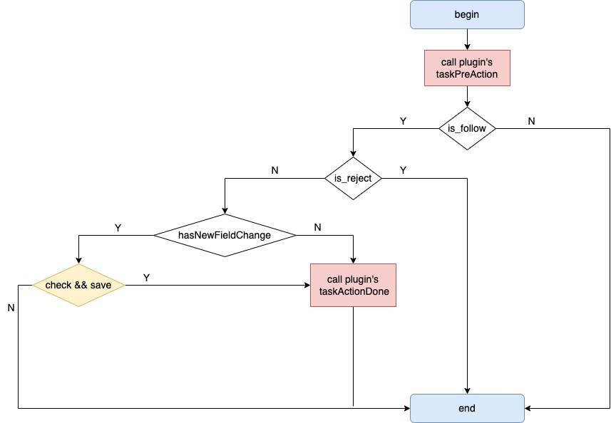
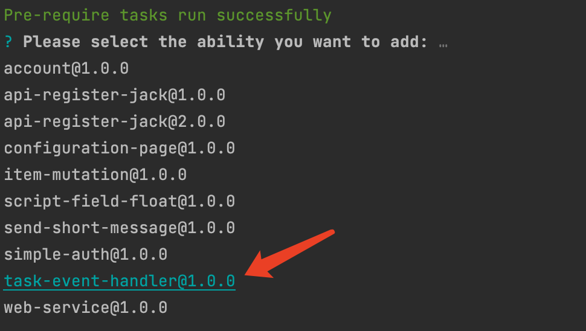
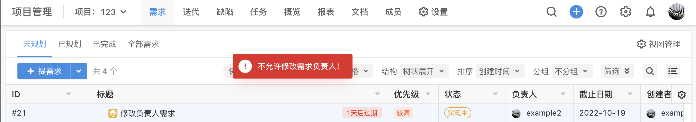
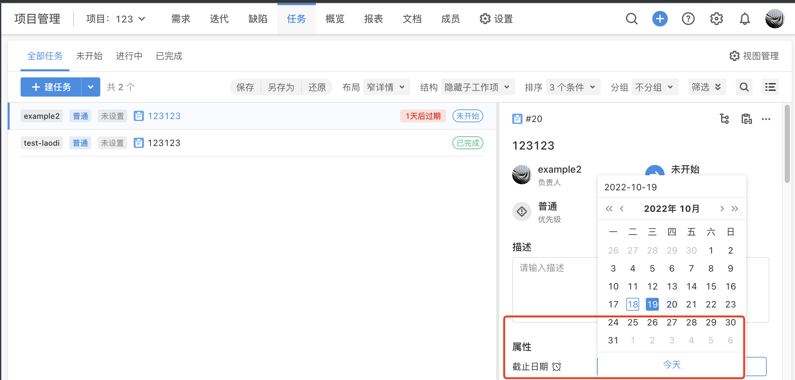
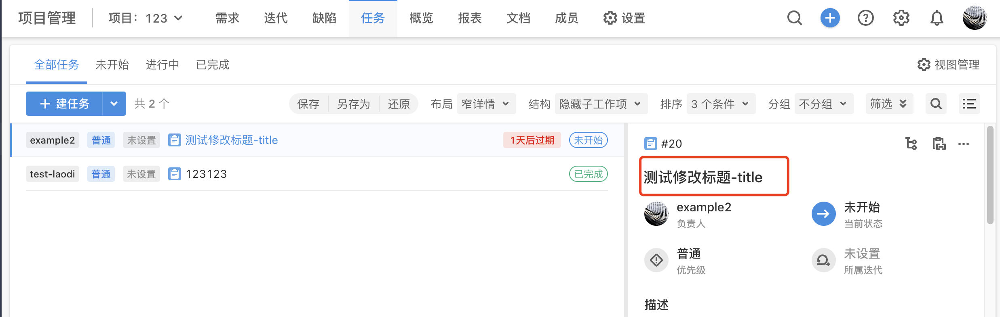

# TaskEventHandler

## Ability Description

When the system generates "task" update event, plugin registered with this ability will receive the event data before the event takes effect and can perform some operations on it, for example:

1. Ignore:not handle this event；
2. Accept:not modify this event, but pay attention to its subsequent processing results；
3. Modify: modify the content of the event；
4. Reject:prevent this event；

## Ability Scope

1. change task's field(include status)
2. batch change task's field
3. batch change task's type

## Ability Usage

Ability Method Flow Chart



1. Use the op tool to add ability



Include the following file changes:

- file modify：config/plugin.yaml added ability configuration

- file add：backend/src/taskeventhandler.ts

2. Configure config/plugin.yaml

Under ability config, configure the "issueScopeType" and "field"

Support configure multiple “issueScopeType” and “field”,separate by "，" or ","

```yaml
abilities:
  - id: de265bd9-9otf
    name: TaskEventHandler
    abilityType: TaskEventHandler
    version: 1.0.0
    function:
      taskActionDoneFunc: taskActionDone
      taskPreActionFunc: taskPreAction
    config:
      - fieldType: Input
        key: issueTypeScope
        show: true
        label: '工作项类型'
        value: '需求,缺陷,任务'
      - fieldType: Input
        key: field
        show: true
        label: '工作项属性'
        value: '截止日期,负责人，截止日期'
```

3. Modify backend/src/taskeventhandler.ts

the file contains two methods：

- taskPreAction

- taskActionDone

定义返回结构体变量，

```tsx
type taskPreResponse = {
  statusCode: number
  body: {
    code: number
    body: {
      is_follow: boolean
      is_reject: boolean
      reject_reason: string
      task_events: any
      other_data: string
    }
  }
}
```

example of taskPreAction returned result:

- Ignore：set “is_follow = false”

- Reject：set “is_follow = true” && “is_reject = true”

- Accept：set “is_follow = true” && “is_reject = false”

- Modify：set “is_folow = true” && “is_reject = false” and add field modifications to the "event" object；

add the processing logic to the method，

```typescript
// pre
export async function taskPreAction(request: PluginRequest): Promise<PluginResponse> {
  const body = request?.body as any
  const userUUID = body.user_uuid
  const lang = body.lang
  const events = body.task_events
  const action = events[0].action
  Logger.info('nEvents', events)
  Logger.info('userID:', userUUID)
  Logger.info('lang', lang)
  Logger.info('action', action)
  // 添加属性修改
  const aField = {
    field_name: '标题',
    value: '测试添加属性修改标题',
  }
  events[0].task_fields.push(aField)
  return {
    statusCode: 200,
    body: {
      code: 200,
      body: {
        is_follow: true,
        is_reject: false,
        reject_reason: '',
        task_events: events,
        other_data: '其他数据',
      },
    },
  }
}
// done
export async function taskActionDone(request: PluginRequest): Promise<PluginResponse> {
  var body = request?.body as any
  var events = body.task_events
  var otherData = body.other_data
  var userUUID = body.user_uuid
  var lang = body.lang
  var action = events[0].action
  Logger.info('ans event', events)
  Logger.info('ans other_data', otherData)
  Logger.info('ans userID:', userUUID)
  Logger.info('ans lang', lang)
  Logger.info('ans action', action)
  return {
    statusCode: 200,
    body: {
      code: 200,
    },
  }
}
```

## Struct Definition

1. taskPreAction input param

| param       | type        | required | explain       |
| ----------- | ----------- | -------- | ------------- |
| user_uuid   | string      | Y        | user id       |
| lang        | string      | Y        | user language |
| task_events | []TaskEvent | Y        | change data   |

2. taskPreAction output param

| param         | type        | required | explain                                 |
| ------------- | ----------- | -------- | --------------------------------------- |
| is_follow     | string      | Y        |                                         |
| is_reject     | string      | Y        |                                         |
| reject_reason | string      | N        |                                         |
| task_events   | []TaskEvent | Y        | change data                             |
| other_data    | interface   | N        | other data will trans to taskActionDone |

3. taskActionDone input param

| param       | type        | required | explain            |
| ----------- | ----------- | -------- | ------------------ |
| user_uuid   | string      | Y        |                    |
| lang        | string      | Y        |                    |
| task_events | []TaskEvent | Y        | change data        |
| other_data  | interface   | N        | from taskPreAction |

4. taskActionDone output param

none

5. TaskEvent

| param                     | type              | required | explain                                                                  |
| ------------------------- | ----------------- | -------- | ------------------------------------------------------------------------ |
| task_fields               | []TaskEventField  | Y        | change field list                                                        |
| task_uuid                 | string            | Y        | task uuid                                                                |
| action                    | string            | Y        | update<br />transit<br />change_issue_type<br />publish_version<br />add |
| issue_type_scope_uuid     | string            | Y        | task scopeUUID                                                           |
| issue_type_scope_name     | string            | Y        | task scope 的 Name                                                       |
| issue_type_scope_name_map | map[string]string | Y        | task scope name each language                                            |

6. TaskEventField

| param            | type              | required | explain                                                                                                               |
| ---------------- | ----------------- | -------- | --------------------------------------------------------------------------------------------------------------------- |
| field_uuid       | string            | N        | field id                                                                                                              |
| field_type       | string            | N        | field tyoe                                                                                                            |
| field_name       | string            | N        | field name key                                                                                                        |
| field_name_map   | map[string]string | N        | each language field name for example： <br />en: 'Assignee/Owner' <br />origin: '{{field.assign}}' <br />zh: '负责人' |
| field_value_type | string            | N        | field value type 0-未知/1-int/2-string/3-[]string                                                                     |
| value            | interface         | N        | field value                                                                                                           |

## 能力示例

示例地址

[Task-Event-Handler](https://gitlab.partner.ones.ai/example/task-event-handler)

示例内容

- 不允许需求的负责人被修改
- 允许任务的负责人被修改，并且修改任务标题

示例代码，具体代码实现可以根据示例地址下载后查看，

```tsx
let res: taskPreResponse = {
  statusCode: 200,
  body: {
    code: 200,
    body: {
      is_follow: true,
      is_reject: false,
      reject_reason: '拒绝理由',
      task_events: events,
      other_data: '其他数据',
    },
  },
}

//如果是'需求'修改负责人，则拒绝修改
const is_reject_need = await reject_task(events[0], events[0]?.task_fields)
if (is_reject_need == false) {
  res.body.body.is_follow = true
  res.body.body.is_reject = true
  res.body.body.reject_reason = '不允许修改需求负责人！'
  return res
}

//如果是'任务'修改负责人，则允许修改，并添加修改标题属性
const is_reject_task = await reject_task(events[0], events[0]?.task_fields)
if (is_reject_task) {
  Logger.info('允许修改...')
  res.body.body.is_follow = true
  res.body.body.is_reject = false //允许修改

  // 添加属性修改
  const addField = {
    field_name: '标题',
    value: '测试修改标题-title',
  }
  res.body.body.task_events[0].task_fields.push(addField)
  Logger.info('task_fields:', res.body.body.task_events[0].task_fields)
  Logger.info('Pre res:', res)
}
return res
```

插件安装到实例环境后，在项目管理中点击修改需求的负责人，提示"不可修改负责人"，



在项目管理中点击修改任务的负责人或截止日期，发现负责人修改成功，并且标题内容显示为"测试修改标题-title"，





## matters needing attention

1. When taskEvent.action is “transit”、“publish_version”,plugin are not allow to change the task status.

2. Because taskPreAction logic before task's required valid,so when you set the required field to a blank value, an error will be returned.

3. When TaskEvent.action is “change_issue_type”,not allow set the issue_type and parent field.

4. TaskEvent deleting the field change is not supported.
